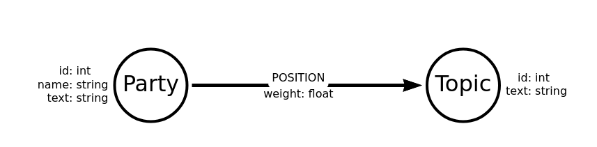

= Discover Neo4j Aura Free Live Stream

====
*_More drama than a cat video! ((C) Mike on Twitch chat)_*
====

A repo with cypher and examples from the Discover *Neo4j Aura Free* https://twitch.tv/neo4j[Twitch stream^]. All streams will roughly follow the following format:

* Review a data set
* Decide what questions to ask from it
* Put together an initial data model
* Load the data into https://dev.neo4j.com/discover-aura[Neo4j Aura Free^] and query!

Got a data set you'd like us to explore? Provided it's a public data set and can be accessed from a URI, let us know! Either raise an issue on the repo, or tweet @ellazal or @alexandererdl or @mesirii on Twitter.

== Join us live for the stream!

Every Monday: 8am UTC | 9am BST | 10am CEST | 1:30pm IST | 4pm SGT
https://twitch.tv/neo4j[On Twitch^]

Following along? Don't forget to get your https://dev.neo4j.com/discover-aura[*Free* Neo4j Aura instance^] up and running.

=== Previous episodes:

<<Week 1 - The NBA data set>>

<<Week 2 - The Board Game Geek data set>>

<<Week 3 - The Caruana - Carlsen Chess Game data set>>

<<Week 4 - The Resonate music data api>>

<<Week 5 - Rest areas across New York state data set>>

<<Week 6 - New Zealand credit card spend data set>>

<<Week 7 - Jungle of German Election Landscape>>

<<Week 8 - StackOverflow>>

<<Week 9 - GDelt Project>>

<<Week 10 - Getting Dumps and Example Projects into Aura Free>>

<<Week 11 - Importing and Querying Kickstarter Projects>>

== Week 1 - The NBA data set

In this week's episode, Lju and Alexander explore a National Basketball Association (NBA) dataset, from https://fivethirtyeight.com/[FiveThirtyEight^]. Catch-up on the episode now!

.catch-up video
[caption="Week 1 ",link=https://www.youtube.com/watch?v=_tuea3bsrPA^]
image::https://i.ytimg.com/vi/_tuea3bsrPA/maxresdefault.jpg[]

=== Key links 

* https://dev.neo4j.com/discover-aura[Neo4j Aura landing page^]
* https://github.com/fivethirtyeight/data/blob/master/nba-elo/nbaallelo.csv[Github repo for the NBA data^]
* https://raw.githubusercontent.com/fivethirtyeight/data/master/nba-elo/nbaallelo.csv[Raw CSV^]
* https://arrows.app[Arrows app^]
* https://arrows.app/#/import/json=eyJncmFwaCI6eyJub2RlcyI6W3siaWQiOiJuMCIsInBvc2l0aW9uIjp7IngiOi0xNzEsInkiOi02Ny42MDAwMDIyODg4MTgzNn0sImNhcHRpb24iOiIiLCJsYWJlbHMiOlsiVGVhbSJdLCJwcm9wZXJ0aWVzIjp7ImNvZGUiOiIiLCJuYW1lIjoiIn0sInN0eWxlIjp7fX0seyJpZCI6Im4xIiwicG9zaXRpb24iOnsieCI6MzI0LjUsInkiOi02Ny42MDAwMDIyODg4MTgzNn0sImNhcHRpb24iOiIiLCJsYWJlbHMiOlsiTWF0Y2giXSwicHJvcGVydGllcyI6eyJpZCI6IiIsImRhdGUiOiIiLCJ2ZW51ZSI6IiJ9LCJzdHlsZSI6e319XSwicmVsYXRpb25zaGlwcyI6W3siaWQiOiJuMCIsImZyb21JZCI6Im4wIiwidG9JZCI6Im4xIiwidHlwZSI6IlBMQVlFRF9JTiIsInByb3BlcnRpZXMiOnsicG9pbnRzIjoiIiwic3RhcnRFbG8iOiIiLCJlbmRFbG8iOiIifSwic3R5bGUiOnt9fV0sInN0eWxlIjp7Im5vZGUtY29sb3IiOiIjZmZmZmZmIiwiYm9yZGVyLXdpZHRoIjo0LCJib3JkZXItY29sb3IiOiIjMDAwMDAwIiwicmFkaXVzIjo1MCwibm9kZS1wYWRkaW5nIjo1LCJub2RlLW1hcmdpbiI6Miwib3V0c2lkZS1wb3NpdGlvbiI6ImF1dG8iLCJjYXB0aW9uLXBvc2l0aW9uIjoiaW5zaWRlIiwiY2FwdGlvbi1tYXgtd2lkdGgiOjIwMCwiY2FwdGlvbi1jb2xvciI6IiMwMDAwMDAiLCJjYXB0aW9uLWZvbnQtc2l6ZSI6NTAsImNhcHRpb24tZm9udC13ZWlnaHQiOiJub3JtYWwiLCJsYWJlbC1wb3NpdGlvbiI6Imluc2lkZSIsImxhYmVsLWNvbG9yIjoiIzAwMDAwMCIsImxhYmVsLWJhY2tncm91bmQtY29sb3IiOiIjZmZmZmZmIiwibGFiZWwtYm9yZGVyLWNvbG9yIjoiIzAwMDAwMCIsImxhYmVsLWJvcmRlci13aWR0aCI6NCwibGFiZWwtZm9udC1zaXplIjo0MCwibGFiZWwtcGFkZGluZyI6NSwibGFiZWwtbWFyZ2luIjo0LCJkaXJlY3Rpb25hbGl0eSI6ImRpcmVjdGVkIiwiZGV0YWlsLXBvc2l0aW9uIjoiaW5saW5lIiwiZGV0YWlsLW9yaWVudGF0aW9uIjoicGFyYWxsZWwiLCJhcnJvdy13aWR0aCI6NSwiYXJyb3ctY29sb3IiOiIjMDAwMDAwIiwibWFyZ2luLXN0YXJ0Ijo1LCJtYXJnaW4tZW5kIjo1LCJtYXJnaW4tcGVlciI6MjAsImF0dGFjaG1lbnQtc3RhcnQiOiJub3JtYWwiLCJhdHRhY2htZW50LWVuZCI6Im5vcm1hbCIsInR5cGUtY29sb3IiOiIjMDAwMDAwIiwidHlwZS1iYWNrZ3JvdW5kLWNvbG9yIjoiI2ZmZmZmZiIsInR5cGUtYm9yZGVyLWNvbG9yIjoiIzAwMDAwMCIsInR5cGUtYm9yZGVyLXdpZHRoIjowLCJ0eXBlLWZvbnQtc2l6ZSI6MTYsInR5cGUtcGFkZGluZyI6NSwicHJvcGVydHktcG9zaXRpb24iOiJvdXRzaWRlIiwicHJvcGVydHktY29sb3IiOiIjMDAwMDAwIiwicHJvcGVydHktZm9udC1zaXplIjoxNiwicHJvcGVydHktZm9udC13ZWlnaHQiOiJub3JtYWwifX0sImRpYWdyYW1OYW1lIjoiTkJBIEdyYXBoIn0=[Data model from the session^]

==== The data set

This week we explored a https://en.wikipedia.org/wiki/National_Basketball_Association[NBA^] data set. The data consisted of teams and all of their matches, along with points scored, match dates and location, as well as pre and post match https://en.wikipedia.org/wiki/Elo_rating_system[Elo ratings^].

image::img\img_repo.png[]

==== The questions

The following questions for the data set came up during the stream:

* Historical results between two teams
* The teams with the biggest Elo rating difference
* Find out home/away matches
* Can we predict results based on past experiencees?

==== The data model

You can view and play with the data model in Arrows App https://arrows.app/#/import/json=eyJncmFwaCI6eyJub2RlcyI6W3siaWQiOiJuMCIsInBvc2l0aW9uIjp7IngiOi0xNzEsInkiOi02Ny42MDAwMDIyODg4MTgzNn0sImNhcHRpb24iOiIiLCJsYWJlbHMiOlsiVGVhbSJdLCJwcm9wZXJ0aWVzIjp7ImNvZGUiOiIiLCJuYW1lIjoiIn0sInN0eWxlIjp7fX0seyJpZCI6Im4xIiwicG9zaXRpb24iOnsieCI6MzI0LjUsInkiOi02Ny42MDAwMDIyODg4MTgzNn0sImNhcHRpb24iOiIiLCJsYWJlbHMiOlsiTWF0Y2giXSwicHJvcGVydGllcyI6eyJpZCI6IiIsImRhdGUiOiIiLCJ2ZW51ZSI6IiJ9LCJzdHlsZSI6e319XSwicmVsYXRpb25zaGlwcyI6W3siaWQiOiJuMCIsImZyb21JZCI6Im4wIiwidG9JZCI6Im4xIiwidHlwZSI6IlBMQVlFRF9JTiIsInByb3BlcnRpZXMiOnsicG9pbnRzIjoiIiwic3RhcnRFbG8iOiIiLCJlbmRFbG8iOiIifSwic3R5bGUiOnt9fV0sInN0eWxlIjp7Im5vZGUtY29sb3IiOiIjZmZmZmZmIiwiYm9yZGVyLXdpZHRoIjo0LCJib3JkZXItY29sb3IiOiIjMDAwMDAwIiwicmFkaXVzIjo1MCwibm9kZS1wYWRkaW5nIjo1LCJub2RlLW1hcmdpbiI6Miwib3V0c2lkZS1wb3NpdGlvbiI6ImF1dG8iLCJjYXB0aW9uLXBvc2l0aW9uIjoiaW5zaWRlIiwiY2FwdGlvbi1tYXgtd2lkdGgiOjIwMCwiY2FwdGlvbi1jb2xvciI6IiMwMDAwMDAiLCJjYXB0aW9uLWZvbnQtc2l6ZSI6NTAsImNhcHRpb24tZm9udC13ZWlnaHQiOiJub3JtYWwiLCJsYWJlbC1wb3NpdGlvbiI6Imluc2lkZSIsImxhYmVsLWNvbG9yIjoiIzAwMDAwMCIsImxhYmVsLWJhY2tncm91bmQtY29sb3IiOiIjZmZmZmZmIiwibGFiZWwtYm9yZGVyLWNvbG9yIjoiIzAwMDAwMCIsImxhYmVsLWJvcmRlci13aWR0aCI6NCwibGFiZWwtZm9udC1zaXplIjo0MCwibGFiZWwtcGFkZGluZyI6NSwibGFiZWwtbWFyZ2luIjo0LCJkaXJlY3Rpb25hbGl0eSI6ImRpcmVjdGVkIiwiZGV0YWlsLXBvc2l0aW9uIjoiaW5saW5lIiwiZGV0YWlsLW9yaWVudGF0aW9uIjoicGFyYWxsZWwiLCJhcnJvdy13aWR0aCI6NSwiYXJyb3ctY29sb3IiOiIjMDAwMDAwIiwibWFyZ2luLXN0YXJ0Ijo1LCJtYXJnaW4tZW5kIjo1LCJtYXJnaW4tcGVlciI6MjAsImF0dGFjaG1lbnQtc3RhcnQiOiJub3JtYWwiLCJhdHRhY2htZW50LWVuZCI6Im5vcm1hbCIsInR5cGUtY29sb3IiOiIjMDAwMDAwIiwidHlwZS1iYWNrZ3JvdW5kLWNvbG9yIjoiI2ZmZmZmZiIsInR5cGUtYm9yZGVyLWNvbG9yIjoiIzAwMDAwMCIsInR5cGUtYm9yZGVyLXdpZHRoIjowLCJ0eXBlLWZvbnQtc2l6ZSI6MTYsInR5cGUtcGFkZGluZyI6NSwicHJvcGVydHktcG9zaXRpb24iOiJvdXRzaWRlIiwicHJvcGVydHktY29sb3IiOiIjMDAwMDAwIiwicHJvcGVydHktZm9udC1zaXplIjoxNiwicHJvcGVydHktZm9udC13ZWlnaHQiOiJub3JtYWwifX0sImRpYWdyYW1OYW1lIjoiTkJBIEdyYXBoIn0=[here^].

.The NBA data model we used in the stream
image::img\NBAGraph.png[]

One of the questions that came up was rather than using the above model, why didn't we choose using `PLAYED_IN_AWAY` and `PLAYED_IN_HOME` relationship types instead. This is an option too - and if primarily the questions you are asking are around home/away matches, then this would give a slightly faster performance.

To keep the data model as simple as possible, we decided to keep the relationship between `Team` and `Match` generic for now. We'll give an example query of how to bring back Home/Away teams shortly.

==== Loading the data

One thing to bear about the data is the use of `_iscopy` property - you will spot that the rows 'repeat', but they are reflecting the view point of each of the teams, i.e. the home team as the primary team in the row, and the away team as the primary team. As a result, we can safely skip `_iscopy=1` when loading the data.

image::img\img_data.png[]

To load the data into the database, we use the following query:

====
[source,cypher]
LOAD CSV WITH HEADERS FROM "https://raw.githubusercontent.com/fivethirtyeight/data/master/nba-elo/nbaallelo.csv" AS row
//skipping doubles, also Aura Free limit of 50k nodes, ~ 100 teams
WITH row LIMIT 99900 WHERE row._iscopy="0"
MERGE (ht:Team {code:row.team_id})
    ON CREATE SET ht.name = row.fran_id
MERGE (at:Team {code:row.opp_id})
    ON CREATE SET at.name = row.opp_fran
CREATE (m:Match {id:row.game_id, venue:right(row.game_id, 3), date:row.date_game})
WITH ht, at, m, row.pts AS hpoints, row.opp_pts AS apoints, 
    row.elo_i AS hse, row.elo_n AS hee, row.opp_elo_i AS ase, 
    row.opp_elo_n AS aee
CREATE (ht)-[:PLAYED_IN {points:hpoints, startElo:hse, endElo:hee}]->(m)
CREATE (at)-[:PLAYED_IN {points:apoints, startElo:ase, endElo:aee}]->(m)
====

NOTE: When using `LOAD CSV`, integers and floats may be treated as strings. As a result, don't forget to check, especially if you get unexpected results, e.g. `row._iscopy="0"` versus `row._iscopy=0`

==== Querying the data

Some of you may have spotted that all of our numerical data is being stored as strings. Whilst we could have sorted that at the load stage, we can also quickly handle it now. We're going to change points to integers, and Elo ratings to floats, found as properties in the `PLAYED_IN` relationships:

====
[source,cypher]
MATCH ()-[r:PLAYED_IN]->()
SET r.points = tointeger(r.points)
SET r.startElo = tofloat(r.startElo)
SET r.endElo = tofloat(r.endElo)
====

*Question 1 - Historical results between two teams*

====
[source,cypher]
//Look at the Huskies/Knicks rivalries
//Using the Match ID for the ISO 'format' date
MATCH (t1:Team {code:"TRH"})
MATCH (t2:Team {code:"NYK"})
MATCH (t1)-[r1]->(m)<-[r2]-(t2)
//Using the Match ID for the ISO 'format' date
RETURN left(m.id, size(m.id)-4) AS Date, t1.name, t2.name, 
    r1.points > r2.points AS `Huskies won`, m.venue ORDER BY Date
====

*Question 2 - The teams with the biggest Elo rating difference*

====
[source,cypher]
MATCH (t:Team)-[r]->(m)
WITH t.name AS name, min(r.endElo) AS lowestElo, max(r.endElo) AS highestElo
WITH name, lowestElo, highestElo, highestElo - lowestElo AS diffElo
RETURN name, lowestElo, highestElo, diffElo ORDER BY diffElo DESC
====

*Question 3 - Find out home/away matches*

====
[source,cypher]
MATCH (t:Team {name:"Sixers"})-[r:PLAYED_IN]->(m:Match)<-[r2:PLAYED_IN]-(opp:Team)
//match venue to team code for home matches, or <> for away matches
WHERE m.venue = t.code
RETURN left(m.id, size(m.id)-4) AS Date, opp.name AS `Played Home Against`,
    r.points + " - " + r2.points AS `Score`
====

*Question 4 - Can we predict results based on past experiences?*

====
[source,cypher]
We'll come back to you on this one! Watch this space :)
====

== Week 2 - The Board Game Geek data set

In this week's episode, Lju and Alexander explore a scraped data set from Board Game Geek, from https://github.com/ThaWeatherman/scrapers/blob/b8757711296703356891f8f4e7757de6698a6b5b/boardgamegeek/games.csv[Sean Beck's Github repository^]. Catch-up on the episode now!

.catch-up video
[caption="Week 1 ",link=https://www.youtube.com/watch?v=0X1dmTO0RZQ^]
image::https://i.ytimg.com/vi/0X1dmTO0RZQ/maxresdefault.jpg[]

=== Key links 

* https://dev.neo4j.com/discover-aura[Neo4j Aura landing page^]
* https://github.com/ThaWeatherman/scrapers/blob/b8757711296703356891f8f4e7757de6698a6b5b/boardgamegeek/games.csv[Github repo for the Board Game Geek data^]
* https://raw.githubusercontent.com/ThaWeatherman/scrapers/b8757711296703356891f8f4e7757de6698a6b5b/boardgamegeek/games.csv[Raw CSV^]
* https://arrows.app[Arrows app^]
* https://arrows.app/#/import/json=eyJncmFwaCI6eyJub2RlcyI6W3siaWQiOiJuMCIsInBvc2l0aW9uIjp7IngiOi0xNzcsInkiOi0xNTZ9LCJjYXB0aW9uIjoiIiwibGFiZWxzIjpbIkdhbWUiXSwicHJvcGVydGllcyI6eyJpZCI6IiIsIm5hbWUiOiIiLCJyYXRpbmciOiIiLCJwbGF5aW5nVGltZSI6IiIsIndlaWdodCI6IiJ9LCJzdHlsZSI6e319LHsiaWQiOiJuMSIsInBvc2l0aW9uIjp7IngiOjE2NiwieSI6LTE1Nn0sImNhcHRpb24iOiIiLCJsYWJlbHMiOlsiUGxheWVyQ291bnQiXSwicHJvcGVydGllcyI6eyJ2YWx1ZSI6IiJ9LCJzdHlsZSI6e319XSwicmVsYXRpb25zaGlwcyI6W3siaWQiOiJuMCIsImZyb21JZCI6Im4wIiwidG9JZCI6Im4xIiwidHlwZSI6Ik1BWF9QTEFZRVIiLCJwcm9wZXJ0aWVzIjp7fSwic3R5bGUiOnt9fSx7ImlkIjoibjEiLCJmcm9tSWQiOiJuMCIsInRvSWQiOiJuMSIsInR5cGUiOiJNSU5fUExBWUVSIiwicHJvcGVydGllcyI6e30sInN0eWxlIjp7fX1dLCJzdHlsZSI6eyJub2RlLWNvbG9yIjoiI2ZmZmZmZiIsImJvcmRlci13aWR0aCI6NCwiYm9yZGVyLWNvbG9yIjoiIzAwMDAwMCIsInJhZGl1cyI6NTAsIm5vZGUtcGFkZGluZyI6NSwibm9kZS1tYXJnaW4iOjIsIm91dHNpZGUtcG9zaXRpb24iOiJhdXRvIiwiY2FwdGlvbi1wb3NpdGlvbiI6Imluc2lkZSIsImNhcHRpb24tbWF4LXdpZHRoIjoyMDAsImNhcHRpb24tY29sb3IiOiIjMDAwMDAwIiwiY2FwdGlvbi1mb250LXNpemUiOjUwLCJjYXB0aW9uLWZvbnQtd2VpZ2h0Ijoibm9ybWFsIiwibGFiZWwtcG9zaXRpb24iOiJpbnNpZGUiLCJsYWJlbC1jb2xvciI6IiMwMDAwMDAiLCJsYWJlbC1iYWNrZ3JvdW5kLWNvbG9yIjoiI2ZmZmZmZiIsImxhYmVsLWJvcmRlci1jb2xvciI6IiMwMDAwMDAiLCJsYWJlbC1ib3JkZXItd2lkdGgiOjQsImxhYmVsLWZvbnQtc2l6ZSI6NDAsImxhYmVsLXBhZGRpbmciOjUsImxhYmVsLW1hcmdpbiI6NCwiZGlyZWN0aW9uYWxpdHkiOiJkaXJlY3RlZCIsImRldGFpbC1wb3NpdGlvbiI6ImlubGluZSIsImRldGFpbC1vcmllbnRhdGlvbiI6InBhcmFsbGVsIiwiYXJyb3ctd2lkdGgiOjUsImFycm93LWNvbG9yIjoiIzAwMDAwMCIsIm1hcmdpbi1zdGFydCI6NSwibWFyZ2luLWVuZCI6NSwibWFyZ2luLXBlZXIiOjIwLCJhdHRhY2htZW50LXN0YXJ0Ijoibm9ybWFsIiwiYXR0YWNobWVudC1lbmQiOiJub3JtYWwiLCJ0eXBlLWNvbG9yIjoiIzAwMDAwMCIsInR5cGUtYmFja2dyb3VuZC1jb2xvciI6IiNmZmZmZmYiLCJ0eXBlLWJvcmRlci1jb2xvciI6IiMwMDAwMDAiLCJ0eXBlLWJvcmRlci13aWR0aCI6MCwidHlwZS1mb250LXNpemUiOjE2LCJ0eXBlLXBhZGRpbmciOjUsInByb3BlcnR5LXBvc2l0aW9uIjoib3V0c2lkZSIsInByb3BlcnR5LWNvbG9yIjoiIzAwMDAwMCIsInByb3BlcnR5LWZvbnQtc2l6ZSI6MTYsInByb3BlcnR5LWZvbnQtd2VpZ2h0Ijoibm9ybWFsIn19LCJkaWFncmFtTmFtZSI6IkJvYXJkIEdhbWUgR2VlayJ9[Data model from the session^]

==== The data set

This week we explored a scraped dataset from https://boardgamegeek.com/browse/boardgame[Board Game Geek^]. The data consisted of games, ratings, complexity ratings, number of players, playing time, and so forth.

As we're keen to continue with the theme of 'no download', Alexander managed to locate a cut of data on https://github.com/ThaWeatherman/scrapers/blob/b8757711296703356891f8f4e7757de6698a6b5b/boardgamegeek/games.csv[Sean Beck's public Github repository^], which we use in this session.

image::img\bb_csv.png[]

==== The questions

The following questions for the data set came up during the stream:

* What are the top rated games and what they are called?
* What games that are most popular?
* What games are available for x players with complexity of y?
* What games can I play with x friends which require at least y minutes?

=== The data model

You can view and play with the data model in Arrows App https://arrows.app/#/import/json=eyJncmFwaCI6eyJub2RlcyI6W3siaWQiOiJuMCIsInBvc2l0aW9uIjp7IngiOi0xNzcsInkiOi0xNTZ9LCJjYXB0aW9uIjoiIiwibGFiZWxzIjpbIkdhbWUiXSwicHJvcGVydGllcyI6eyJpZCI6IiIsIm5hbWUiOiIiLCJyYXRpbmciOiIiLCJwbGF5aW5nVGltZSI6IiIsIndlaWdodCI6IiJ9LCJzdHlsZSI6e319LHsiaWQiOiJuMSIsInBvc2l0aW9uIjp7IngiOjE2NiwieSI6LTE1Nn0sImNhcHRpb24iOiIiLCJsYWJlbHMiOlsiUGxheWVyQ291bnQiXSwicHJvcGVydGllcyI6eyJ2YWx1ZSI6IiJ9LCJzdHlsZSI6e319XSwicmVsYXRpb25zaGlwcyI6W3siaWQiOiJuMCIsImZyb21JZCI6Im4wIiwidG9JZCI6Im4xIiwidHlwZSI6Ik1BWF9QTEFZRVIiLCJwcm9wZXJ0aWVzIjp7fSwic3R5bGUiOnt9fSx7ImlkIjoibjEiLCJmcm9tSWQiOiJuMCIsInRvSWQiOiJuMSIsInR5cGUiOiJNSU5fUExBWUVSIiwicHJvcGVydGllcyI6e30sInN0eWxlIjp7fX1dLCJzdHlsZSI6eyJub2RlLWNvbG9yIjoiI2ZmZmZmZiIsImJvcmRlci13aWR0aCI6NCwiYm9yZGVyLWNvbG9yIjoiIzAwMDAwMCIsInJhZGl1cyI6NTAsIm5vZGUtcGFkZGluZyI6NSwibm9kZS1tYXJnaW4iOjIsIm91dHNpZGUtcG9zaXRpb24iOiJhdXRvIiwiY2FwdGlvbi1wb3NpdGlvbiI6Imluc2lkZSIsImNhcHRpb24tbWF4LXdpZHRoIjoyMDAsImNhcHRpb24tY29sb3IiOiIjMDAwMDAwIiwiY2FwdGlvbi1mb250LXNpemUiOjUwLCJjYXB0aW9uLWZvbnQtd2VpZ2h0Ijoibm9ybWFsIiwibGFiZWwtcG9zaXRpb24iOiJpbnNpZGUiLCJsYWJlbC1jb2xvciI6IiMwMDAwMDAiLCJsYWJlbC1iYWNrZ3JvdW5kLWNvbG9yIjoiI2ZmZmZmZiIsImxhYmVsLWJvcmRlci1jb2xvciI6IiMwMDAwMDAiLCJsYWJlbC1ib3JkZXItd2lkdGgiOjQsImxhYmVsLWZvbnQtc2l6ZSI6NDAsImxhYmVsLXBhZGRpbmciOjUsImxhYmVsLW1hcmdpbiI6NCwiZGlyZWN0aW9uYWxpdHkiOiJkaXJlY3RlZCIsImRldGFpbC1wb3NpdGlvbiI6ImlubGluZSIsImRldGFpbC1vcmllbnRhdGlvbiI6InBhcmFsbGVsIiwiYXJyb3ctd2lkdGgiOjUsImFycm93LWNvbG9yIjoiIzAwMDAwMCIsIm1hcmdpbi1zdGFydCI6NSwibWFyZ2luLWVuZCI6NSwibWFyZ2luLXBlZXIiOjIwLCJhdHRhY2htZW50LXN0YXJ0Ijoibm9ybWFsIiwiYXR0YWNobWVudC1lbmQiOiJub3JtYWwiLCJ0eXBlLWNvbG9yIjoiIzAwMDAwMCIsInR5cGUtYmFja2dyb3VuZC1jb2xvciI6IiNmZmZmZmYiLCJ0eXBlLWJvcmRlci1jb2xvciI6IiMwMDAwMDAiLCJ0eXBlLWJvcmRlci13aWR0aCI6MCwidHlwZS1mb250LXNpemUiOjE2LCJ0eXBlLXBhZGRpbmciOjUsInByb3BlcnR5LXBvc2l0aW9uIjoib3V0c2lkZSIsInByb3BlcnR5LWNvbG9yIjoiIzAwMDAwMCIsInByb3BlcnR5LWZvbnQtc2l6ZSI6MTYsInByb3BlcnR5LWZvbnQtd2VpZ2h0Ijoibm9ybWFsIn19LCJkaWFncmFtTmFtZSI6IkJvYXJkIEdhbWUgR2VlayJ9[here^].

.The Board Game Geek model we used in the stream

image:img\bbgmodel.png[]

Based on the questions we're looking to answer, we're interested in the following fields in the CSV:

* Game name and id
* Rating
* Min and max playeers
* Game playing time
* Game complexity/weight
* Number of users who rated the game (we forgot to add this in the stream! We will revisit this data set and add it accordingly)

This was a bumper session for modelling decisions! Based on the questions, we could have easily just had a single `Game` node, with all the mentioned fields as properties. There are a couple of issues with this:

* Firstly, it wouldn't be a very graphy graph! We'd have a lot of lonely nodes :)
* Secondly, we need to think about what questions we are asking - we've got questions that ask about games based on number of players - and as a general rule of thumb when thinking if something is a node/relationship/property - if we use something a lot, it's probably going to be a node

In the end, as we are interested in games around player count, as well as identifying that player count are discrete values, this is what lead to the chosen model. This is by no means a complete job! We still need to think about playing time, weight and rating, and we may well decide that those shouldn't live on `Game`. But for brevity, we ran with this model during the session.

==== Loading the data

To load the data into the database, we use the following query:

====
[source,cypher]
LOAD CSV WITH HEADERS FROM "https://raw.githubusercontent.com/ThaWeatherman/scrapers/b8757711296703356891f8f4e7757de6698a6b5b/boardgamegeek/games.csv" AS ROW
WITH ROW WHERE tointeger(row.playingtime) > 9 
    AND tointeger(row.playingtime) <61
CREATE (g:Game {name:row.name, weight:tofloat(row.average_weight), 
    rating:tofloat(row.average_rating), 
    playingTime:tointeger(row.playingtime), id:row.id})
MERGE (pmin:PlayerCount {value:tointeger(row.minplayers)})
MERGE (pmax:PlayerCount {value:tointeger(row.maxplayers)})
WITH g, pmin, pmax
CREATE (g)-[:HAS_MIN_PLAYERS]->(pmin)
CREATE (g)-[:HAS_MAX_PLAYERS]->(pmax)
====

Bearing in mind the 50k node limit in Aura Free, we decided to limit the games loaded based on playing time of between 10 and 60 minutes.

==== Querying the data

Whereas last week we cast strings to integers and floats after we loaded the data, this week, we did it whilst loading the data. You can see what we did in the load query.

*Question 1 - What are the top rated games and what they are called?*

====
[source,cypher]
MATCH (g:Game)
RETURN g.name, g.rating 
    ORDER BY g.rating DESC LIMIT 10
====

*Question 2 - What games that are most popular?*

We forgot to load the data for this, so we'll come back to this in a future episode! You are, of course, welcome to import the data (field name: `users_rated`) and have a go yourself!

*Question 3 - What games are available for x players with complexity of y?*

====
[source,cypher]
WITH 4 AS complexity, 3 AS min, 5 AS max
MATCH (g:Game)-[:HAS_MIN_PLAYERS]->(pcmin:PlayerCount),
(g)-[:HAS_MAX_PLAYERS]->(pcmax:PlayerCount)
WHERE g.weight >= complexity AND pcmin.value <= max 
    AND pcmax.value >= min
RETURN g.name AS name, g.weight AS complexity, 
    [pcmin.value, pcmax.value] AS `player range` 
    ORDER BY complexity
====

NOTE: We've corrected the query as it was flagged that the query put together on the stream would miss certain games!

*Question 4 - What games can I play with x friends which require at least y minutes?*

====
[source,cypher]
WITH 30 AS playingTime, 2 AS min, 2 AS max
MATCH (g:Game)-[:HAS_MIN_PLAYERS]->(pcmin:PlayerCount),
(g)-[:HAS_MAX_PLAYERS]->(pcmax:PlayerCount)
WHERE g.playingTime >= playingTime AND pcmin.value <= max 
    AND pcmax.value >= min
RETURN g.name AS name, g.playingTime AS `playing time`, 
    [pcmin.value, pcmax.value] AS `player range` 
    ORDER BY `playing time`
====

== Week 3 - The Caruana - Carlsen Chess Game data set

In this week's episode, Lju explores data from a Carauana - Carlsen chess game, from  and Alexander explore a National Basketball Association (NBA) dataset, from https://https://github.com/zq99/[Zaid Qureshi's Github repository^]. Catch-up on the episode now!

A big shoutout to BennuFire who keeps asking those awesome questions!

.catch-up video
[caption="Week 3 ",link=https://youtu.be/vkTQpOr2BNc^]
image::https://i.ytimg.com/vi/vkTQpOr2BNc/maxresdefault.jpg[]

=== Key links 

* https://dev.neo4j.com/discover-aura[Neo4j Aura landing page^]
* https://github.com/zq99/pgn2data/blob/master/samples/caruana_carlsen_2018_moves.csv[Github repo for the game data^]
* https://raw.githubusercontent.com/zq99/pgn2data/master/samples/caruana_carlsen_2018_moves.csv[Raw CSV^]
* https://arrows.app[Arrows app^]
* https://arrows.app/#/import/json=eyJncmFwaCI6eyJub2RlcyI6W3siaWQiOiJuMCIsInBvc2l0aW9uIjp7IngiOi05MC43NjcxMjg1NjUzNjQ4MywieSI6LTI0MX0sImNhcHRpb24iOiIiLCJsYWJlbHMiOlsiUG9zaXRpb24iXSwicHJvcGVydGllcyI6eyJmZW4iOiIifSwic3R5bGUiOnt9fSx7ImlkIjoibjEiLCJwb3NpdGlvbiI6eyJ4Ijo0MTcuNjQ0NDI2NzAwNjMwNSwieSI6LTI0MX0sImNhcHRpb24iOiIiLCJsYWJlbHMiOlsiTW92ZSJdLCJwcm9wZXJ0aWVzIjp7Im5vIjoiIiwibW92ZSI6IiIsImNvbG91ciI6IiJ9LCJzdHlsZSI6e319LHsiaWQiOiJuMiIsInBvc2l0aW9uIjp7IngiOjIxNS44MTE5OTY1MDgzODM2NiwieSI6LTY3Ljg4MDkwNzgyMDI0MDA1fSwiY2FwdGlvbiI6IiIsImxhYmVscyI6WyJQaWVjZSJdLCJwcm9wZXJ0aWVzIjp7InR5cGUiOiIifSwic3R5bGUiOnt9fSx7ImlkIjoibjMiLCJwb3NpdGlvbiI6eyJ4Ijo1MTcuNjQ0NDI2NzAwNjMwNCwieSI6MzIuMTE5MDkyMTc5NzU5OTQ2fSwiY2FwdGlvbiI6IiIsImxhYmVscyI6WyJQb3NpdGlvbiJdLCJwcm9wZXJ0aWVzIjp7ImZlbiI6IiJ9LCJzdHlsZSI6e319LHsiaWQiOiJuNCIsInBvc2l0aW9uIjp7IngiOjEwMjYuMDU1OTgxOTY2NjI1NywieSI6MzIuMTE5MDkyMTc5NzU5OTQ2fSwiY2FwdGlvbiI6IiIsImxhYmVscyI6WyJNb3ZlIl0sInByb3BlcnRpZXMiOnsibm8iOiIiLCJtb3ZlIjoiIiwiY29sb3VyIjoiIn0sInN0eWxlIjp7fX0seyJpZCI6Im41IiwicG9zaXRpb24iOnsieCI6NzcxLjg1MDIwNDMzMzYyODEsInkiOjIzMS41OTQyNDU3NzE1NzU2M30sImNhcHRpb24iOiIiLCJsYWJlbHMiOlsiUGllY2UiXSwicHJvcGVydGllcyI6eyJ0eXBlIjoiIiwibG9jYXRpb24iOiIifSwic3R5bGUiOnt9fV0sInJlbGF0aW9uc2hpcHMiOlt7ImlkIjoibjEiLCJmcm9tSWQiOiJuMSIsInRvSWQiOiJuMiIsInR5cGUiOiJJTlZPTFZFUyIsInByb3BlcnRpZXMiOnt9LCJzdHlsZSI6e319LHsiaWQiOiJuMiIsImZyb21JZCI6Im4yIiwidG9JZCI6Im4wIiwidHlwZSI6IlJFU1VMVFNfSU4iLCJwcm9wZXJ0aWVzIjp7fSwic3R5bGUiOnt9fSx7ImlkIjoibjMiLCJmcm9tSWQiOiJuMSIsInRvSWQiOiJuMCIsInR5cGUiOiJSRVNVTFRFRF9JTiIsInByb3BlcnRpZXMiOnt9LCJzdHlsZSI6e319LHsiaWQiOiJuNCIsImZyb21JZCI6Im40IiwidG9JZCI6Im41IiwidHlwZSI6IklOVk9MVkVTIiwicHJvcGVydGllcyI6e30sInN0eWxlIjp7fX0seyJpZCI6Im41IiwiZnJvbUlkIjoibjUiLCJ0b0lkIjoibjMiLCJ0eXBlIjoiUkVTVUxUU19JTiIsInByb3BlcnRpZXMiOnt9LCJzdHlsZSI6e319LHsiaWQiOiJuNiIsImZyb21JZCI6Im40IiwidG9JZCI6Im4zIiwidHlwZSI6IlJFU1VMVEVEX0lOIiwicHJvcGVydGllcyI6e30sInN0eWxlIjp7fX1dLCJzdHlsZSI6eyJub2RlLWNvbG9yIjoiI2ZmZmZmZiIsImJvcmRlci13aWR0aCI6NCwiYm9yZGVyLWNvbG9yIjoiIzAwMDAwMCIsInJhZGl1cyI6NTAsIm5vZGUtcGFkZGluZyI6NSwibm9kZS1tYXJnaW4iOjIsIm91dHNpZGUtcG9zaXRpb24iOiJhdXRvIiwiY2FwdGlvbi1wb3NpdGlvbiI6Imluc2lkZSIsImNhcHRpb24tbWF4LXdpZHRoIjoyMDAsImNhcHRpb24tY29sb3IiOiIjMDAwMDAwIiwiY2FwdGlvbi1mb250LXNpemUiOjUwLCJjYXB0aW9uLWZvbnQtd2VpZ2h0Ijoibm9ybWFsIiwibGFiZWwtcG9zaXRpb24iOiJpbnNpZGUiLCJsYWJlbC1jb2xvciI6IiMwMDAwMDAiLCJsYWJlbC1iYWNrZ3JvdW5kLWNvbG9yIjoiI2ZmZmZmZiIsImxhYmVsLWJvcmRlci1jb2xvciI6IiMwMDAwMDAiLCJsYWJlbC1ib3JkZXItd2lkdGgiOjQsImxhYmVsLWZvbnQtc2l6ZSI6NDAsImxhYmVsLXBhZGRpbmciOjUsImxhYmVsLW1hcmdpbiI6NCwiZGlyZWN0aW9uYWxpdHkiOiJkaXJlY3RlZCIsImRldGFpbC1wb3NpdGlvbiI6ImlubGluZSIsImRldGFpbC1vcmllbnRhdGlvbiI6InBhcmFsbGVsIiwiYXJyb3ctd2lkdGgiOjUsImFycm93LWNvbG9yIjoiIzAwMDAwMCIsIm1hcmdpbi1zdGFydCI6NSwibWFyZ2luLWVuZCI6NSwibWFyZ2luLXBlZXIiOjIwLCJhdHRhY2htZW50LXN0YXJ0Ijoibm9ybWFsIiwiYXR0YWNobWVudC1lbmQiOiJub3JtYWwiLCJ0eXBlLWNvbG9yIjoiIzAwMDAwMCIsInR5cGUtYmFja2dyb3VuZC1jb2xvciI6IiNmZmZmZmYiLCJ0eXBlLWJvcmRlci1jb2xvciI6IiMwMDAwMDAiLCJ0eXBlLWJvcmRlci13aWR0aCI6MCwidHlwZS1mb250LXNpemUiOjE2LCJ0eXBlLXBhZGRpbmciOjUsInByb3BlcnR5LXBvc2l0aW9uIjoib3V0c2lkZSIsInByb3BlcnR5LWNvbG9yIjoiIzAwMDAwMCIsInByb3BlcnR5LWZvbnQtc2l6ZSI6MTYsInByb3BlcnR5LWZvbnQtd2VpZ2h0Ijoibm9ybWFsIn19LCJkaWFncmFtTmFtZSI6IkNhcmF1YW5hIC0gQ2FybHNlbiBnYW1lIn0=[Data model from the session^]

==== The data set

This week we explored generated data based on the first round of the https://en.wikipedia.org/wiki/World_Chess_Championship_2018[Carlsen - Caruana World Championship Match from 2018^]. The data consisted of the moves, https://en.wikipedia.org/wiki/Forsyth%E2%80%93Edwards_Notation[FEN^] positions after each move, which piece moved, and so forth. 

image::img\zq99chessrepo.png[]

==== The questions

The following questions for the data set came up during the stream:

* How many times did the same position repeat?
* What was the most commonly used piece overall?
* What is the most popular destination square on the board?
* What was the most commonly used individual piece, and what moves did it play?

==== The data model

You can view and play with the data model in Arrows App https://arrows.app/#/import/json=eyJncmFwaCI6eyJub2RlcyI6W3siaWQiOiJuMCIsInBvc2l0aW9uIjp7IngiOi05MC43NjcxMjg1NjUzNjQ4MywieSI6LTI0MX0sImNhcHRpb24iOiIiLCJsYWJlbHMiOlsiUG9zaXRpb24iXSwicHJvcGVydGllcyI6eyJmZW4iOiIifSwic3R5bGUiOnt9fSx7ImlkIjoibjEiLCJwb3NpdGlvbiI6eyJ4Ijo0MTcuNjQ0NDI2NzAwNjMwNSwieSI6LTI0MX0sImNhcHRpb24iOiIiLCJsYWJlbHMiOlsiTW92ZSJdLCJwcm9wZXJ0aWVzIjp7Im5vIjoiIiwibW92ZSI6IiIsImNvbG91ciI6IiJ9LCJzdHlsZSI6e319LHsiaWQiOiJuMiIsInBvc2l0aW9uIjp7IngiOjIxNS44MTE5OTY1MDgzODM2NiwieSI6LTY3Ljg4MDkwNzgyMDI0MDA1fSwiY2FwdGlvbiI6IiIsImxhYmVscyI6WyJQaWVjZSJdLCJwcm9wZXJ0aWVzIjp7InR5cGUiOiIifSwic3R5bGUiOnt9fSx7ImlkIjoibjMiLCJwb3NpdGlvbiI6eyJ4Ijo1MTcuNjQ0NDI2NzAwNjMwNCwieSI6MzIuMTE5MDkyMTc5NzU5OTQ2fSwiY2FwdGlvbiI6IiIsImxhYmVscyI6WyJQb3NpdGlvbiJdLCJwcm9wZXJ0aWVzIjp7ImZlbiI6IiJ9LCJzdHlsZSI6e319LHsiaWQiOiJuNCIsInBvc2l0aW9uIjp7IngiOjEwMjYuMDU1OTgxOTY2NjI1NywieSI6MzIuMTE5MDkyMTc5NzU5OTQ2fSwiY2FwdGlvbiI6IiIsImxhYmVscyI6WyJNb3ZlIl0sInByb3BlcnRpZXMiOnsibm8iOiIiLCJtb3ZlIjoiIiwiY29sb3VyIjoiIn0sInN0eWxlIjp7fX0seyJpZCI6Im41IiwicG9zaXRpb24iOnsieCI6NzcxLjg1MDIwNDMzMzYyODEsInkiOjIzMS41OTQyNDU3NzE1NzU2M30sImNhcHRpb24iOiIiLCJsYWJlbHMiOlsiUGllY2UiXSwicHJvcGVydGllcyI6eyJ0eXBlIjoiIiwibG9jYXRpb24iOiIifSwic3R5bGUiOnt9fV0sInJlbGF0aW9uc2hpcHMiOlt7ImlkIjoibjEiLCJmcm9tSWQiOiJuMSIsInRvSWQiOiJuMiIsInR5cGUiOiJJTlZPTFZFUyIsInByb3BlcnRpZXMiOnt9LCJzdHlsZSI6e319LHsiaWQiOiJuMiIsImZyb21JZCI6Im4yIiwidG9JZCI6Im4wIiwidHlwZSI6IlJFU1VMVFNfSU4iLCJwcm9wZXJ0aWVzIjp7fSwic3R5bGUiOnt9fSx7ImlkIjoibjMiLCJmcm9tSWQiOiJuMSIsInRvSWQiOiJuMCIsInR5cGUiOiJSRVNVTFRFRF9JTiIsInByb3BlcnRpZXMiOnt9LCJzdHlsZSI6e319LHsiaWQiOiJuNCIsImZyb21JZCI6Im40IiwidG9JZCI6Im41IiwidHlwZSI6IklOVk9MVkVTIiwicHJvcGVydGllcyI6e30sInN0eWxlIjp7fX0seyJpZCI6Im41IiwiZnJvbUlkIjoibjUiLCJ0b0lkIjoibjMiLCJ0eXBlIjoiUkVTVUxUU19JTiIsInByb3BlcnRpZXMiOnt9LCJzdHlsZSI6e319LHsiaWQiOiJuNiIsImZyb21JZCI6Im40IiwidG9JZCI6Im4zIiwidHlwZSI6IlJFU1VMVEVEX0lOIiwicHJvcGVydGllcyI6e30sInN0eWxlIjp7fX1dLCJzdHlsZSI6eyJub2RlLWNvbG9yIjoiI2ZmZmZmZiIsImJvcmRlci13aWR0aCI6NCwiYm9yZGVyLWNvbG9yIjoiIzAwMDAwMCIsInJhZGl1cyI6NTAsIm5vZGUtcGFkZGluZyI6NSwibm9kZS1tYXJnaW4iOjIsIm91dHNpZGUtcG9zaXRpb24iOiJhdXRvIiwiY2FwdGlvbi1wb3NpdGlvbiI6Imluc2lkZSIsImNhcHRpb24tbWF4LXdpZHRoIjoyMDAsImNhcHRpb24tY29sb3IiOiIjMDAwMDAwIiwiY2FwdGlvbi1mb250LXNpemUiOjUwLCJjYXB0aW9uLWZvbnQtd2VpZ2h0Ijoibm9ybWFsIiwibGFiZWwtcG9zaXRpb24iOiJpbnNpZGUiLCJsYWJlbC1jb2xvciI6IiMwMDAwMDAiLCJsYWJlbC1iYWNrZ3JvdW5kLWNvbG9yIjoiI2ZmZmZmZiIsImxhYmVsLWJvcmRlci1jb2xvciI6IiMwMDAwMDAiLCJsYWJlbC1ib3JkZXItd2lkdGgiOjQsImxhYmVsLWZvbnQtc2l6ZSI6NDAsImxhYmVsLXBhZGRpbmciOjUsImxhYmVsLW1hcmdpbiI6NCwiZGlyZWN0aW9uYWxpdHkiOiJkaXJlY3RlZCIsImRldGFpbC1wb3NpdGlvbiI6ImlubGluZSIsImRldGFpbC1vcmllbnRhdGlvbiI6InBhcmFsbGVsIiwiYXJyb3ctd2lkdGgiOjUsImFycm93LWNvbG9yIjoiIzAwMDAwMCIsIm1hcmdpbi1zdGFydCI6NSwibWFyZ2luLWVuZCI6NSwibWFyZ2luLXBlZXIiOjIwLCJhdHRhY2htZW50LXN0YXJ0Ijoibm9ybWFsIiwiYXR0YWNobWVudC1lbmQiOiJub3JtYWwiLCJ0eXBlLWNvbG9yIjoiIzAwMDAwMCIsInR5cGUtYmFja2dyb3VuZC1jb2xvciI6IiNmZmZmZmYiLCJ0eXBlLWJvcmRlci1jb2xvciI6IiMwMDAwMDAiLCJ0eXBlLWJvcmRlci13aWR0aCI6MCwidHlwZS1mb250LXNpemUiOjE2LCJ0eXBlLXBhZGRpbmciOjUsInByb3BlcnR5LXBvc2l0aW9uIjoib3V0c2lkZSIsInByb3BlcnR5LWNvbG9yIjoiIzAwMDAwMCIsInByb3BlcnR5LWZvbnQtc2l6ZSI6MTYsInByb3BlcnR5LWZvbnQtd2VpZ2h0Ijoibm9ybWFsIn19LCJkaWFncmFtTmFtZSI6IkNhcmF1YW5hIC0gQ2FybHNlbiBnYW1lIn0=[here^].

.The data model we used in the stream
image::img\chessmodel.png[]

==== Loading the data

In the CSV we were looking at, there were two move fields:
* `move_no` is the 'half move' number, i.e. 1 for White's first move, 2 for Black's, etc.
* `move_no_pair` is the actual move of the game, i.e. White and Black each move for a complete move. This is the field we use for move number.

To load the data into the database, we use the following query:

====
[source,cypher]
LOAD CSV WITH HEADERS FROM "https://raw.githubusercontent.com/zq99/pgn2data/master/samples/caruana_carlsen_2018_moves.csv" AS row
MERGE (p:Position {fen:row.fen})
CREATE (m:Move {move:row.move, colour:row.color, no:tointeger(row.move_no_pair), piece:row.piece})
CREATE (m)-[:RESULTS_IN]->(p);
====

NOTE: When using `LOAD CSV`, integers and floats may be treated as strings. As a result, don't forget to check, especially if you get unexpected results

This will load in our `Position` and `Move` nodes. The following step is going to create our (individual) `Piece` labels.

====
[source,cypher]
CALL apoc.periodic.commit(
    "MATCH (m:Move) WHERE EXISTS(m.piece) 
    //strange Cypher issue going on - so we're casting the property to string
    WITH m, m.move+'' AS move LIMIT $limit
    MATCH (m)-->(pos)
    MERGE (piece:Piece {location:left(move,2), type:m.piece, colour:m.colour})
        SET piece.location = right(move,2)
    WITH m, pos, piece
    CREATE (piece)-[:RESULTS_IN]->(pos)
    CREATE (m)-[:INVOLVES]->(piece)
    REMOVE m.piece
    RETURN count(*)",
    {limit:1}
)
====

We are using https://neo4j.com/labs/apoc/4.1/overview/apoc.periodic/apoc.periodic.commit/[`apoc.periodic.commit`^] to make sure we step through one by one the `Move` nodes to get move and piece information, so that we can use this to create our `Piece` node. A little 'fudge' we're using to make sure we're tracking individual pieces is by always checking what square they were originally on, and then update their `location` to their destination square.

Something to be aware of, we are not taking account of what happens when a player castles (The rook moves as well as the king! Although we only ever record the king moving...), and pawn captures via en passant. We can worry about that another day!

==== Querying the data

* How many times did the same position repeat?
* What was the most commonly used piece overall?
* What is the most popular destination square on the board?
* What was the most commonly used individual piece, and what moves did it play?

*Question 1 - How many times did the same position repeat?*

====
[source,cypher]
MATCH (m:Move)-[:RESULTS_IN]->(pos:Position)
WITH pos, collect(m) AS moves WHERE size(moves) > 1
RETURN pos.fen, size(moves) AS size ORDER BY size DESC
====

*Question 2 - What was the most commonly used piece overall*

====
[source,cypher]
MATCH (m:Move)-->(p:Piece)
WITH p.type AS type, collect(m) AS moves
RETURN type, size(moves) AS size ORDER BY size DESC
====

*Question 3 - What is the most popular destination square on the board*

====
[source,cypher]
MATCH (m:Move)
WITH right(m.move,2) AS destination
RETURN destination, count(destination) AS count 
    ORDER BY count DESC
====

*Question 4 - What was the most commonly used individual piece, and what moves did it play?*

Hat-tip to BennuFire for this one! Don't forget - we've not handled castling or en passant (or promotions for that matter!).

====
[source,cypher]
MATCH (m:Move)-->(p:Piece)
WITH p, {No:m.no,Move:m.move} AS moves ORDER BY m.no
WITH p, collect(moves) AS moves
RETURN p.type, p.colour, moves, size(moves) AS count ORDER BY count DESC
====

Bonus query, generate a move path for each piece. First of all, we're going to use [this example^] from the knowledge base to allow us to create a link between the moves associated with a piece:

====
[source,cypher]
MATCH (m:Move)-->(p:Piece)
WITH p, m ORDER BY m.no
WITH p, collect(m) AS moves
FOREACH (i in range(0, size(moves) - 2) |
 FOREACH (node1 in [moves[i]] |
  FOREACH (node2 in [moves[i+1]] |
   CREATE (node1)-[:NEXT_MOVE {colour:node1.colour}]->(node2))))
====

Now, if we want to see the chain of moves associated by individual piece, we use the following query (just looking for knights for now...):

====
[source,cypher]
MATCH (m1:Move)-[r1:INVOLVES]->(p:Piece {type:'N'})
WHERE NOT ()-[:NEXT_MOVE]->(m1:Move)
WITH m1, p, r1
MATCH (m1)-[r2:NEXT_MOVE* 0..100 {colour:p.colour}]->(m:Move)
RETURN  *
====

You may need to remove 'connect resulting nodes' in your settings to create the same image below.

image::img\chessmovechain.png[]

== Week 4 - The Resonate music data api

In this week's episode, Lju and Alexander explore some playlist data from https://resonate.is/about/[Resonate^], based on example Cypher queries https://github.com/whatSocks[whatSocks^] has put together. Resonate is a co-ownership music streaming platform. Catch-up on the episode now!

.catch-up video
[caption="Week 4 ",link=https://youtu.be/t9rZrTxsFQs^]
image::https://i.ytimg.com/vi/t9rZrTxsFQs/maxresdefault.jpg[]

=== Key links 

* https://dev.neo4j.com/discover-aura[Neo4j Aura landing page^]
* https://github.com/whatSocks/reso-tag-charts[whatSocks Resonate GitHub repo^]
* https://arrows.app[Arrows app^]
* https://arrows.app/#/import/json=eyJncmFwaCI6eyJzdHlsZSI6eyJub2RlLWNvbG9yIjoiI2ZmZmZmZiIsImJvcmRlci13aWR0aCI6NCwiYm9yZGVyLWNvbG9yIjoiIzAwMDAwMCIsInJhZGl1cyI6NTAsIm5vZGUtcGFkZGluZyI6NSwibm9kZS1tYXJnaW4iOjIsIm91dHNpZGUtcG9zaXRpb24iOiJhdXRvIiwiY2FwdGlvbi1wb3NpdGlvbiI6Imluc2lkZSIsImNhcHRpb24tbWF4LXdpZHRoIjoyMDAsImNhcHRpb24tY29sb3IiOiIjMDAwMDAwIiwiY2FwdGlvbi1mb250LXNpemUiOjUwLCJjYXB0aW9uLWZvbnQtd2VpZ2h0Ijoibm9ybWFsIiwibGFiZWwtcG9zaXRpb24iOiJpbnNpZGUiLCJsYWJlbC1jb2xvciI6IiMwMDAwMDAiLCJsYWJlbC1iYWNrZ3JvdW5kLWNvbG9yIjoiI2ZmZmZmZiIsImxhYmVsLWJvcmRlci1jb2xvciI6IiMwMDAwMDAiLCJsYWJlbC1ib3JkZXItd2lkdGgiOjQsImxhYmVsLWZvbnQtc2l6ZSI6NDAsImxhYmVsLXBhZGRpbmciOjUsImxhYmVsLW1hcmdpbiI6NCwiZGlyZWN0aW9uYWxpdHkiOiJkaXJlY3RlZCIsImRldGFpbC1wb3NpdGlvbiI6ImlubGluZSIsImRldGFpbC1vcmllbnRhdGlvbiI6InBhcmFsbGVsIiwiYXJyb3ctd2lkdGgiOjUsImFycm93LWNvbG9yIjoiIzAwMDAwMCIsIm1hcmdpbi1zdGFydCI6NSwibWFyZ2luLWVuZCI6NSwibWFyZ2luLXBlZXIiOjIwLCJhdHRhY2htZW50LXN0YXJ0Ijoibm9ybWFsIiwiYXR0YWNobWVudC1lbmQiOiJub3JtYWwiLCJ0eXBlLWNvbG9yIjoiIzAwMDAwMCIsInR5cGUtYmFja2dyb3VuZC1jb2xvciI6IiNmZmZmZmYiLCJ0eXBlLWJvcmRlci1jb2xvciI6IiMwMDAwMDAiLCJ0eXBlLWJvcmRlci13aWR0aCI6MCwidHlwZS1mb250LXNpemUiOjE2LCJ0eXBlLXBhZGRpbmciOjUsInByb3BlcnR5LXBvc2l0aW9uIjoib3V0c2lkZSIsInByb3BlcnR5LWNvbG9yIjoiIzAwMDAwMCIsInByb3BlcnR5LWZvbnQtc2l6ZSI6MTYsInByb3BlcnR5LWZvbnQtd2VpZ2h0Ijoibm9ybWFsIn0sIm5vZGVzIjpbeyJpZCI6Im4wIiwicG9zaXRpb24iOnsieCI6LTM4OS4wMjU5OTcyODAyMDEzNSwieSI6LTQ1fSwiY2FwdGlvbiI6IiIsInN0eWxlIjp7fSwibGFiZWxzIjpbIlRyYWNrIl0sInByb3BlcnRpZXMiOnsidGl0bGUiOiIiLCJ1dWlkIjoiIiwidGFnc19pbXBvcnRlZCI6IiJ9fSx7ImlkIjoibjEiLCJwb3NpdGlvbiI6eyJ4IjotMjMsInkiOi00NX0sImNhcHRpb24iOiIiLCJzdHlsZSI6e30sImxhYmVscyI6WyJSVXNlciJdLCJwcm9wZXJ0aWVzIjp7InV1aWQiOiIifX0seyJpZCI6Im4yIiwicG9zaXRpb24iOnsieCI6NTg2LjM0NzA0OTQyODg1MjEsInkiOi00NX0sImNhcHRpb24iOiIiLCJzdHlsZSI6e30sImxhYmVscyI6WyJUYWciXSwicHJvcGVydGllcyI6eyJ1dWlkIjoiIn19LHsiaWQiOiJuMyIsInBvc2l0aW9uIjp7IngiOjI2My43MzU0NjMyNzYxMTg5NCwieSI6LTQ1fSwiY2FwdGlvbiI6IiIsInN0eWxlIjp7fSwibGFiZWxzIjpbIlRyYWNrR3JvdXAiXSwicHJvcGVydGllcyI6eyJ0aXRsZSI6IiIsInNsdWciOiIiLCJ0eXBlIjoiIiwidXVpZCI6IiIsInRyYWNrc19pbXBvcnRlZCI6IiJ9fV0sInJlbGF0aW9uc2hpcHMiOlt7ImlkIjoibjAiLCJ0eXBlIjoiQ1JFQVRFRCIsInN0eWxlIjp7fSwicHJvcGVydGllcyI6e30sImZyb21JZCI6Im4xIiwidG9JZCI6Im4wIn0seyJpZCI6Im4xIiwidHlwZSI6Ik9XTlMiLCJzdHlsZSI6e30sInByb3BlcnRpZXMiOnt9LCJmcm9tSWQiOiJuMSIsInRvSWQiOiJuMyJ9LHsiaWQiOiJuMiIsInR5cGUiOiJIQVNfVEFHIiwic3R5bGUiOnt9LCJwcm9wZXJ0aWVzIjp7fSwiZnJvbUlkIjoibjMiLCJ0b0lkIjoibjIifV19LCJkaWFncmFtTmFtZSI6IlJlc29uYXRlIG11c2ljIGRhdGEifQ===[Data model from the session^]

==== The data set

This week we explored data from the https://resonate.is/[Resonate^] music streaming service. We also did something a little differently! Normally, we use https://neo4j.com/developer/guide-import-csv/[LOAD CSV^] to get data into our https://dev.neo4j.com/discover-aura[Neo4j Aura Free tier^] instance. However, this time around, we are access data via a REST API, and take advantage of https://neo4j.com/labs/apoc/4.1/overview/apoc.load/apoc.load.json/[`apoc.load.json`^]. whatSocks has kindly provided an example of how to call the Resonate API in her repo, so that's what we're using this week.

This does mean we're doing things slightly differently, in that the data model has already been defined, so we'll run with that rather than defining our own. This is a very interesting data set, so we'll surely be back, and we'll come up with a new data model then!

Here are some examples of the data we worked with in the session:

* https://api.resonate.coop/v2/trackgroups?type=playlist[Playlist track groups^]
* https://api.resonate.coop/v2/trackgroups[Track groups^]
* https://api.resonate.coop/v2/artists[Artists^]

==== The data model

As we mentioned above, we're using the data model already provided by whatSocks. Once the data is loaded, you can view it by using the following command in Neo4j Browser: `CALL db.schema.visualization()`.

For those of you who want to experiment with the model in arrows, you can view it https://arrows.app/#/import/json=eyJncmFwaCI6eyJzdHlsZSI6eyJub2RlLWNvbG9yIjoiI2ZmZmZmZiIsImJvcmRlci13aWR0aCI6NCwiYm9yZGVyLWNvbG9yIjoiIzAwMDAwMCIsInJhZGl1cyI6NTAsIm5vZGUtcGFkZGluZyI6NSwibm9kZS1tYXJnaW4iOjIsIm91dHNpZGUtcG9zaXRpb24iOiJhdXRvIiwiY2FwdGlvbi1wb3NpdGlvbiI6Imluc2lkZSIsImNhcHRpb24tbWF4LXdpZHRoIjoyMDAsImNhcHRpb24tY29sb3IiOiIjMDAwMDAwIiwiY2FwdGlvbi1mb250LXNpemUiOjUwLCJjYXB0aW9uLWZvbnQtd2VpZ2h0Ijoibm9ybWFsIiwibGFiZWwtcG9zaXRpb24iOiJpbnNpZGUiLCJsYWJlbC1jb2xvciI6IiMwMDAwMDAiLCJsYWJlbC1iYWNrZ3JvdW5kLWNvbG9yIjoiI2ZmZmZmZiIsImxhYmVsLWJvcmRlci1jb2xvciI6IiMwMDAwMDAiLCJsYWJlbC1ib3JkZXItd2lkdGgiOjQsImxhYmVsLWZvbnQtc2l6ZSI6NDAsImxhYmVsLXBhZGRpbmciOjUsImxhYmVsLW1hcmdpbiI6NCwiZGlyZWN0aW9uYWxpdHkiOiJkaXJlY3RlZCIsImRldGFpbC1wb3NpdGlvbiI6ImlubGluZSIsImRldGFpbC1vcmllbnRhdGlvbiI6InBhcmFsbGVsIiwiYXJyb3ctd2lkdGgiOjUsImFycm93LWNvbG9yIjoiIzAwMDAwMCIsIm1hcmdpbi1zdGFydCI6NSwibWFyZ2luLWVuZCI6NSwibWFyZ2luLXBlZXIiOjIwLCJhdHRhY2htZW50LXN0YXJ0Ijoibm9ybWFsIiwiYXR0YWNobWVudC1lbmQiOiJub3JtYWwiLCJ0eXBlLWNvbG9yIjoiIzAwMDAwMCIsInR5cGUtYmFja2dyb3VuZC1jb2xvciI6IiNmZmZmZmYiLCJ0eXBlLWJvcmRlci1jb2xvciI6IiMwMDAwMDAiLCJ0eXBlLWJvcmRlci13aWR0aCI6MCwidHlwZS1mb250LXNpemUiOjE2LCJ0eXBlLXBhZGRpbmciOjUsInByb3BlcnR5LXBvc2l0aW9uIjoib3V0c2lkZSIsInByb3BlcnR5LWNvbG9yIjoiIzAwMDAwMCIsInByb3BlcnR5LWZvbnQtc2l6ZSI6MTYsInByb3BlcnR5LWZvbnQtd2VpZ2h0Ijoibm9ybWFsIn0sIm5vZGVzIjpbeyJpZCI6Im4wIiwicG9zaXRpb24iOnsieCI6LTM4OS4wMjU5OTcyODAyMDEzNSwieSI6LTQ1fSwiY2FwdGlvbiI6IiIsInN0eWxlIjp7fSwibGFiZWxzIjpbIlRyYWNrIl0sInByb3BlcnRpZXMiOnsidGl0bGUiOiIiLCJ1dWlkIjoiIiwidGFnc19pbXBvcnRlZCI6IiJ9fSx7ImlkIjoibjEiLCJwb3NpdGlvbiI6eyJ4IjotMjMsInkiOi00NX0sImNhcHRpb24iOiIiLCJzdHlsZSI6e30sImxhYmVscyI6WyJSVXNlciJdLCJwcm9wZXJ0aWVzIjp7InV1aWQiOiIifX0seyJpZCI6Im4yIiwicG9zaXRpb24iOnsieCI6NTg2LjM0NzA0OTQyODg1MjEsInkiOi00NX0sImNhcHRpb24iOiIiLCJzdHlsZSI6e30sImxhYmVscyI6WyJUYWciXSwicHJvcGVydGllcyI6eyJ1dWlkIjoiIn19LHsiaWQiOiJuMyIsInBvc2l0aW9uIjp7IngiOjI2My43MzU0NjMyNzYxMTg5NCwieSI6LTQ1fSwiY2FwdGlvbiI6IiIsInN0eWxlIjp7fSwibGFiZWxzIjpbIlRyYWNrR3JvdXAiXSwicHJvcGVydGllcyI6eyJ0aXRsZSI6IiIsInNsdWciOiIiLCJ0eXBlIjoiIiwidXVpZCI6IiIsInRyYWNrc19pbXBvcnRlZCI6IiJ9fV0sInJlbGF0aW9uc2hpcHMiOlt7ImlkIjoibjAiLCJ0eXBlIjoiQ1JFQVRFRCIsInN0eWxlIjp7fSwicHJvcGVydGllcyI6e30sImZyb21JZCI6Im4xIiwidG9JZCI6Im4wIn0seyJpZCI6Im4xIiwidHlwZSI6Ik9XTlMiLCJzdHlsZSI6e30sInByb3BlcnRpZXMiOnt9LCJmcm9tSWQiOiJuMSIsInRvSWQiOiJuMyJ9LHsiaWQiOiJuMiIsInR5cGUiOiJIQVNfVEFHIiwic3R5bGUiOnt9LCJwcm9wZXJ0aWVzIjp7fSwiZnJvbUlkIjoibjMiLCJ0b0lkIjoibjIifV19LCJkaWFncmFtTmFtZSI6IlJlc29uYXRlIG11c2ljIGRhdGEifQ===[here^].

.The Resonate music platform data model
image::img\Resonatemodel.png[]

==== The questions

The following questions for the data came up during the stream:

* What tag is most commonly used for a track?
* What are the most popular songs across playlists (appearing at least twice)?
* How similar are tags to each other (based on string name!)?
* What tags appear per track list?

==== Loading the data

Here are the following queries we used from https://github.com/whatSocks/reso-tag-charts[the repo^] to load our data.

Firstly, loading the track groups of type playlist. whatSocks will use the propety `tracks_imported` later as part of a periodic commit as a flag to check what's left to process
====
[source,cypher]
WITH 'https://api.resonate.coop/v2/' AS uri
CALL apoc.load.json(uri + 'trackgroups?type=playlist') // in this example, grabbing listener-generated playlists
YIELD value
UNWIND value["data"] AS data
MERGE (u:RUser {uuid:toString(data["user"]["id"])})
MERGE (t:TrackGroup {uuid:toString(data["id"])})
MERGE (u)-[:OWNS]->(t)
SET t.title = data["title"]
SET t.type = data["type"]
SET t.slug = data["slug"]
SET t.tracks_imported = false
====

Now add the rest of the TrackGroups
====
[source,cypher]
WITH 'https://api.resonate.coop/v2/' AS uri
CALL apoc.load.json(uri + 'trackgroups') // in this example, grabbing listener-generated playlists
YIELD value
UNWIND value["data"] AS data
MERGE (u:RUser {uuid:toString(data["user"]["id"])})
MERGE (t:TrackGroup {uuid:toString(data["id"])})
MERGE (u)-[:OWNS]->(t)
SET t.title = data["title"]
SET t.type = data["type"]
SET t.slug = data["slug"]
SET t.tracks_imported = false
====

Now adding the Tracks, using the `tracks_imported` flag
====
[source,cypher]
CALL apoc.periodic.commit(
"MATCH (tg:TrackGroup)
WHERE NOT tg.tracks_imported 
SET tg.tracks_imported = true
WITH tg limit $limit
WITH 'https://api.resonate.coop/v2/' AS uri, tg.uuid as tg_id
CALL apoc.load.json(uri + 'trackgroups/' + tg_id )
yield value
UNWIND value['data']['items'] AS items
MERGE (u:RUser {uuid:toString(items['track']['creator_id'])})
MERGE (track:Track {uuid:toString(items['track']['id'])})
MERGE (t)-[:HAS_TRACK]->(track)
MERGE (track)<-[:CREATED]-(u)
SET track.title = items['track']['title']
SET track.tags_imported = false
RETURN count(*)
",
{limit:10});
====

Last but not least, adding the tags
====
[source,cypher]
CALL apoc.periodic.commit(
"
MATCH (u:RUser)-[:CREATED]->(track:Track)
WHERE not u.uuid  in ['7212','4315','4414'] // bad data
AND NOT track.tags_imported
SET track.tags_imported = true
WITH u AS artist, u.uuid AS user_id, 
    count(DISTINCT track) AS tracks,'https://api.resonate.coop/v2/' as uri
ORDER BY tracks desc
LIMIT $limit
CALL apoc.load.json(uri + 'artists/' + user_id + '/releases') // grabbing all
YIELD value
UNWIND value['data'] AS data
UNWIND data['tags'] AS tags
MERGE (t:TrackGroup {uuid:toString(data['id'])})
MERGE (user:RUser {uuid:toString(user_id)})-[:OWNS]->(t)
MERGE (tag:Tag {name:toLower(tags)})
MERGE (tag)<-[:HAS_TAG]-(t)
SET tag.uuid=apoc.create.uuid()
SET t.title = data['title']
SET t.type = data['type']
RETURN count(*)
",
{limit:10});
====

==== Querying the data

*Question 1 - What tag is most commonly used for a track?*

====
[source,cypher]
MATCH (t:Track)<-[:CREATED]-(:RUser)-[:OWNS]->(tg:TrackGroup)-[:HAS_TAG]->(tag:Tag)
WITH tag, count(t) AS freq
RETURN tag.name, freq ORDER BY freq DESC
====

*Question 2 - What are the most popular songs across playlists (appearing at least twice)?*

====
[source,cypher]
MATCH (t:Track)<-[:CREATED]-(:RUser)-[:OWNS]->(tg:TrackGroup)
WITH t.title AS title, count(tg) AS freq 
    WHERE freq > 1
RETURN title, freq ORDER BY freq DESC
====

*Question 3 - How similar are tags to each other (based on string name!)?*

For this one, we're using the https://neo4j.com/labs/apoc/4.1/misc/text-functions/[APOC text functions^] to help us - in this case, https://en.wikipedia.org/wiki/S%C3%B8rensen%E2%80%93Dice_coefficient[Sorensen Dice Similarity^]: 

====
[source,cypher]
MATCH (t1:Tag), (t2:Tag) 
//use internal node IDs to make sure we don't compare the same node, and compare the same node pairs twice :)
WHERE id(t1)>id(t2) 
RETURN t1.name, t2.name, apoc.text.sorensenDiceSimilarity(t1.name, t2.name) AS score 
    ORDER BY score DESC
====

*Question 4 - What tags appear per track list?*

====
[source,cypher]
MATCH (tg:TrackGroup)-[:HAS_TAG]->(t:Tag)
RETURN tg.slug, collect(t.name) 
====

We can take this much further, and start looking at intersections of tags - e.g. do we see the same tags commonly appearing together. Watch this space!

== Week 5 - Rest areas across New York state data set

In this week's episode, Lju and Alexander explore data on rest areas across New York State, from https://catalog.data.gov/dataset/rest-areas-across-ny[the U.S. Government open data site^]. Catch-up on the episode now!

.catch-up video
[caption="Week 5 ",link=https://www.youtube.com/watch?v=Nb2kUlf-aj4^]
image::https://i.ytimg.com/vi/Nb2kUlf-aj4/maxresdefault.jpg[]

=== Key links 

* https://dev.neo4j.com/discover-aura[Neo4j Aura landing page^]
* https://catalog.data.gov/dataset/rest-areas-across-ny[U.S. Government open data site^]
* https://data.ny.gov/api/views/qebf-4fd8/rows.csv?accessType=DOWNLOAD[Raw CSV^]
* https://arrows.app[Arrows app^]
* https://arrows.app/#/import/json=eyJncmFwaCI6eyJzdHlsZSI6eyJub2RlLWNvbG9yIjoiI2ZmZmZmZiIsImJvcmRlci13aWR0aCI6NCwiYm9yZGVyLWNvbG9yIjoiIzAwMDAwMCIsInJhZGl1cyI6NTAsIm5vZGUtcGFkZGluZyI6NSwibm9kZS1tYXJnaW4iOjIsIm91dHNpZGUtcG9zaXRpb24iOiJhdXRvIiwiY2FwdGlvbi1wb3NpdGlvbiI6Imluc2lkZSIsImNhcHRpb24tbWF4LXdpZHRoIjoyMDAsImNhcHRpb24tY29sb3IiOiIjMDAwMDAwIiwiY2FwdGlvbi1mb250LXNpemUiOjUwLCJjYXB0aW9uLWZvbnQtd2VpZ2h0Ijoibm9ybWFsIiwibGFiZWwtcG9zaXRpb24iOiJpbnNpZGUiLCJsYWJlbC1jb2xvciI6IiMwMDAwMDAiLCJsYWJlbC1iYWNrZ3JvdW5kLWNvbG9yIjoiI2ZmZmZmZiIsImxhYmVsLWJvcmRlci1jb2xvciI6IiMwMDAwMDAiLCJsYWJlbC1ib3JkZXItd2lkdGgiOjQsImxhYmVsLWZvbnQtc2l6ZSI6NDAsImxhYmVsLXBhZGRpbmciOjUsImxhYmVsLW1hcmdpbiI6NCwiZGlyZWN0aW9uYWxpdHkiOiJkaXJlY3RlZCIsImRldGFpbC1wb3NpdGlvbiI6ImlubGluZSIsImRldGFpbC1vcmllbnRhdGlvbiI6InBhcmFsbGVsIiwiYXJyb3ctd2lkdGgiOjUsImFycm93LWNvbG9yIjoiIzAwMDAwMCIsIm1hcmdpbi1zdGFydCI6NSwibWFyZ2luLWVuZCI6NSwibWFyZ2luLXBlZXIiOjIwLCJhdHRhY2htZW50LXN0YXJ0Ijoibm9ybWFsIiwiYXR0YWNobWVudC1lbmQiOiJub3JtYWwiLCJ0eXBlLWNvbG9yIjoiIzAwMDAwMCIsInR5cGUtYmFja2dyb3VuZC1jb2xvciI6IiNmZmZmZmYiLCJ0eXBlLWJvcmRlci1jb2xvciI6IiMwMDAwMDAiLCJ0eXBlLWJvcmRlci13aWR0aCI6MCwidHlwZS1mb250LXNpemUiOjE2LCJ0eXBlLXBhZGRpbmciOjUsInByb3BlcnR5LXBvc2l0aW9uIjoib3V0c2lkZSIsInByb3BlcnR5LWNvbG9yIjoiIzAwMDAwMCIsInByb3BlcnR5LWZvbnQtc2l6ZSI6MTYsInByb3BlcnR5LWZvbnQtd2VpZ2h0Ijoibm9ybWFsIn0sIm5vZGVzIjpbeyJpZCI6Im4wIiwicG9zaXRpb24iOnsieCI6LTI2MSwieSI6LTI4NTd9LCJjYXB0aW9uIjoiIiwic3R5bGUiOnt9LCJsYWJlbHMiOlsiUm91dGUiXSwicHJvcGVydGllcyI6eyJuYW1lIjoiIn19LHsiaWQiOiJuMSIsInBvc2l0aW9uIjp7IngiOjE1Ny41LCJ5IjotMjg1N30sImNhcHRpb24iOiIiLCJzdHlsZSI6e30sImxhYmVscyI6WyJSZXN0U3RvcCIsIk9wZW4iXSwicHJvcGVydGllcyI6eyJsb2NhdGlvbiI6IiIsIm5hbWUiOiIiLCJoYW5kaWNhcFNwYWNlcyI6IiIsInRydWNrU3BhY2VzIjoiIiwiY2FyU3BhY2VzIjoiIiwicHVibGljUGhvbmUiOiIifX0seyJpZCI6Im4yIiwicG9zaXRpb24iOnsieCI6LTE3MC4xMDM3MzkzMjQ1NDksInkiOi0yNTk2LjU4MTAyOTkxNDE1MzV9LCJjYXB0aW9uIjoiIiwic3R5bGUiOnt9LCJsYWJlbHMiOlsiQ291bnR5Il0sInByb3BlcnRpZXMiOnsibmFtZSI6IiJ9fV0sInJlbGF0aW9uc2hpcHMiOlt7ImlkIjoibjEiLCJ0eXBlIjoiT05fUk9VVEUiLCJzdHlsZSI6e30sInByb3BlcnRpZXMiOnsiZGlyZWN0aW9uIjoiIn0sImZyb21JZCI6Im4xIiwidG9JZCI6Im4wIn0seyJpZCI6Im4yIiwidHlwZSI6IkJBU0VEX0lOIiwic3R5bGUiOnt9LCJwcm9wZXJ0aWVzIjp7fSwiZnJvbUlkIjoibjEiLCJ0b0lkIjoibjIifV19LCJkaWFncmFtTmFtZSI6IlJlc3QgYXJlYXMgaW4gTmV3IFlvcmsgU3RhdGUifQ==[Data model from the session^]

==== The data set

This week we explored https://catalog.data.gov/dataset/rest-areas-across-ny[rest areas available in New York State^] data, including location, name and facilities available. 

Whilst it's a relatively small data set (some 32 rows!), it is a rather fun data set for us to explore. It also gives us a great opportunity to have a play with https://neo4j.com/docs/cypher-manual/current/functions/spatial/[Neo4j spatial^].

==== The questions

The following questions for the data set came up during the stream:

* If I'm traveling on a certain route in a certain direction, what rest stops are available?
* What rest areas closest to me has a public phone?
* What route has the most handicap spaces available?

==== The data model

You can view and play with the data model in Arrows App https://arrows.app/#/import/json=eyJncmFwaCI6eyJzdHlsZSI6eyJub2RlLWNvbG9yIjoiI2ZmZmZmZiIsImJvcmRlci13aWR0aCI6NCwiYm9yZGVyLWNvbG9yIjoiIzAwMDAwMCIsInJhZGl1cyI6NTAsIm5vZGUtcGFkZGluZyI6NSwibm9kZS1tYXJnaW4iOjIsIm91dHNpZGUtcG9zaXRpb24iOiJhdXRvIiwiY2FwdGlvbi1wb3NpdGlvbiI6Imluc2lkZSIsImNhcHRpb24tbWF4LXdpZHRoIjoyMDAsImNhcHRpb24tY29sb3IiOiIjMDAwMDAwIiwiY2FwdGlvbi1mb250LXNpemUiOjUwLCJjYXB0aW9uLWZvbnQtd2VpZ2h0Ijoibm9ybWFsIiwibGFiZWwtcG9zaXRpb24iOiJpbnNpZGUiLCJsYWJlbC1jb2xvciI6IiMwMDAwMDAiLCJsYWJlbC1iYWNrZ3JvdW5kLWNvbG9yIjoiI2ZmZmZmZiIsImxhYmVsLWJvcmRlci1jb2xvciI6IiMwMDAwMDAiLCJsYWJlbC1ib3JkZXItd2lkdGgiOjQsImxhYmVsLWZvbnQtc2l6ZSI6NDAsImxhYmVsLXBhZGRpbmciOjUsImxhYmVsLW1hcmdpbiI6NCwiZGlyZWN0aW9uYWxpdHkiOiJkaXJlY3RlZCIsImRldGFpbC1wb3NpdGlvbiI6ImlubGluZSIsImRldGFpbC1vcmllbnRhdGlvbiI6InBhcmFsbGVsIiwiYXJyb3ctd2lkdGgiOjUsImFycm93LWNvbG9yIjoiIzAwMDAwMCIsIm1hcmdpbi1zdGFydCI6NSwibWFyZ2luLWVuZCI6NSwibWFyZ2luLXBlZXIiOjIwLCJhdHRhY2htZW50LXN0YXJ0Ijoibm9ybWFsIiwiYXR0YWNobWVudC1lbmQiOiJub3JtYWwiLCJ0eXBlLWNvbG9yIjoiIzAwMDAwMCIsInR5cGUtYmFja2dyb3VuZC1jb2xvciI6IiNmZmZmZmYiLCJ0eXBlLWJvcmRlci1jb2xvciI6IiMwMDAwMDAiLCJ0eXBlLWJvcmRlci13aWR0aCI6MCwidHlwZS1mb250LXNpemUiOjE2LCJ0eXBlLXBhZGRpbmciOjUsInByb3BlcnR5LXBvc2l0aW9uIjoib3V0c2lkZSIsInByb3BlcnR5LWNvbG9yIjoiIzAwMDAwMCIsInByb3BlcnR5LWZvbnQtc2l6ZSI6MTYsInByb3BlcnR5LWZvbnQtd2VpZ2h0Ijoibm9ybWFsIn0sIm5vZGVzIjpbeyJpZCI6Im4wIiwicG9zaXRpb24iOnsieCI6LTI2MSwieSI6LTI4NTd9LCJjYXB0aW9uIjoiIiwic3R5bGUiOnt9LCJsYWJlbHMiOlsiUm91dGUiXSwicHJvcGVydGllcyI6eyJuYW1lIjoiIn19LHsiaWQiOiJuMSIsInBvc2l0aW9uIjp7IngiOjE1Ny41LCJ5IjotMjg1N30sImNhcHRpb24iOiIiLCJzdHlsZSI6e30sImxhYmVscyI6WyJSZXN0U3RvcCIsIk9wZW4iXSwicHJvcGVydGllcyI6eyJsb2NhdGlvbiI6IiIsIm5hbWUiOiIiLCJoYW5kaWNhcFNwYWNlcyI6IiIsInRydWNrU3BhY2VzIjoiIiwiY2FyU3BhY2VzIjoiIiwicHVibGljUGhvbmUiOiIifX0seyJpZCI6Im4yIiwicG9zaXRpb24iOnsieCI6LTE3MC4xMDM3MzkzMjQ1NDksInkiOi0yNTk2LjU4MTAyOTkxNDE1MzV9LCJjYXB0aW9uIjoiIiwic3R5bGUiOnt9LCJsYWJlbHMiOlsiQ291bnR5Il0sInByb3BlcnRpZXMiOnsibmFtZSI6IiJ9fV0sInJlbGF0aW9uc2hpcHMiOlt7ImlkIjoibjEiLCJ0eXBlIjoiT05fUk9VVEUiLCJzdHlsZSI6e30sInByb3BlcnRpZXMiOnsiZGlyZWN0aW9uIjoiIn0sImZyb21JZCI6Im4xIiwidG9JZCI6Im4wIn0seyJpZCI6Im4yIiwidHlwZSI6IkJBU0VEX0lOIiwic3R5bGUiOnt9LCJwcm9wZXJ0aWVzIjp7fSwiZnJvbUlkIjoibjEiLCJ0b0lkIjoibjIifV19LCJkaWFncmFtTmFtZSI6IlJlc3QgYXJlYXMgaW4gTmV3IFlvcmsgU3RhdGUifQ==[here^].

We have used more than one label on a node! Looking at the data set, we could see that some rest areas were open, and others were closed. A convenient way to filter out open rest stops is to apply a label - this allows the query engine to quickly filter out nodes without looking at properties.

We've not loaded all of the available properties. By all means, if you wish to do a bit of exploring, please do!

.The rest areas in NY State data model we used in the stream
image::img\ranys.png[]

==== Loading the data

To load the data into the database, we use the following query:

====
[source,cypher]
LOAD CSV WITH HEADERS FROM "https://data.ny.gov/api/views/qebf-4fd8/rows.csv?accessType=DOWNLOAD" AS row
MERGE (c:County {name:row.County})
MERGE (r:Route {name:row.Route})
CREATE (rs:RestStop {name:row.Name, description:tointeger(row.Description), 
    publicPhone:tointeger(row.`Public Phone`), handicapSpaces:tointeger(row.`Handicapped Spaces`), 
    truckSpaces:tointeger(row.`Truck Spaces`), carSpaces:tointeger(row.`Car Spaces`), 
    location:point({latitude:tofloat(row.Latitude), longitude:tofloat(row.Longitude)})})
CREATE (rs)-[:ON_ROUTE {direction:row.`Travel Direction`}]->(r)
CREATE (rs)-[:IN_COUNTY]->(c)
WITH rs, row.Status AS status WHERE status = "Open"
SET rs:Open
====

As before, we need to cast lots of the numbers into integers and floats as appropriate! We didn't do this on the live stream, we've made the changes in this write up.

Another interesting thing about this data set, is that we get to use the Neo4j spatial types! You can https://neo4j.com/docs/cypher-manual/current/syntax/spatial/[read more about them here^].

==== Querying the data

*Question 1 -  If I'm traveling on a certain route in a certain direction, what rest stops are available with truck parking?*

====
[source,cypher]
WITH 'I-87' as route, 'Southbound' as direction
MATCH (r:Route{name:route})-[:ON_ROUTE {direction:direction}]-(rs:RestStop:Open)
WHERE rs.truckSpaces > 0
RETURN rs.name, rs.truckSpaces,  rs.location.y, rs.location.x ORDER BY rs.location.y DESC
====

In this query, we are using the https://neo4j.com/docs/cypher-manual/current/functions/spatial/#functions-distance[distance function from Neo4j spatial^].

*Question 2 - What rest areas closest to me has a public phone?*

We quickly discovered that none of the rest areas had public telephones! so we switched it over from telephones to handicap spaces.

Here's the https://goo.gl/maps/4w5yok1x82d4Ckv86[random location in New York state^] we picked as the location to work with.

====
[source,cypher]
WITH point({latitude:43.102700,longitude:-75.232339}) as location
MATCH (rs:RestStop:Open) WHERE rs.handicapSpaces>0
RETURN rs.name, rs.location.y+","+rs.location.x, distance(rs.location, location) AS dist 
    ORDER BY dist
====

*Question 3 - What route has the most handicap spaces available?*

====
[source,cypher]
MATCH (rs:RestStop:Open)-[:ON_ROUTE]->(r:Route)
WHERE rs.handicapSpaces>0
WITH r, collect(rs) AS stops  ORDER BY size(stops) DESC LIMIT 1
RETURN r.name AS `Route Name`, size(stops) AS `No. Stops`
====

== Week 6 - New Zealand credit card spend data set

In this week's episode, Alexander and Lju explore a data set on credit card spending in New Zealand, from the https://www.stats.govt.nz/[New Zealand government statistics website^]. Catch-up on the episode now!

.catch-up video
[caption="Week 6 ",link=https://youtu.be/_uSlkT9943w^]
image::https://i.ytimg.com/vi/_uSlkT9943w/maxresdefault.jpg[]

=== Key links 

* https://dev.neo4j.com/discover-aura[Neo4j Aura landing page^]
* https://catalog.data.gov/dataset/rest-areas-across-ny[New Zealand credit card spend data^]
* https://data.ny.gov/api/views/qebf-4fd8/rows.csv?accessType=DOWNLOAD[Raw CSV^]
* https://arrows.app[Arrows app^]
* https://arrows.app/#/import/json=eyJncmFwaCI6eyJub2RlcyI6W3siaWQiOiJuMCIsInBvc2l0aW9uIjp7IngiOi0xODIsInkiOi02NH0sImNhcHRpb24iOiIiLCJsYWJlbHMiOlsiU2VyaWVzUmVmZXJlbmNlIl0sInByb3BlcnRpZXMiOnsiaWQiOiIiLCJ2YWx1ZSI6IiIsImNhcmRUeXBlIjoiIn0sInN0eWxlIjp7fX0seyJpZCI6Im4xIiwicG9zaXRpb24iOnsieCI6MjQ3LjUwMDAwMDAwMDAwMDA2LCJ5IjotNjR9LCJjYXB0aW9uIjoiIiwibGFiZWxzIjpbIkNhdGVnb3J5Il0sInByb3BlcnRpZXMiOnsidHlwZSI6IiJ9LCJzdHlsZSI6e319LHsiaWQiOiJuMiIsInBvc2l0aW9uIjp7IngiOjEyOC41OTgzNjI4NjMwMjUwNSwieSI6LTM2MC42NDYwOTcyMDQ3NDc4fSwiY2FwdGlvbiI6IiIsImxhYmVscyI6WyJEYXRlIl0sInByb3BlcnRpZXMiOnsidmFsdWUiOiIifSwic3R5bGUiOnt9fV0sInJlbGF0aW9uc2hpcHMiOlt7ImlkIjoibjAiLCJmcm9tSWQiOiJuMCIsInRvSWQiOiJuMSIsInR5cGUiOiJIQVNfQ0FURUdPUlkiLCJwcm9wZXJ0aWVzIjp7fSwic3R5bGUiOnt9fSx7ImlkIjoibjEiLCJmcm9tSWQiOiJuMCIsInRvSWQiOiJuMiIsInR5cGUiOiJIQVNfREFURSIsInByb3BlcnRpZXMiOnt9LCJzdHlsZSI6e319XSwic3R5bGUiOnsibm9kZS1jb2xvciI6IiNmZmZmZmYiLCJib3JkZXItd2lkdGgiOjQsImJvcmRlci1jb2xvciI6IiMwMDAwMDAiLCJyYWRpdXMiOjUwLCJub2RlLXBhZGRpbmciOjUsIm5vZGUtbWFyZ2luIjoyLCJvdXRzaWRlLXBvc2l0aW9uIjoiYXV0byIsImNhcHRpb24tcG9zaXRpb24iOiJpbnNpZGUiLCJjYXB0aW9uLW1heC13aWR0aCI6MjAwLCJjYXB0aW9uLWNvbG9yIjoiIzAwMDAwMCIsImNhcHRpb24tZm9udC1zaXplIjo1MCwiY2FwdGlvbi1mb250LXdlaWdodCI6Im5vcm1hbCIsImxhYmVsLXBvc2l0aW9uIjoiaW5zaWRlIiwibGFiZWwtY29sb3IiOiIjMDAwMDAwIiwibGFiZWwtYmFja2dyb3VuZC1jb2xvciI6IiNmZmZmZmYiLCJsYWJlbC1ib3JkZXItY29sb3IiOiIjMDAwMDAwIiwibGFiZWwtYm9yZGVyLXdpZHRoIjo0LCJsYWJlbC1mb250LXNpemUiOjQwLCJsYWJlbC1wYWRkaW5nIjo1LCJsYWJlbC1tYXJnaW4iOjQsImRpcmVjdGlvbmFsaXR5IjoiZGlyZWN0ZWQiLCJkZXRhaWwtcG9zaXRpb24iOiJpbmxpbmUiLCJkZXRhaWwtb3JpZW50YXRpb24iOiJwYXJhbGxlbCIsImFycm93LXdpZHRoIjo1LCJhcnJvdy1jb2xvciI6IiMwMDAwMDAiLCJtYXJnaW4tc3RhcnQiOjUsIm1hcmdpbi1lbmQiOjUsIm1hcmdpbi1wZWVyIjoyMCwiYXR0YWNobWVudC1zdGFydCI6Im5vcm1hbCIsImF0dGFjaG1lbnQtZW5kIjoibm9ybWFsIiwidHlwZS1jb2xvciI6IiMwMDAwMDAiLCJ0eXBlLWJhY2tncm91bmQtY29sb3IiOiIjZmZmZmZmIiwidHlwZS1ib3JkZXItY29sb3IiOiIjMDAwMDAwIiwidHlwZS1ib3JkZXItd2lkdGgiOjAsInR5cGUtZm9udC1zaXplIjoxNiwidHlwZS1wYWRkaW5nIjo1LCJwcm9wZXJ0eS1wb3NpdGlvbiI6Im91dHNpZGUiLCJwcm9wZXJ0eS1jb2xvciI6IiMwMDAwMDAiLCJwcm9wZXJ0eS1mb250LXNpemUiOjE2LCJwcm9wZXJ0eS1mb250LXdlaWdodCI6Im5vcm1hbCJ9fSwiZGlhZ3JhbU5hbWUiOiJOWiBjcmVkaXQgY2FyZCBzcGVuZCJ9[Data model from the session^]

==== The data set

This week we explored https://www.stats.govt.nz/information-releases/electronic-card-transactions-july-2021[New Zealand credit card spend data^], which had information on amounts, dates and categories involved in the spend.

Unfortunately, we discovered during the stream that the data in the CSV had a couple of issues:

* We were unable to use `LOAD CSV` directly against the compressed file. Usually, this is https://neo4j.com/docs/cypher-manual/current/clauses/load-csv/[handled by Cypher^]
* It turns out that the data are the stats for populating a chart 🤦

For solving the first problem, we took the executive decision to just upload a decompressed version of the CSV up to a https://raw.githubusercontent.com/lju-lazarevic/misc/main/electronic-card-transactions-july-2021-csv-tables.csv[repo^], so that for those of you following along, you'll be able to run the queries in this write up.

For resolving the second problem, we just shrugged our shoulders and carried on. We can still use that data to answer some questions! Just perhaps not the questions we'd liked to have asked!

==== The questions

* Which per month was highest spend category?
* Per category, do people spend more on credit or debit cards? - Unfortunately we can't answer this question, based on the data set! Sorry!

==== The data model

You can view and play with the data model in Arrows App https://arrows.app/#/import/json=eyJncmFwaCI6eyJub2RlcyI6W3siaWQiOiJuMCIsInBvc2l0aW9uIjp7IngiOi0xODIsInkiOi02NH0sImNhcHRpb24iOiIiLCJsYWJlbHMiOlsiU2VyaWVzUmVmZXJlbmNlIl0sInByb3BlcnRpZXMiOnsiaWQiOiIiLCJ2YWx1ZSI6IiIsImNhcmRUeXBlIjoiIn0sInN0eWxlIjp7fX0seyJpZCI6Im4xIiwicG9zaXRpb24iOnsieCI6MjQ3LjUwMDAwMDAwMDAwMDA2LCJ5IjotNjR9LCJjYXB0aW9uIjoiIiwibGFiZWxzIjpbIkNhdGVnb3J5Il0sInByb3BlcnRpZXMiOnsidHlwZSI6IiJ9LCJzdHlsZSI6e319LHsiaWQiOiJuMiIsInBvc2l0aW9uIjp7IngiOjEyOC41OTgzNjI4NjMwMjUwNSwieSI6LTM2MC42NDYwOTcyMDQ3NDc4fSwiY2FwdGlvbiI6IiIsImxhYmVscyI6WyJEYXRlIl0sInByb3BlcnRpZXMiOnsidmFsdWUiOiIifSwic3R5bGUiOnt9fV0sInJlbGF0aW9uc2hpcHMiOlt7ImlkIjoibjAiLCJmcm9tSWQiOiJuMCIsInRvSWQiOiJuMSIsInR5cGUiOiJIQVNfQ0FURUdPUlkiLCJwcm9wZXJ0aWVzIjp7fSwic3R5bGUiOnt9fSx7ImlkIjoibjEiLCJmcm9tSWQiOiJuMCIsInRvSWQiOiJuMiIsInR5cGUiOiJIQVNfREFURSIsInByb3BlcnRpZXMiOnt9LCJzdHlsZSI6e319XSwic3R5bGUiOnsibm9kZS1jb2xvciI6IiNmZmZmZmYiLCJib3JkZXItd2lkdGgiOjQsImJvcmRlci1jb2xvciI6IiMwMDAwMDAiLCJyYWRpdXMiOjUwLCJub2RlLXBhZGRpbmciOjUsIm5vZGUtbWFyZ2luIjoyLCJvdXRzaWRlLXBvc2l0aW9uIjoiYXV0byIsImNhcHRpb24tcG9zaXRpb24iOiJpbnNpZGUiLCJjYXB0aW9uLW1heC13aWR0aCI6MjAwLCJjYXB0aW9uLWNvbG9yIjoiIzAwMDAwMCIsImNhcHRpb24tZm9udC1zaXplIjo1MCwiY2FwdGlvbi1mb250LXdlaWdodCI6Im5vcm1hbCIsImxhYmVsLXBvc2l0aW9uIjoiaW5zaWRlIiwibGFiZWwtY29sb3IiOiIjMDAwMDAwIiwibGFiZWwtYmFja2dyb3VuZC1jb2xvciI6IiNmZmZmZmYiLCJsYWJlbC1ib3JkZXItY29sb3IiOiIjMDAwMDAwIiwibGFiZWwtYm9yZGVyLXdpZHRoIjo0LCJsYWJlbC1mb250LXNpemUiOjQwLCJsYWJlbC1wYWRkaW5nIjo1LCJsYWJlbC1tYXJnaW4iOjQsImRpcmVjdGlvbmFsaXR5IjoiZGlyZWN0ZWQiLCJkZXRhaWwtcG9zaXRpb24iOiJpbmxpbmUiLCJkZXRhaWwtb3JpZW50YXRpb24iOiJwYXJhbGxlbCIsImFycm93LXdpZHRoIjo1LCJhcnJvdy1jb2xvciI6IiMwMDAwMDAiLCJtYXJnaW4tc3RhcnQiOjUsIm1hcmdpbi1lbmQiOjUsIm1hcmdpbi1wZWVyIjoyMCwiYXR0YWNobWVudC1zdGFydCI6Im5vcm1hbCIsImF0dGFjaG1lbnQtZW5kIjoibm9ybWFsIiwidHlwZS1jb2xvciI6IiMwMDAwMDAiLCJ0eXBlLWJhY2tncm91bmQtY29sb3IiOiIjZmZmZmZmIiwidHlwZS1ib3JkZXItY29sb3IiOiIjMDAwMDAwIiwidHlwZS1ib3JkZXItd2lkdGgiOjAsInR5cGUtZm9udC1zaXplIjoxNiwidHlwZS1wYWRkaW5nIjo1LCJwcm9wZXJ0eS1wb3NpdGlvbiI6Im91dHNpZGUiLCJwcm9wZXJ0eS1jb2xvciI6IiMwMDAwMDAiLCJwcm9wZXJ0eS1mb250LXNpemUiOjE2LCJwcm9wZXJ0eS1mb250LXdlaWdodCI6Im5vcm1hbCJ9fSwiZGlhZ3JhbU5hbWUiOiJOWiBjcmVkaXQgY2FyZCBzcGVuZCJ9[here^].

Nothing particularly contraversial here, and as always, there are a number of ways to do the model. One stand-out item here, we put `cardType` as a property on `SeriesReference`. We could have potentially done this as a double label as well.

.The New Zealand credit card data model used in the stream
image::img\nzcc.png[]

==== Loading the data

To load the data into the database, we use the following query:

====
[source,cypher]
LOAD CSV WITH HEADERS FROM "https://raw.githubusercontent.com/lju-lazarevic/misc/main/electronic-card-transactions-july-2021-csv-tables.csv" AS row
WITH row 
WHERE row.Series_title_1 = "Actual"
MERGE (c:Category {type:row.Series_title_2})
MERGE (d:Date {value:row.Period})
CREATE (s:SeriesReference {id:row.Series_reference, value:tofloat(row.Data_value)})
CREATE (s)-[:HAS_DATE]->(d)
CREATE (s)-[:HAS_Category]->(c)
====

Note that we're only drawing the 'Actual' values from the data. Also, `row.Series_title_2` (fairly safe to say this gives the game away about the data - whoops) has a mix of things, including those category titles we're interested in.

As before, we need to cast lots of the numbers into floats as appropriate!.

==== Querying the data

*Question - Which per month was highest spend category?*

Starting off, let's have a look at what comes back as a category. 

====
[source,cypher]
MATCH (d:Date)<--(s)-->(c:Category)
WHERE s.value IS NOT NULL
RETURN d.value AS Date, s.value AS Spend, c.type AS Category ORDER BY Date, Category
====

As well as getting categories of interest, we also get a bunch of other values we're not interested in, such as 'Total spend', etc. We can provide a list of things we're interested in to tweak the above query:

====
[source,cypher]
WITH ["Apparel", "Consumables", "Durables", "Fuel", "Hospitality", "Motor vehicles excl. fuel", "Non-retail excl. services", "Services"] AS cats
MATCH (d:Date)<--(s)-->(c:Category)
WHERE s.value IS NOT NULL AND c.type IN cats
RETURN d.value AS Date, s.value AS Spend, c.type AS Category ORDER BY Date, Category
====

Last but not least, the specific question was to get the top category per month, so let's get that done! We'll do it by using a little trick of ordering and then collecting values into an array, and then pulling the first value to get the 'top' values:

====
[source,cypher]
WITH ["Apparel", "Consumables", "Durables", "Fuel", "Hospitality", "Motor vehicles excl. fuel", "Non-retail excl. services", "Services"] AS cats
MATCH (d:Date)<--(s)-->(c:Category)
WHERE s.value IS NOT NULL AND c.type IN cats
WITH d, s, c ORDER BY d.value, s.value desc
WITH d, collect([c.type, s.value]) as col
RETURN d.value AS Date, col[0][1] AS Spend, col[0][0] AS Category 
====

[TIP]
When using multiple values as part of an `ORDER BY`, you will need to specify each time the order, either ascending (leave blank as is by default) or descending with `DESC`

== Week 7 - Jungle of German Election Landscape

=== Graph-Analysis Wahl-O-Mat Bundestagswahl 2021

For every German Election the "Wahl-O-Mat" offers an interactive tool to compare your views on a number of topics/theses with the polical parties up for election.

You can try the interactive comparison at: https://www.wahl-o-mat.de

=== Source Data

The data can be https://www.bpb.de/politik/wahlen/wahl-o-mat/bundestagswahl-2021/337541/download[downloaded from the site^], the zip-file contains an excel sheet, that we can export as a CSV.

Our analysis is only for educational and scientific use.

====
Die Bundeszentrale für politische Bildung ist Urheber des nachfolgend veröffentlichten "Wahl-O-Mat-Datensatzes". Die Veröffentlichung des Datensatzes dient lediglich dem Zugang zu den in ihm enthaltenen Informationen. Jede Nutzung des Datensatzes, egal welcher Art, wird untersagt. Die Schranken des Urheberrechts durch gesetzlich erlaubte Nutzung bleiben hiervon unberührt.

Eine Ausnahme gilt nur für die Analyse des Datensatzes zu wissenschaftlichen oder journalistischen Zwecken sowie für die Veröffentlichung der Ergebnisse dieser Analyse. Dabei muss jederzeit klar erkennbar sein, dass die Bundeszentrale für politische Bildung nicht Urheber dieser Analyse ist.
====

== Graph Database

We're loading and exploring our data in https://console.neo4j.io[Neo4j Aura Free^].

=== Data Model

== Data Model

The data model is pretty straightforward, we create a node for `Party` and `Topic` each and store the stance of the party as a weight on `POSITION` releationhip, where 

* disagree is 0.0
* neutral is 0.5
* agree is 1.0

=== Data Import

The CSV can be loaded directly into the Database using LOAD CSV and this script:

.Create Indexes
[source,cypher]
----
create index on :Party(name);
create index on :Topic(name);
create constraint if not exists on (p:Party) assert p.id is unique;
create constraint if not exists on (t:Topic) assert t.id is unique;
----

.Load Data
[source,cypher]
----
LOAD CSV WITH HEADERS FROM 
"https://github.com/neo4j-examples/discoveraurafree/raw/main/data/wom-btw-2021.csv" 
AS row

MERGE  (p:Party {id:toInteger(row.`Partei: Nr.`)}) 
ON CREATE SET p.text = row.`Partei: Name`, p.name = row.`Partei: Kurzbezeichnung`
MERGE (t:Topic {id:toInteger(row.`These: Nr.`)}) 
ON CREATE SET t.name = row.`These: Titel`, t.text = row.`These: These`

MERGE (p)-[pos:POSITION]->(t) 
ON CREATE SET pos.text = row.`Position: Begründung`,
pos.weight = 
CASE row.`Position: Position` 
  WHEN "stimme nicht zu" THEN 0.0 
  WHEN "stimme zu" THEN 1.0 
  WHEN "neutral" THEN 0.5 
END

RETURN count(*);
----

=== Exploration

We can just visualize the Data by querying with Neo4j Browser or Neo4j Bloom (where we can style the results based on attributes).

.top 5 parties, same positions
[source,cypher]
----
MATCH (p:Party)-[r:POSITION]->(t) 
WHERE p.id <= 6 AND t.id <10 AND r.weight = 1 
RETURN *;
----

We can also compute the similarity (distance) between parties, similar to ratings of movies by the sum or avg of weight distances.

.similarity (distance)
[source,cypher]
----
MATCH (p1:Party)-[r1:POSITION]->(t:Topic)<-[r2:POSITION]-(p2:Party) 
WHERE id(p1)>id(p2)
RETURN p1.name,p2.name, sum(abs(r1.weight-r2.weight)) AS sum,
avg(abs(r1.weight-r2.weight)) AS avg
ORDER BY sum ASC;
----

We can turn that similarity (distance) when it's below a certain threshhold into a relationship:

.similarity relationship
[source,cypher]
----
MATCH (p1:Party)-[r1:POSITION]->(t:Topic)<-[r2:POSITION]-(p2:Party) 
WHERE id(p1)>id(p2)
WITH p1, p2, avg(abs(r1.weight-r2.weight)) AS dist
WHERE dist < 0.3
MERGE (p1)-[s:SIMILAR]-(p2) SET s.weight = 1-dist;
----

=== Similar Analyses

* https://www.dkriesel.com/blog/2021/0903_wahl-o-mat-auswertung_bundestagswahl_2021[Wahl-O-Mat-Exploration Bundestagswahl 2021: Party Landscape by D.Kriesel^]

== Week 8 - StackOverflow

The Stackoverflow data is a really fun dataset. 
Every developer who ever asked or answered questions there or just copied code can relate to it.

We wanted to answer two questions:

* What other tags are related to this tag?
* Which users could answer this unanswered question best.

Our model in Arrows had users asking questions, that are tagged and other users answering these questions.

image::img/stackoverflow.png[]

Then we looked at the data returned from the StackOverflow REST API which gives us the opportunity to find pages of questions with certain tags.

E.g. this https://api.stackexchange.com/2.2/questions?pagesize=100&order=desc&sort=creation&tagged=neo4j&site=stackoverflow&filter=!5-i6Zw8Y)4W7vpy91PMYsKM-k9yzEsSC1_Uxlf[link returns the last 100 questions for neo4j^].

We're using `apoc.load.json` procedure to load the data from the REST API and then regular Cypher to create the graph data from the response.

Then we incrementally looked at the data and imported, questions, users and tags, we used the starting statement from the https://neo4j.com/labs/apoc/4.1/import/load-json/#load-json-examples-stackoverflow[APOC docs page for load json^].

It takes the data from the REST API call, turns the "items" aka questiosn from a list into rows and then returns for each question the title, owner (map), creation date, and the other top-level keys of the question.

[source,cypher]
----
WITH "https://api.stackexchange.com/2.2/questions?pagesize=100&order=desc&sort=creation&tagged=neo4j&site=stackoverflow&filter=!5-i6Zw8Y)4W7vpy91PMYsKM-k9yzEsSC1_Uxlf" AS url
CALL apoc.load.json(url) YIELD value
UNWIND value.items AS item
RETURN item.title, item.owner, item.creation_date, keys(item)
LIMIT 5;
----

After importing the minimal data we could answer our first question - which tags are related to each other.

The query was, e.g. for the "cypher" tag.

[source,cypher]
----
match (t:Tag {name:"cypher"})<-[:TAGGED]-(q:Question)-[:TAGGED]->(t2:Tag)
return t2.name,count(*) as c
order by c desc limit 10 
----

Our second question - Who can answer this question best? - required us to import also the answers and people answering into the graph.

For that we just took the example statement from the [APOC docs^] but reduced the page-size to 50 to deal with an Aura Free memory limit.

[source,cypher]
----
WITH "https://api.stackexchange.com/2.2/questions?pagesize=50&order=desc&sort=creation&tagged=neo4j&site=stackoverflow&filter=!5-i6Zw8Y)4W7vpy91PMYsKM-k9yzEsSC1_Uxlf" AS url
CALL apoc.load.json(url) YIELD value
UNWIND value.items AS q
MERGE (question:Question {id:q.question_id})
ON CREATE SET question.title = q.title,
              question.share_link = q.share_link,
              question.favorite_count = q.favorite_count

FOREACH (tagName IN q.tags | MERGE (tag:Tag {name:tagName}) MERGE (question)-[:TAGGED]->(tag))
FOREACH (a IN q.answers |
   MERGE (question)<-[:ANSWERS]-(answer:Answer {id:a.answer_id})
   MERGE (answerer:User {id:a.owner.user_id}) ON CREATE SET answerer.display_name = a.owner.display_name
   MERGE (answer)<-[:PROVIDED]-(answerer)
)

WITH * WHERE NOT q.owner.user_id IS NULL
MERGE (owner:User {id:q.owner.user_id}) ON CREATE SET owner.display_name = q.owner.display_name
MERGE (owner)-[:ASKED]->(question)
----

Then we could build up our query step by step to find best folks to answer unanswered questions.

[source,cypher]
----
match (q0:Question)-[:TAGGED]->(tag) where not exists { (q0)<-[:ANSWERS]-() }
with q0, tag limit 5
match (q)-[:TAGGED]->(tag:Tag)
match (q:Question)<-[:ANSWERS]-(a)<-[:PROVIDED]-(u:User)

return q0.title, collect(distinct tag.name) as tags, u.display_name, count(*) as c

order by c desc limit 10
----

For our second question we also had to import answers and the people posting them, so that we could 

The recording https://youtu.be/arjywFPvf80?t=722[is here^]

== Week 9 - GDelt Project

This week we want to explore the https://www.gdeltproject.org/[GDelt project^], which collects and analyses global news from hundreds of sources and makes them available in many formats.

You can https://www.youtube.com/watch?v=7iONKK8gleM&list=PL9Hl4pk2FsvVZaoIpfsfpdzEXxyUJlAYw&index=8[watch the recording of the GDelt Exploration here^].

For our needs their API is good enough but if you want to go deeper there is much more to be found.

* API page: https://blog.gdeltproject.org/gdelt-geo-2-0-api-debuts/
* JSON API: https://api.gdeltproject.org/api/v2/geo/geo?query=elections&MODE=country&format=geojson&TIMESPAN=1d&GEORES=0 
* CSV API: https://api.gdeltproject.org/api/v2/geo/geo?query=elections&MODE=country&format=csv&TIMESPAN=7d&GEORES=0

We'll be using the CSV endpoint to get news for a certain topic with geolocation and country.

We could also use the JSON result but it misses the geo-information.

Unfortunately the REST API is a bit too limited for real use, as it does not return

* language
* timestamp
* entities (people, locations, organizations)

So for properly using GDelt you have to query the bigquery tables to extract all that detail.

David Allen has explored that in this repository: https://github.com/moxious/gdelt

=== Data Model

The data model is pretty straightforward, we have

* News
* Country
* Topic

image::img/gdelt-model.png[]

=== Data Import

.Exploring the data
[source,cypher]
----
WITH "elections" AS topic
LOAD CSV WITH HEADERS FROM "https://api.gdeltproject.org/api/v2/geo/geo?query="+topic+"&MODE=country&format=csv&TIMESPAN=7d&GEORES=0" AS row 
RETURN row LIMIT 5
----

.Loading the data
[source,cypher]
----
WITH "elections" AS topic
LOAD CSV WITH HEADERS FROM "https://api.gdeltproject.org/api/v2/geo/geo?query="+topic+"&MODE=country&format=csv&TIMESPAN=7d&GEORES=0" AS row 

MERGE (t:Topic {name:topic})

MERGE (n:News {url:row.URL})
ON CREATE SET n.title=row.Title, n.location=point({latitude:toFloat(row.Latitude), longitude:toFloat(row.Longitude)}), n.image=row.ImageURL

MERGE (n))-[:TOPIC]->(t)

MERGE (c:Country {name:row.Location}) ON CREATE SET c.location = n.location
MERGE (n)-[:COUNTRY]->(c)
MERGE (t)-[r:RESULTS]->(c) SET r.count=toInteger(row.LocationResultCount)
----

Feel free to use other topics to query, we used these additional ones in the session:

* climate
* china
* usa
* taiwan
* corona
* vaccines

=== Data Exploration 

.Some News with Topic and Country
[source,cypher]
----
MATCH (c:Country)<-[:COUNTRY]-(n:News)-[:TOPIC]->(t:Topic)
RETURN * LIMIT 20
----

.News per Country
[source,cypher]
----
match (c:Country) 
return c, size( (c)<-[:COUNTRY]-()) as newsCount 
order by newsCount desc LIMIT 5
----

.Topic Overlap between News
[source,cypher]
----
MATCH path=(t1:Topic)<-[:TOPIC]-(n:News)-[:TOPIC]->(t2:Topic) 
RETURN path LIMIT 20
----

image::img/gdelt-overlap.png[]

We also looked at how to expand our news graph by extracting new topics from titles.

.Extract Top Words from Titles
[source,cypher]
----
match (n:News) 
unwind apoc.text.split(toLower(n.title), "\W+") as word
with word where size(word) > 3
return word, count(*) order by count(*) desc limit 100
----

== Week 10 - Getting Dumps and Example Projects into Aura Free

This week we spoke quickly about the https://neo4j.com/developer-blog/exploring-the-pandora-papers-with-neo4j/[ICIJ Pandora Papers^], which we'll look at in more detail when the data is released in one of the next weeks.

The main topic was to explore the different ways of getting existing graph data into Aura from other Neo4j instances:

. New: Built In Movies Database and Guide
. Load a Dump from Neo4j Sandbox Backup
. Load a Dump from a Neo4j Graph Example Repository
. Load a Dump from Neo4j Desktop

=== New: Built In Movies Database and Guide

Aura Free has a new option for the newly created database. 
Besides the default empty database you can also select one with the small Movies dataset. 

image::img/movies-db.png[]

On opening Neo4j Browser it shows a introductory, interactive Neo4j Browser Guide that guides you through the basics of the graph model and the Cypher query language.

Just make sure to connect to your database with your credentials after Neo4j-Browser opens.
Click on `:server connect` if the connection dialogue doesn't open automatically.

image::img/movies-guide.png[]

=== Load a Dump from Neo4j Sandbox Backup

Sometimes you have already loaded or computed data into a https://neo4j.com/sandbox[Neo4j Sandbox^] e.g. via libraries or functions that are not available in Aura Free like https://neo4j.com/labs/apoc/[APOC-full^], https://neo4j.com/labs/neosemantics/[neosemantics (RDF)^], or https://neo4j.com/product/graph-data-science-library/[Graph Data Science^].

Then you can take a Backup in the Sandbox UI and after downloading it, load it into your newly created or existing Aura Database.

In our example we loaded the https://blog.bruggen.com/2021/10/rebeergraph-importing-belgian-beergraph.html["Beer Graph" by Rik van Bruggen^]  with `apoc.load.html` from a Wikipedia.

The basic data model is:

[source,cypher]
----
(BeerBrand)-[:IS_A]->(BeerType)
(BeerBrand)<-[:BREWS]-(Brewery)
(BeerBrand)-[:HAS_ALCOHOLPERCENTAGE]->(AlcoholPercentage)
----

Here is the code to load it.

[source,cypher]
----
WITH "https://nl.wikipedia.org/wiki/Lijst_van_Belgische_bieren" as url
    CALL apoc.load.html(url, {
        brand: "table.wikitable tbody tr td:eq(0)", 
        beertype: "table.wikitable tbody tr td:eq(1)",
        alcoholpercentage: "table.wikitable tbody tr td:eq(2)",
        brewery: "table.wikitable tbody tr td:eq(3)",
        timeframe: "table.wikitable tbody tr td:eq(4)"
        }) yield value
WITH value, size(value.brand) as rangeup
UNWIND range(0,rangeup) as i
WITH value.brand[i].text as BeerBrand, value.brewery[i].text as Brewery, 
     value.alcoholpercentage[i].text as AlcoholPercentage, 
     value.beertype[i].text as BeerType, value.timeframe[i].text as Timeframe
MERGE (bt:BeerType {name: coalesce(BeerType,"Unknown")})
MERGE (bb:BeerBrand {name: coalesce(BeerBrand,"Unknown")})
SET bb.Timeframe = coalesce(Timeframe,"Unknown")
MERGE (br:Brewery {name: coalesce(Brewery,"Unknown")})
MERGE (ap:AlcoholPercentage {value: coalesce(AlcoholPercentage,"Unknown")})
MERGE (bb)-[:HAS_ALCOHOLPERCENTAGE]->(ap)
MERGE (bb)-[:IS_A]->(bt)
MERGE (bb)<-[:BREWS]-(br);
----

Afterwards we took the backup in the Sandbox UI, downloaded the dump file and then used the Aura Import UI to upload the dump.

image::img/sandbox-backup.png[]

It takes a few (10) minutes for the load to finish regardless of dump size as it's queued in the backend system.

image::img/upload-dump.png[]

=== Load a Dump from a Neo4j Graph Example Repository

All the sandbox datasets, with

* browser guides,
* example queries,
* data models,
* code examples (for Java, JavaScript, Python, .Net, Go and GraphQL) and also 
* data-dump files 

are available on the https://github.com/neo4j-graph-examples[GitHub organization neo4j-graph-examples^]

In our case we used the https://github.com/neo4j-graph-examples/recommendations["Recommendations"^] that contains the https://grouplens.org/datasets/movielens/[MovieLens user-ratings dataset^] together with movie and actor/director data from https://themoviedb.org.

The dataset consists of: 

* 28,863 nodes
* 166,261 relationships

which fit nicely into the limits of an Aura Free Instance (50k nodes, 175k relationshiops).

So we download the Neo4j 4.3 dump file from the https://github.com/neo4j-graph-examples/recommendations/tree/main/data[GitHub repository folder^] and then upload it via the Aura UI as before.

In your Aura Database you can then also use the Browser guide with:

----
:play https://guides.neo4j.com/sandbox/recommendations/index.html
----

image::img/recommendations-guide.png[]

And run the https://github.com/neo4j-graph-examples/recommendations/tree/main/code[code examples^] from Sandbox (e.g. from a GitHub Codespace on a Fork of the Repository) against your Aura Free instance.

image::img/codespace.png[]

=== Load a Dump from Neo4j Desktop

You can also create a dump in Neo4j Desktop, just by selecting the "dump" Action from your database menu.

image::img/desktop-dump.png[]

Then the upload mechanism is the same as before.

== Week 11 - Importing and Querying Kickstarter Projects

This week for our "Discover Aura Free" Series, we want to look at dataset from Maven Analytics recommended by our colleague Jennifer Reif.

https://www.mavenanalytics.io/data-playground?accessType=open&search=kickstarter

image::img/kickstarter-dataset.png[]

So if you want to code along, sign up to or in to https://dev.neo4j.com/aura, create your free database and join us.

Being avid https://www.kickstarter.com[Kickstarter^] backers (esp. for board games and gadgets) ourselves, that dataset was most compelling to us. 

Here is the video of our live-stream:

https://www.youtube.com/watch?v=LuYRvzL4i1k&list=PL9Hl4pk2FsvVZaoIpfsfpdzEXxyUJlAYw&index=10

We looked at the kickstarter site overall and at a https://www.kickstarter.com/projects/327718895/beast-4[particular project^] to also be able to relate the data in the dataset with the actual site.

The dataset contains 375k kickstarter projects from 2009 to 2017 including category, country and pledge data.

Some questions we can ask after importing the datasets:

* what does the (sub)-category tree look like visually in terms of success
* what are the most successful categories or countries
* what are highest pledges of successful projects

=== Dataset

The data is available as zip download with 2 CSVs, one with the data dictionary, the other with 375k rows of Kickstarter projects.

Columns:

* ID - Internal kickstarter id
* Name - Name of the project
* Category - Project category
* Subcategory - Project subcategory
* Country - Country the project is from
* Launched - Date the project was launched
* Deadline - Deadline date for crowdfunding
* Goal - Amount of money the creator needs to complete the project (USD)
* Pledged - Amount of money pledged by the crowd (USD)
* Backers - Number of backers (integer)
* State - Current condition the project is in (as of 2018-01-02) (Successful, Canceled, Failed, Live, Suspended)

To make it easier to import I would usually upload the CSV file somewhere publicly to access it easily, like GitHub, Pastebin or S3. 

This time we wanted to demonstrate how you can use Google Spreadsheets for that.

After uploading the 100k chunk of the file as a new sheet, you can chose "File -> Publish to the Web" to publish a single sheet e.g. as a CSV publicly.

So other tools and people can access just that data readonly, including our Neo4j instance.

image::img/spreadsheet-publish.png[]

[NOTE]
Google spreadsheets didn't like to import the full 400k rows so we split the file using `xsv split -c 10000 split kickstarter.csv` into smaller chunks (`csvkit` works too, or just `head -10000` in any unix shell).

As the long URL is a bit unwieldy, we created a bit.ly shortlink for our needs: https://dev.neo4j.com/kickstarter

=== Data Model

The data model has some interesting tidbits, esp. around modeling the State.

image::img/kickstarter-datamodel.png[]

We could model the state just as a property like in the CSV, but as there are only a few relevant states and it's an important attribute of a project to distinguish them, we can also add labels to a project for

* Successful
* Failed
* Canceled

That helps us to visualize the state of a project quickly and also sub-select the relevant projects easily.

We extract the subcategory and category and the country as separate nodes.

We could extract the pledge information into a separate node e.g. for finance / security reasons, but we kept it in the project for simplicity.

=== Import

After creating our blank AuraDB Free database, and opening Neo4j Browser we can get going.

==== Exploring the CSV

We can just look at the first few rows of the data 

[source,cypher]
----
load csv with headers from "https://dev.neo4j.com/kickstarter" as row 
return row limit 5;
----

which gives us object/hash/dict/map representations of each row with the headers as key and the row data  as values.

NOTE: All values are strings, if we want to convert them we need to do that manually.

----
{
  "Goal": "3854",
  "Category": "Film & Video",
  "Subcategory": "Webseries",
  "State": "Failed",
  "Pledged": "426",
  "Deadline": "2016-08-12",
  "Country": "Canada",
  "Backers": "13",
  "ID": "689678626",
  "Launched": "2016-07-22 22:53:49",
  "Name": "The Vanishing Garden"
}
----

We also check how many rows our dataset contains.

[source,cypher]
----
load csv with headers from "https://dev.neo4j.com/kickstarter" as row 
return count(*);
----

That returns 75k rows, which is a bit much for our AuraDB free instance (50k nodes, 175k rels).

So we need to cut it down, but because we want to have projects of all kinds of status, we can subselect a single year to use, that gives us roughly 22k rows to work with.

[source,cypher]
----
load csv with headers from "https://dev.neo4j.com/kickstarter" as row 
with row where row.Launched starts with '2016'
return count(*);
----

==== Setup

First we create a bunch of constraints to ensure data uniqueness and speed up the import when looking up existing data:

[source,cypher]
----
create constraint on (p:Project) assert p.id is unique;
create constraint on (c:Category) assert c.name is unique;
create constraint on (c:SubCategory) assert c.name is unique;
create constraint on (c:Country) assert c.name is unique;
----

==== Importing Projects

We import the data incrementally, starting with the projects.
We use MERGE here so that we can re-run the import without causing duplication.

[source,cypher]
----
load csv with headers from "https://dev.neo4j.com/kickstarter" as row 
with row where row.Launched starts with '2016'

MERGE (p:Project {id:row.ID})
ON CREATE SET 
p.name = row.Name, 
p.launched = date(substring(row.Launched,0,10))
p.deadline = date(row.Deadline)
p.state = row.State;
----

We'll add the pledge information later.

We see that it imported some 22k projects, by clicking on the (Project) pill in the sidebar we can quickly pull up a few projects in the visualization.

Now we want to turn the state information into labels.
For just the 3 labels we can run a single update statement each, that adds a label of the right kind to the project node.

[source,cypher]
----
MATCH (p:Project) WHERE p.state = 'Successful' SET p:Successful;
MATCH (p:Project) WHERE p.state = 'Failed' SET p:Failed;
MATCH (p:Project) WHERE p.state = 'Canceled' SET p:Canceled;
----

So if we now query projects from the sidebar we see their success even visually.
In the stream we discuss styling the colors, by clicking on the pills on top of the visualization and then choosing a different color.

image::img/kickstarter-projects.png[]

==== Importing Categories

Importing the categories involves creating nodes for them and then connecting the subcategory to the project and the subcategory to the category.
As we use MERGE here, it also ensures each relationship is created only once.

[source,cypher]
----
load csv with headers from "https://dev.neo4j.com/kickstarter" as row 
with row where row.Launched starts with '2016'

match (p:Project {id:row.ID})
merge (sc:SubCategory {name:row.Subcategory})
merge (p)-[:IN_CATEGORY]->(sc)
merge (c:Category {name:row.Category})
merge (sc)-[:IN_CATEGORY]->(c)
return count(*);
----

[NOTE]
====
Please note that shared names of subcategories in this approach will be merged together into a single one.

If you don't want this, you have to create the subcategories in the context of a category, like shown below.

[source,cypher]
----
load csv with headers from "https://dev.neo4j.com/kickstarter" as row 
with row where row.Launched starts with '2016'

match (p:Project {id:row.ID})
merge (c:Category {name:row.Category})
merge (sc:SubCategory {name:row.Subcategory})-[:IN_CATEGORY]->(c)
merge (p)-[:IN_CATEGORY]->(sc)
return count(*);
----

====

We can now run a bunch of queries to see which categories exist, how many there are and to get a visual.

.Querying Categories
[source,cypher]
----
MATCH (n:Category) RETURN n LIMIT 25;

MATCH (n:Category) RETURN count(*);

MATCH (n:SubCategory) RETURN count(*);

MATCH path = (c:Category)<-[:IN_CATEGORY]-(n:SubCategory) RETURN path;
----

==== Importing Countries:

Importing countries is pretty straightforward, just create the node for a country if it doesn't exist and connect it to the project.

[source,cypher]
----
load csv with headers from "https://dev.neo4j.com/kickstarter" as row 
with row where row.Launched starts with '2016'

match (p:Project {id:row.ID})
merge (c:Country {name:row.Country})
merge (p)-[:IN_COUNTRY]->(c)
return count(*);
----

==== Importing Pledges and Backers

Originally we had discussed extracting the backing information into separate nodes, but given the questions and the time we had we leave that as an exercise.

So we just find our projects again based on their id and set the few extra properties, remember to convert them to numeric values as needed.

[source,cypher]
----
load csv with headers from "https://dev.neo4j.com/kickstarter" as row 
with row where row.Launched starts with '2016'

match (p:Project {id:row.ID})
set p.pledge = toInteger(row.Pledged)
set p.goal = toInteger(row.Goal)
set p.backers = toInteger(row.Backers)
return count(*);
----

If we want to explore our imported data model visually, we can use `apoc.meta.graph` procedure.

Which shows both the base data model but also our extra labels

[source,cypher]
----
call apoc.meta.graph();
----

image::img/kickstarter-meta.png[]

=== Querying

Now with the data in our graph we can start visualizing and querying it and answer our question.

==== Top Projects & Pledges

.Most Backers of a failed project
[source,cypher]
----
MATCH (p:Project:Failed)
RETURN p.name, p.backers
ORDER BY p.backers DESC LIMIT 20
----

Sad for the wolfes :(

----
╒════════════════════════════════════════════════════════╤═══════════╕
│"p.name"                                                │"p.backers"│
╞════════════════════════════════════════════════════════╪═══════════╡
│"Save The Wolves!"                                      │3867       │
├────────────────────────────────────────────────────────┼───────────┤
│"Voyage of Fortune's Star — a 7th Sea cRPG"             │1287       │
├────────────────────────────────────────────────────────┼───────────┤
│"K11 Bumper | iPhone 7 and 7 Plus"                      │1032       │
├────────────────────────────────────────────────────────┼───────────┤
│"{THE AND} Global Relationship Project"                 │830        │
├────────────────────────────────────────────────────────┼───────────┤
│"New55 COLOR 4x5 Peelapart Film"                        │805        │
├────────────────────────────────────────────────────────┼───────────┤
│"Russian Subway Dogs"                                   │778        │
...
----

.Highest Average Pledge for Successful Projects
[source,cypher]
----
MATCH (n:Project:Successful) where n.backers > 0 
RETURN n.name, toFloat(n.pledge) / n.backers as pledgeValue
ORDER BY pledgeValue desc limit 10;
----

Professional chefs cooking at your home, e-bikes, art-guitars, 3d-printers, all expeected but still pretty high pledges. 

I think my highest was $750 for a laser cutter :)

----
╒════════════════════════════════════════════════════════════╤══════════════════╕
│"n.name"                                                    │"pledgeValue"     │
╞════════════════════════════════════════════════════════════╪══════════════════╡
│"Cooks at your home"                                        │6862.5            │
├────────────────────────────────────────────────────────────┼──────────────────┤
│"Project ArtGuitar® features Palehorse"                     │3900.0            │
├────────────────────────────────────────────────────────────┼──────────────────┤
│"Gocycle - the BEST folding electric bike in the world!"    │2509.4285714285716│
├────────────────────────────────────────────────────────────┼──────────────────┤
│"Futuristic Mechanical Tourbillon Watch Made Into Reality"  │2300.3            │
├────────────────────────────────────────────────────────────┼──────────────────┤
│"Tantrum Cycles, the Missing Link in full suspension bikes" │2079.128205128205 │
├────────────────────────────────────────────────────────────┼──────────────────┤
│"New Carbon SUV e-bike"                                     │2023.5074626865671│
├────────────────────────────────────────────────────────────┼──────────────────┤
│"RoVa4D Full Color Blender 3D Printer"                      │1998.5            │
----

==== Categories

.Visual Exploration of Category Tree and Projects
[source,cypher]
----
MATCH path = (c:Category)<-[:IN_CATEGORY]-(n:SubCategory) 
RETURN path;
----

We can show the category tree and expand a few subcategories to see their projects (and their state) visually in one picture.

image::img/kickstarter-categories.png[]

.Top Categories and their State
[source,cypher]
----
MATCH (c:Category)<-[:IN_CATEGORY]-(n:SubCategory)<-[:IN_CATEGORY]-(p:Project) 
RETURN c.name, p.state, count(*)
ORDER BY count(*) desc LIMIT 50;
----

.Top Categories in Numbers of Projects
[source,cypher]
----
MATCH (c:Category)<-[:IN_CATEGORY]-(n:SubCategory)<-[:IN_CATEGORY]-(p:Project) 
RETURN c.name, count(*)
ORDER BY count(*) desc LIMIT 10;
----

Kinda expected, let's look at the successful ones.

----
╒══════════════╤══════════╕
│"c.name"      │"count(*)"│
╞══════════════╪══════════╡
│"Technology"  │2959      │
├──────────────┼──────────┤
│"Games"       │2889      │
├──────────────┼──────────┤
│"Film & Video"│2673      │
├──────────────┼──────────┤
│"Design"      │2592      │
├──────────────┼──────────┤
│"Publishing"  │2353      │
├──────────────┼──────────┤
│"Music"       │2175      │
├──────────────┼──────────┤
│"Fashion"     │1630      │
├──────────────┼──────────┤
│"Food"        │1416      │
├──────────────┼──────────┤
│"Art"         │1355      │
├──────────────┼──────────┤
│"Comics"      │802       │
└──────────────┴──────────┘
----

.Top Categories in Numbers of Successful Projects
[source,cypher]
----
MATCH (c:Category)<-[:IN_CATEGORY]-(n:SubCategory)<-[:IN_CATEGORY]-(p:Project:Successful) 
RETURN c.name, count(*)
ORDER BY count(*) desc LIMIT 10;
----

Not that many, in Tech, Art, but many comics and in design, music also has almost 50% success rate.

----
╒══════════════╤══════════╕
│"c.name"      │"count(*)"│
╞══════════════╪══════════╡
│"Games"       │1108      │
├──────────────┼──────────┤
│"Design"      │1002      │
├──────────────┼──────────┤
│"Music"       │969       │
├──────────────┼──────────┤
│"Film & Video"│939       │
├──────────────┼──────────┤
│"Publishing"  │859       │
├──────────────┼──────────┤
│"Technology"  │599       │
├──────────────┼──────────┤
│"Art"         │509       │
├──────────────┼──────────┤
│"Comics"      │465       │
├──────────────┼──────────┤
│"Fashion"     │426       │
├──────────────┼──────────┤
│"Food"        │346       │
└──────────────┴──────────┘
----

.Success Rate of Categories
[source,cypher]
----
MATCH (c:Category)<-[:IN_CATEGORY]-(n:SubCategory)<-[:IN_CATEGORY]-(p:Project) 
WITH  c.name as category, count(*) as total, 
sum(case when p:Failed then 1 else 0 end) as failed,
sum(case when p:Successful then 1 else 0 end) as success
RETURN category, total, toFloat(failed)/total as fP, toFloat(success)/total as sP
order by sP desc;
----

We can calculate the totals, and partials of failed and successful projects across the category tree and then sort by success rate.

Of course this is skewed towards categories with fewer projects as there is less competition and a few more successful projects have oversized impact.

----
╒══════════════╤═══════╤═══════════════════╤═══════════════════╕
│"category"    │"total"│"fP"               │"sP"               │
╞══════════════╪═══════╪═══════════════════╪═══════════════════╡
│"Comics"      │802    │0.3329177057356609 │0.5798004987531172 │
├──────────────┼───────┼───────────────────┼───────────────────┤
│"Dance"       │195    │0.40512820512820513│0.5282051282051282 │
├──────────────┼───────┼───────────────────┼───────────────────┤
│"Theater"     │462    │0.42207792207792205│0.5021645021645021 │
├──────────────┼───────┼───────────────────┼───────────────────┤
│"Music"       │2175   │0.4606896551724138 │0.44551724137931037│
├──────────────┼───────┼───────────────────┼───────────────────┤
│"Design"      │2592   │0.44753086419753085│0.38657407407407407│
├──────────────┼───────┼───────────────────┼───────────────────┤
│"Games"       │2889   │0.42990654205607476│0.38352371062651436│
├──────────────┼───────┼───────────────────┼───────────────────┤
│"Art"         │1355   │0.5328413284132841 │0.3756457564575646 │
├──────────────┼───────┼───────────────────┼───────────────────┤
│"Publishing"  │2353   │0.5316617084572886 │0.36506587335316615│
├──────────────┼───────┼───────────────────┼───────────────────┤
│"Photography" │529    │0.5085066162570888 │0.3648393194706994 │
...
----

==== Querying Countries

.Countries by projects
[source,cypher]
----
MATCH (n:Country) 
RETURN n.name, 
size((n)<-[:IN_COUNTRY]-()) AS projects 
ORDER BY projects DESC;
----

Surprised to see Canada and Australia so high up there, compared to their population, but the US is leading by an order of magnitude

----
╒════════════════╤══════════╕
│"n.name"        │"projects"│
╞════════════════╪══════════╡
│"United States" │14836     │
├────────────────┼──────────┤
│"United Kingdom"│2181      │
├────────────────┼──────────┤
│"Canada"        │1217      │
├────────────────┼──────────┤
│"Germany"       │652       │
├────────────────┼──────────┤
│"Australia"     │647       │
├────────────────┼──────────┤
│"Italy"         │454       │
├────────────────┼──────────┤
│"France"        │436       │
├────────────────┼──────────┤
│"Spain"         │355       │
├────────────────┼──────────┤
│"Mexico"        │290       │
├────────────────┼──────────┤
│"Netherlands"   │240       │
├────────────────┼──────────┤
│"Sweden"        │199       │
----

.Country success rate
[source,cypher]
----
MATCH (c:Country)<-[:IN_COUNTRY]-(p:Project) 
WITH  c.name as category, count(*) as total, 
sum(case when p:Failed then 1 else 0 end) as failed,
sum(case when p:Successful then 1 else 0 end) as success
RETURN category, total, toFloat(failed)/total as fP, 
       toFloat(success)/total as sP
ORDER BY sP DESC;
----

But if you actually want to be successful, being in New Zealand, Singapore, Ireland or Sweden helps :)

----
╒════════════════╤═══════╤═══════════════════╤═══════════════════╕
│"category"      │"total"│"fP"               │"sP"               │
╞════════════════╪═══════╪═══════════════════╪═══════════════════╡
│"United Kingdom"│2181   │0.4667583677212288 │0.41127922971114167│
├────────────────┼───────┼───────────────────┼───────────────────┤
│"New Zealand"   │128    │0.453125           │0.3984375          │
├────────────────┼───────┼───────────────────┼───────────────────┤
│"Singapore"     │140    │0.5214285714285715 │0.37857142857142856│
├────────────────┼───────┼───────────────────┼───────────────────┤
│"Ireland"       │95     │0.5263157894736842 │0.3684210526315789 │
├────────────────┼───────┼───────────────────┼───────────────────┤
│"Sweden"        │199    │0.46733668341708545│0.36180904522613067│
├────────────────┼───────┼───────────────────┼───────────────────┤
│"United States" │14836  │0.5184685899164195 │0.35541925047182527│
----

=== Conclusion

With the data in the AuraDB Free database you can now do a lot of things.

* Continue to explore and analyze the full dataset
* Add more data from other sources, e.g. the Kickstarter API to create a fuller knowledge graph
* Built a kickstarter like app, or an analytics dashboard, e.g. using GraphQL.
