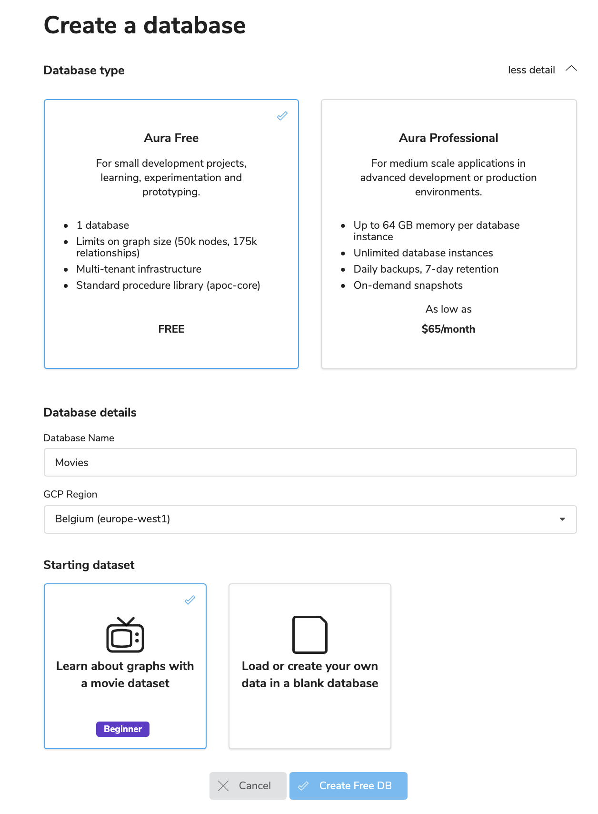
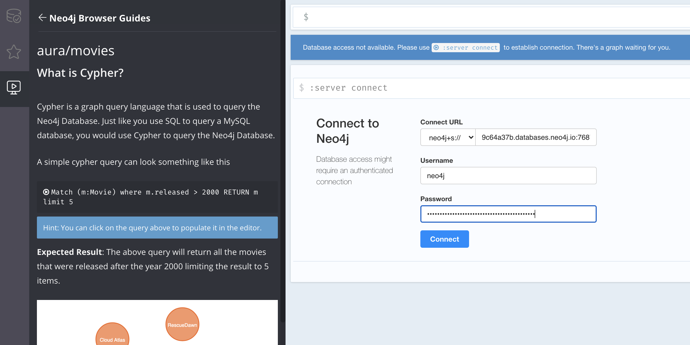
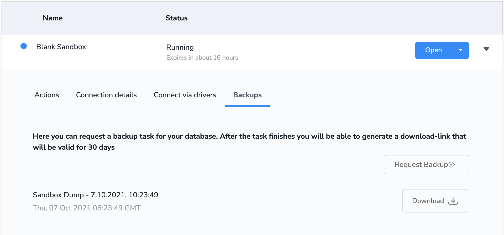
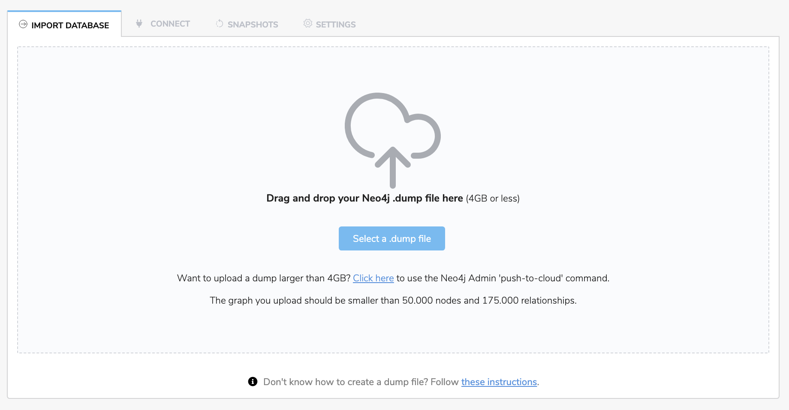
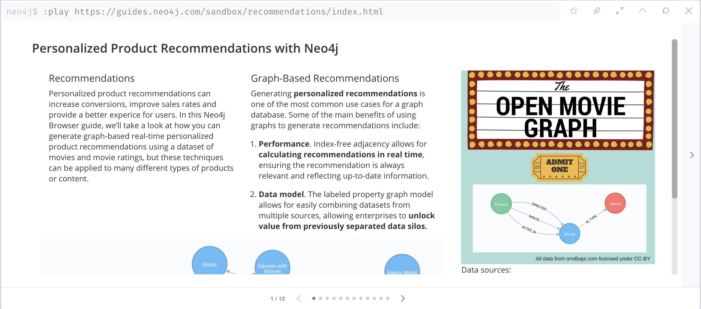
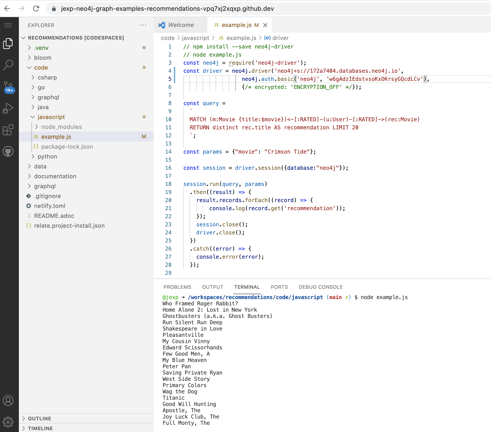
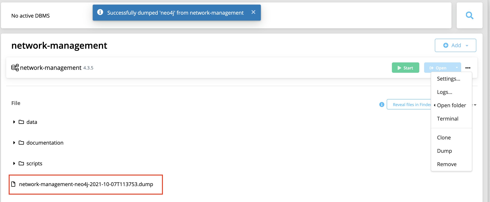

== Week 10 - Getting Dumps and Example Projects into Aura Free

This week we spoke quickly about the https://neo4j.com/developer-blog/exploring-the-pandora-papers-with-neo4j/[ICIJ Pandora Papers^], which we'll look at in more detail when the data is released in one of the next weeks.

The main topic was to explore the different ways of getting existing graph data into Aura from other Neo4j instances:

. New: Built In Movies Database and Guide
. Load a Dump from Neo4j Sandbox Backup
. Load a Dump from a Neo4j Graph Example Repository
. Load a Dump from Neo4j Desktop

=== New: Built In Movies Database and Guide

Aura Free has a new option for the newly created database. 
Besides the default empty database you can also select one with the small Movies dataset. 

On opening Neo4j Browser it shows a introductory, interactive Neo4j Browser Guide that guides you through the basics of the graph model and the Cypher query language.

Just make sure to connect to your database with your credentials after Neo4j-Browser opens.
Click on `:server connect` if the connection dialogue doesn't open automatically.

=== Load a Dump from Neo4j Sandbox Backup

Sometimes you have already loaded or computed data into a https://neo4j.com/sandbox[Neo4j Sandbox^] e.g. via libraries or functions that are not available in Aura Free like https://neo4j.com/labs/apoc/[APOC-full^], https://neo4j.com/labs/neosemantics/[neosemantics (RDF)^], or https://neo4j.com/product/graph-data-science-library/[Graph Data Science^].

Then you can take a Backup in the Sandbox UI and after downloading it, load it into your newly created or existing Aura Database.

In our example we loaded the https://blog.bruggen.com/2021/10/rebeergraph-importing-belgian-beergraph.html["Beer Graph" by Rik van Bruggen^]  with `apoc.load.html` from a Wikipedia.

The basic data model is:

[source,cypher]
----
(BeerBrand)-[:IS_A]->(BeerType)
(BeerBrand)<-[:BREWS]-(Brewery)
(BeerBrand)-[:HAS_ALCOHOLPERCENTAGE]->(AlcoholPercentage)
----

Here is the code to load it.

[source,cypher]
----
WITH "https://nl.wikipedia.org/wiki/Lijst_van_Belgische_bieren" as url
    CALL apoc.load.html(url, {
        brand: "table.wikitable tbody tr td:eq(0)", 
        beertype: "table.wikitable tbody tr td:eq(1)",
        alcoholpercentage: "table.wikitable tbody tr td:eq(2)",
        brewery: "table.wikitable tbody tr td:eq(3)",
        timeframe: "table.wikitable tbody tr td:eq(4)"
        }) yield value
WITH value, size(value.brand) as rangeup
UNWIND range(0,rangeup) as i
WITH value.brand[i].text as BeerBrand, value.brewery[i].text as Brewery, 
     value.alcoholpercentage[i].text as AlcoholPercentage, 
     value.beertype[i].text as BeerType, value.timeframe[i].text as Timeframe
MERGE (bt:BeerType {name: coalesce(BeerType,"Unknown")})
MERGE (bb:BeerBrand {name: coalesce(BeerBrand,"Unknown")})
SET bb.Timeframe = coalesce(Timeframe,"Unknown")
MERGE (br:Brewery {name: coalesce(Brewery,"Unknown")})
MERGE (ap:AlcoholPercentage {value: coalesce(AlcoholPercentage,"Unknown")})
MERGE (bb)-[:HAS_ALCOHOLPERCENTAGE]->(ap)
MERGE (bb)-[:IS_A]->(bt)
MERGE (bb)<-[:BREWS]-(br);
----

Afterwards we took the backup in the Sandbox UI, downloaded the dump file and then used the Aura Import UI to upload the dump.

It takes a few (10) minutes for the load to finish regardless of dump size as it's queued in the backend system.

=== Load a Dump from a Neo4j Graph Example Repository

All the sandbox datasets, with

* browser guides,
* example queries,
* data models,
* code examples (for Java, JavaScript, Python, .Net, Go and GraphQL) and also 
* data-dump files 

are available on the https://github.com/neo4j-graph-examples[GitHub organization neo4j-graph-examples^]

In our case we used the https://github.com/neo4j-graph-examples/recommendations["Recommendations"^] that contains the https://grouplens.org/datasets/movielens/[MovieLens user-ratings dataset^] together with movie and actor/director data from https://themoviedb.org.

The dataset consists of: 

* 28,863 nodes
* 166,261 relationships

which fit nicely into the limits of an Aura Free Instance (50k nodes, 175k relationshiops).

So we download the Neo4j 4.3 dump file from the https://github.com/neo4j-graph-examples/recommendations/tree/main/data[GitHub repository folder^] and then upload it via the Aura UI as before.

In your Aura Database you can then also use the Browser guide with:

----
:play https://guides.neo4j.com/sandbox/recommendations/index.html
----

And run the https://github.com/neo4j-graph-examples/recommendations/tree/main/code[code examples^] from Sandbox (e.g. from a GitHub Codespace on a Fork of the Repository) against your Aura Free instance.

=== Load a Dump from Neo4j Desktop

You can also create a dump in Neo4j Desktop, just by selecting the "dump" Action from your database menu.

Then the upload mechanism is the same as before.
