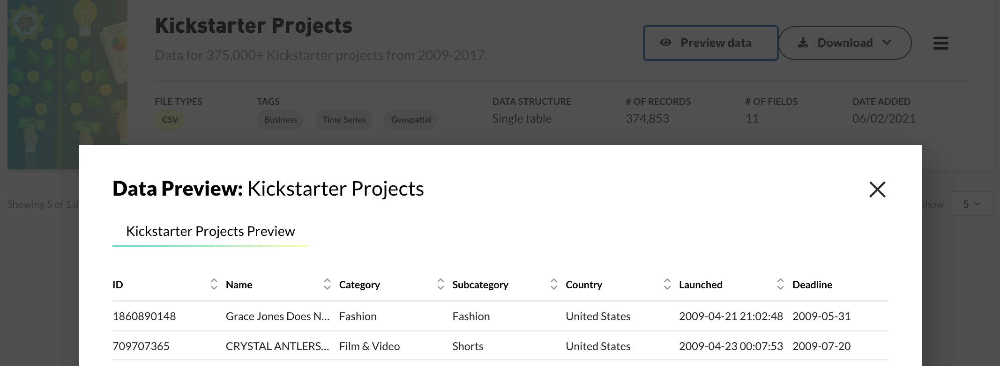
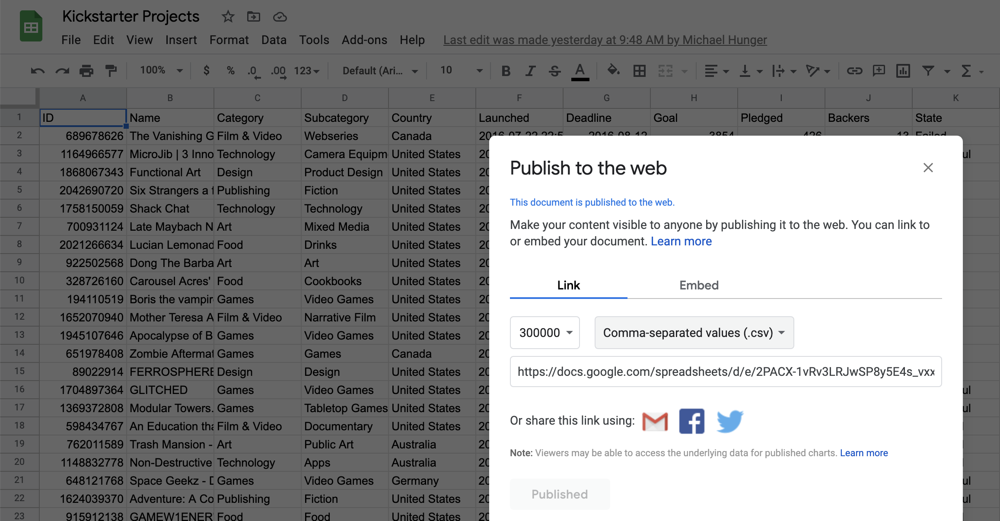
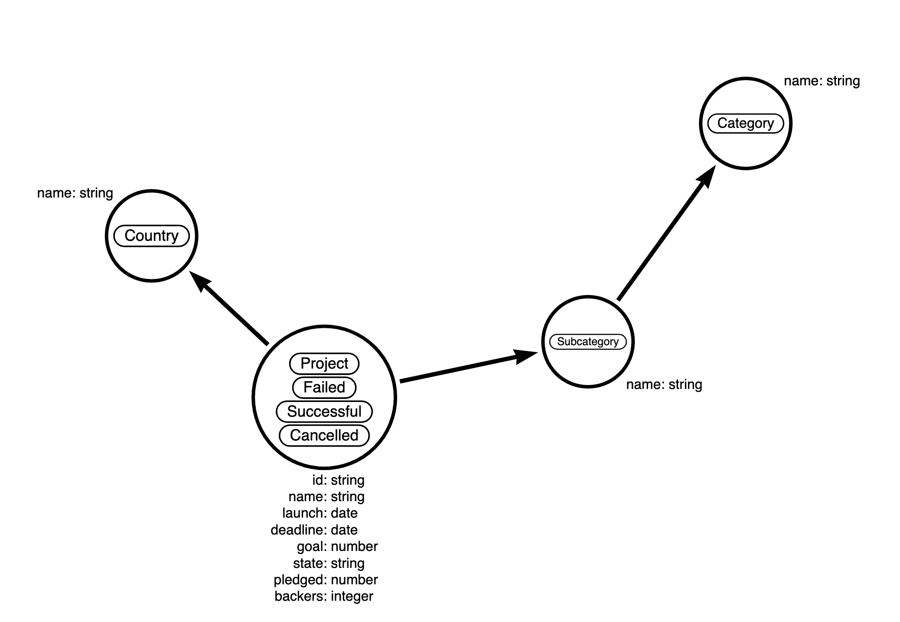
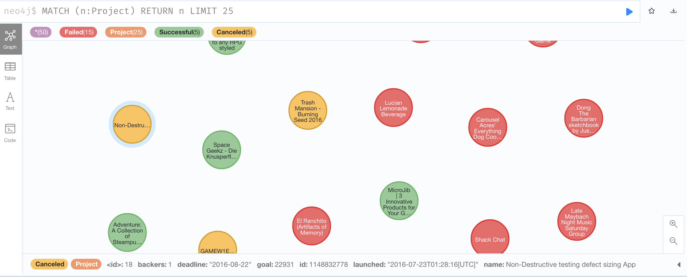
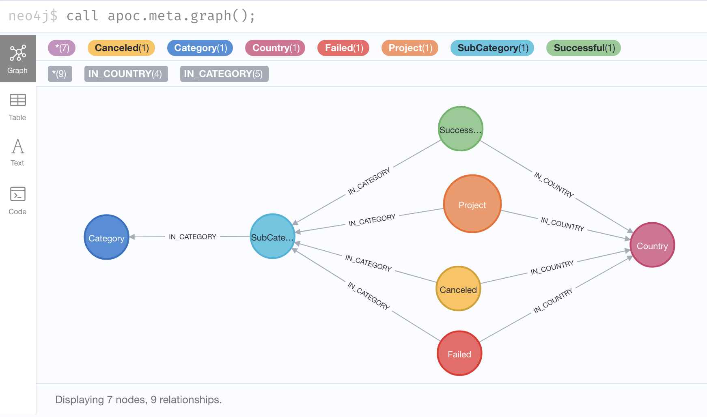
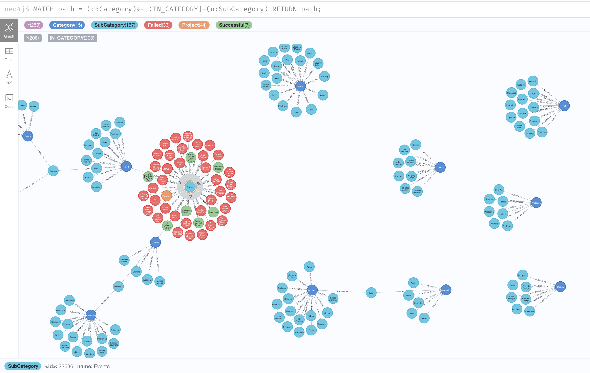

== Week 11 - Importing and Querying Kickstarter Projects

This week for our "Discover Aura Free" Series, we want to look at dataset from Maven Analytics recommended by our colleague Jennifer Reif.

https://www.mavenanalytics.io/data-playground?accessType=open&search=kickstarter

So if you want to code along, sign up to or in to https://dev.neo4j.com/aura, create your free database and join us.

Being avid https://www.kickstarter.com[Kickstarter^] backers (esp. for board games and gadgets) ourselves, that dataset was most compelling to us. 

Here is the video of our live-stream:

https://www.youtube.com/watch?v=LuYRvzL4i1k&list=PL9Hl4pk2FsvVZaoIpfsfpdzEXxyUJlAYw&index=10

We looked at the kickstarter site overall and at a https://www.kickstarter.com/projects/327718895/beast-4[particular project^] to also be able to relate the data in the dataset with the actual site.

The dataset contains 375k kickstarter projects from 2009 to 2017 including category, country and pledge data.

Some questions we can ask after importing the datasets:

* what does the (sub)-category tree look like visually in terms of success
* what are the most successful categories or countries
* what are highest pledges of successful projects

=== Dataset

The data is available as zip download with 2 CSVs, one with the data dictionary, the other with 375k rows of Kickstarter projects.

Columns:

* ID - Internal kickstarter id
* Name - Name of the project
* Category - Project category
* Subcategory - Project subcategory
* Country - Country the project is from
* Launched - Date the project was launched
* Deadline - Deadline date for crowdfunding
* Goal - Amount of money the creator needs to complete the project (USD)
* Pledged - Amount of money pledged by the crowd (USD)
* Backers - Number of backers (integer)
* State - Current condition the project is in (as of 2018-01-02) (Successful, Canceled, Failed, Live, Suspended)

To make it easier to import I would usually upload the CSV file somewhere publicly to access it easily, like GitHub, Pastebin or S3. 

This time we wanted to demonstrate how you can use Google Spreadsheets for that.

After uploading the 100k chunk of the file as a new sheet, you can chose "File -> Publish to the Web" to publish a single sheet e.g. as a CSV publicly.

So other tools and people can access just that data readonly, including our Neo4j instance.

[NOTE]
Google spreadsheets didn't like to import the full 400k rows so we split the file using `xsv split -c 10000 split kickstarter.csv` into smaller chunks (`csvkit` works too, or just `head -10000` in any unix shell).

As the long URL is a bit unwieldy, we created a bit.ly shortlink for our needs: https://dev.neo4j.com/kickstarter

=== Data Model

The data model has some interesting tidbits, esp. around modeling the State.

We could model the state just as a property like in the CSV, but as there are only a few relevant states and it's an important attribute of a project to distinguish them, we can also add labels to a project for

* Successful
* Failed
* Canceled

That helps us to visualize the state of a project quickly and also sub-select the relevant projects easily.

We extract the subcategory and category and the country as separate nodes.

We could extract the pledge information into a separate node e.g. for finance / security reasons, but we kept it in the project for simplicity.

=== Import

After creating our blank AuraDB Free database, and opening Neo4j Browser we can get going.

==== Exploring the CSV

We can just look at the first few rows of the data 

[source,cypher]
----
load csv with headers from "https://dev.neo4j.com/kickstarter" as row 
return row limit 5;
----

which gives us object/hash/dict/map representations of each row with the headers as key and the row data  as values.

NOTE: All values are strings, if we want to convert them we need to do that manually.

----
{
  "Goal": "3854",
  "Category": "Film & Video",
  "Subcategory": "Webseries",
  "State": "Failed",
  "Pledged": "426",
  "Deadline": "2016-08-12",
  "Country": "Canada",
  "Backers": "13",
  "ID": "689678626",
  "Launched": "2016-07-22 22:53:49",
  "Name": "The Vanishing Garden"
}
----

We also check how many rows our dataset contains.

[source,cypher]
----
load csv with headers from "https://dev.neo4j.com/kickstarter" as row 
return count(*);
----

That returns 75k rows, which is a bit much for our AuraDB free instance (50k nodes, 175k rels).

So we need to cut it down, but because we want to have projects of all kinds of status, we can subselect a single year to use, that gives us roughly 22k rows to work with.

[source,cypher]
----
load csv with headers from "https://dev.neo4j.com/kickstarter" as row 
with row where row.Launched starts with '2016'
return count(*);
----

==== Setup

First we create a bunch of constraints to ensure data uniqueness and speed up the import when looking up existing data:

[source,cypher]
----
create constraint on (p:Project) assert p.id is unique;
create constraint on (c:Category) assert c.name is unique;
create constraint on (c:SubCategory) assert c.name is unique;
create constraint on (c:Country) assert c.name is unique;
----

==== Importing Projects

We import the data incrementally, starting with the projects.
We use MERGE here so that we can re-run the import without causing duplication.

[source,cypher]
----
load csv with headers from "https://dev.neo4j.com/kickstarter" as row 
with row where row.Launched starts with '2016'

MERGE (p:Project {id:row.ID})
ON CREATE SET 
p.name = row.Name, 
p.launched = date(substring(row.Launched,0,10))
p.deadline = date(row.Deadline)
p.state = row.State;
----

We'll add the pledge information later.

We see that it imported some 22k projects, by clicking on the (Project) pill in the sidebar we can quickly pull up a few projects in the visualization.

Now we want to turn the state information into labels.
For just the 3 labels we can run a single update statement each, that adds a label of the right kind to the project node.

[source,cypher]
----
MATCH (p:Project) WHERE p.state = 'Successful' SET p:Successful;
MATCH (p:Project) WHERE p.state = 'Failed' SET p:Failed;
MATCH (p:Project) WHERE p.state = 'Canceled' SET p:Canceled;
----

So if we now query projects from the sidebar we see their success even visually.
In the stream we discuss styling the colors, by clicking on the pills on top of the visualization and then choosing a different color.

==== Importing Categories

Importing the categories involves creating nodes for them and then connecting the subcategory to the project and the subcategory to the category.
As we use MERGE here, it also ensures each relationship is created only once.

[source,cypher]
----
load csv with headers from "https://dev.neo4j.com/kickstarter" as row 
with row where row.Launched starts with '2016'

match (p:Project {id:row.ID})
merge (sc:SubCategory {name:row.Subcategory})
merge (p)-[:IN_CATEGORY]->(sc)
merge (c:Category {name:row.Category})
merge (sc)-[:IN_CATEGORY]->(c)
return count(*);
----

[NOTE]
====
Please note that shared names of subcategories in this approach will be merged together into a single one.

If you don't want this, you have to create the subcategories in the context of a category, like shown below.
====

[source,cypher]
----
load csv with headers from "https://dev.neo4j.com/kickstarter" as row 
with row where row.Launched starts with '2016'

match (p:Project {id:row.ID})
merge (c:Category {name:row.Category})
merge (sc:SubCategory {name:row.Subcategory})-[:IN_CATEGORY]->(c)
merge (p)-[:IN_CATEGORY]->(sc)
return count(*);
----

----
We can now run a bunch of queries to see which categories exist, how many there are and to get a visual.

.Querying Categories
[source,cypher]
----
MATCH (n:Category) RETURN n LIMIT 25;

MATCH (n:Category) RETURN count(*);

MATCH (n:SubCategory) RETURN count(*);

MATCH path = (c:Category)<-[:IN_CATEGORY]-(n:SubCategory) RETURN path;
----

==== Importing Countries:

Importing countries is pretty straightforward, just create the node for a country if it doesn't exist and connect it to the project.

[source,cypher]
----
load csv with headers from "https://dev.neo4j.com/kickstarter" as row 
with row where row.Launched starts with '2016'

match (p:Project {id:row.ID})
merge (c:Country {name:row.Country})
merge (p)-[:IN_COUNTRY]->(c)
return count(*);
----

==== Importing Pledges and Backers

Originally we had discussed extracting the backing information into separate nodes, but given the questions and the time we had we leave that as an exercise.

So we just find our projects again based on their id and set the few extra properties, remember to convert them to numeric values as needed.

[source,cypher]
----
load csv with headers from "https://dev.neo4j.com/kickstarter" as row 
with row where row.Launched starts with '2016'

match (p:Project {id:row.ID})
set p.pledge = toInteger(row.Pledged)
set p.goal = toInteger(row.Goal)
set p.backers = toInteger(row.Backers)
return count(*);
----

If we want to explore our imported data model visually, we can use `apoc.meta.graph` procedure.

Which shows both the base data model but also our extra labels

[source,cypher]
----
call apoc.meta.graph();
----

=== Querying

Now with the data in our graph we can start visualizing and querying it and answer our question.

==== Top Projects & Pledges

.Most Backers of a failed project
[source,cypher]
----
MATCH (p:Project:Failed)
RETURN p.name, p.backers
ORDER BY p.backers DESC LIMIT 20
----

Sad for the wolfes :(

----
╒════════════════════════════════════════════════════════╤═══════════╕
│"p.name"                                                │"p.backers"│
╞════════════════════════════════════════════════════════╪═══════════╡
│"Save The Wolves!"                                      │3867       │
├────────────────────────────────────────────────────────┼───────────┤
│"Voyage of Fortune's Star — a 7th Sea cRPG"             │1287       │
├────────────────────────────────────────────────────────┼───────────┤
│"K11 Bumper | iPhone 7 and 7 Plus"                      │1032       │
├────────────────────────────────────────────────────────┼───────────┤
│"{THE AND} Global Relationship Project"                 │830        │
├────────────────────────────────────────────────────────┼───────────┤
│"New55 COLOR 4x5 Peelapart Film"                        │805        │
├────────────────────────────────────────────────────────┼───────────┤
│"Russian Subway Dogs"                                   │778        │
...
----

.Highest Average Pledge for Successful Projects
[source,cypher]
----
MATCH (n:Project:Successful) where n.backers > 0 
RETURN n.name, toFloat(n.pledge) / n.backers as pledgeValue
ORDER BY pledgeValue desc limit 10;
----

Professional chefs cooking at your home, e-bikes, art-guitars, 3d-printers, all expeected but still pretty high pledges. 

I think my highest was $750 for a laser cutter :)

----
╒════════════════════════════════════════════════════════════╤══════════════════╕
│"n.name"                                                    │"pledgeValue"     │
╞════════════════════════════════════════════════════════════╪══════════════════╡
│"Cooks at your home"                                        │6862.5            │
├────────────────────────────────────────────────────────────┼──────────────────┤
│"Project ArtGuitar® features Palehorse"                     │3900.0            │
├────────────────────────────────────────────────────────────┼──────────────────┤
│"Gocycle - the BEST folding electric bike in the world!"    │2509.4285714285716│
├────────────────────────────────────────────────────────────┼──────────────────┤
│"Futuristic Mechanical Tourbillon Watch Made Into Reality"  │2300.3            │
├────────────────────────────────────────────────────────────┼──────────────────┤
│"Tantrum Cycles, the Missing Link in full suspension bikes" │2079.128205128205 │
├────────────────────────────────────────────────────────────┼──────────────────┤
│"New Carbon SUV e-bike"                                     │2023.5074626865671│
├────────────────────────────────────────────────────────────┼──────────────────┤
│"RoVa4D Full Color Blender 3D Printer"                      │1998.5            │
----

==== Categories

.Visual Exploration of Category Tree and Projects
[source,cypher]
----
MATCH path = (c:Category)<-[:IN_CATEGORY]-(n:SubCategory) 
RETURN path;
----

We can show the category tree and expand a few subcategories to see their projects (and their state) visually in one picture.

.Top Categories and their State
[source,cypher]
----
MATCH (c:Category)<-[:IN_CATEGORY]-(n:SubCategory)<-[:IN_CATEGORY]-(p:Project) 
RETURN c.name, p.state, count(*)
ORDER BY count(*) desc LIMIT 50;
----

.Top Categories in Numbers of Projects
[source,cypher]
----
MATCH (c:Category)<-[:IN_CATEGORY]-(n:SubCategory)<-[:IN_CATEGORY]-(p:Project) 
RETURN c.name, count(*)
ORDER BY count(*) desc LIMIT 10;
----

Kinda expected, let's look at the successful ones.

----
╒══════════════╤══════════╕
│"c.name"      │"count(*)"│
╞══════════════╪══════════╡
│"Technology"  │2959      │
├──────────────┼──────────┤
│"Games"       │2889      │
├──────────────┼──────────┤
│"Film & Video"│2673      │
├──────────────┼──────────┤
│"Design"      │2592      │
├──────────────┼──────────┤
│"Publishing"  │2353      │
├──────────────┼──────────┤
│"Music"       │2175      │
├──────────────┼──────────┤
│"Fashion"     │1630      │
├──────────────┼──────────┤
│"Food"        │1416      │
├──────────────┼──────────┤
│"Art"         │1355      │
├──────────────┼──────────┤
│"Comics"      │802       │
└──────────────┴──────────┘
----

.Top Categories in Numbers of Successful Projects
[source,cypher]
----
MATCH (c:Category)<-[:IN_CATEGORY]-(n:SubCategory)<-[:IN_CATEGORY]-(p:Project:Successful) 
RETURN c.name, count(*)
ORDER BY count(*) desc LIMIT 10;
----

Not that many, in Tech, Art, but many comics and in design, music also has almost 50% success rate.

----
╒══════════════╤══════════╕
│"c.name"      │"count(*)"│
╞══════════════╪══════════╡
│"Games"       │1108      │
├──────────────┼──────────┤
│"Design"      │1002      │
├──────────────┼──────────┤
│"Music"       │969       │
├──────────────┼──────────┤
│"Film & Video"│939       │
├──────────────┼──────────┤
│"Publishing"  │859       │
├──────────────┼──────────┤
│"Technology"  │599       │
├──────────────┼──────────┤
│"Art"         │509       │
├──────────────┼──────────┤
│"Comics"      │465       │
├──────────────┼──────────┤
│"Fashion"     │426       │
├──────────────┼──────────┤
│"Food"        │346       │
└──────────────┴──────────┘
----

.Success Rate of Categories
[source,cypher]
----
MATCH (c:Category)<-[:IN_CATEGORY]-(n:SubCategory)<-[:IN_CATEGORY]-(p:Project) 
WITH  c.name as category, count(*) as total, 
sum(case when p:Failed then 1 else 0 end) as failed,
sum(case when p:Successful then 1 else 0 end) as success
RETURN category, total, toFloat(failed)/total as fP, toFloat(success)/total as sP
order by sP desc;
----

We can calculate the totals, and partials of failed and successful projects across the category tree and then sort by success rate.

Of course this is skewed towards categories with fewer projects as there is less competition and a few more successful projects have oversized impact.

----
╒══════════════╤═══════╤═══════════════════╤═══════════════════╕
│"category"    │"total"│"fP"               │"sP"               │
╞══════════════╪═══════╪═══════════════════╪═══════════════════╡
│"Comics"      │802    │0.3329177057356609 │0.5798004987531172 │
├──────────────┼───────┼───────────────────┼───────────────────┤
│"Dance"       │195    │0.40512820512820513│0.5282051282051282 │
├──────────────┼───────┼───────────────────┼───────────────────┤
│"Theater"     │462    │0.42207792207792205│0.5021645021645021 │
├──────────────┼───────┼───────────────────┼───────────────────┤
│"Music"       │2175   │0.4606896551724138 │0.44551724137931037│
├──────────────┼───────┼───────────────────┼───────────────────┤
│"Design"      │2592   │0.44753086419753085│0.38657407407407407│
├──────────────┼───────┼───────────────────┼───────────────────┤
│"Games"       │2889   │0.42990654205607476│0.38352371062651436│
├──────────────┼───────┼───────────────────┼───────────────────┤
│"Art"         │1355   │0.5328413284132841 │0.3756457564575646 │
├──────────────┼───────┼───────────────────┼───────────────────┤
│"Publishing"  │2353   │0.5316617084572886 │0.36506587335316615│
├──────────────┼───────┼───────────────────┼───────────────────┤
│"Photography" │529    │0.5085066162570888 │0.3648393194706994 │
...
----

==== Querying Countries

.Countries by projects
[source,cypher]
----
MATCH (n:Country) 
RETURN n.name, 
size((n)<-[:IN_COUNTRY]-()) AS projects 
ORDER BY projects DESC;
----

Surprised to see Canada and Australia so high up there, compared to their population, but the US is leading by an order of magnitude

----
╒════════════════╤══════════╕
│"n.name"        │"projects"│
╞════════════════╪══════════╡
│"United States" │14836     │
├────────────────┼──────────┤
│"United Kingdom"│2181      │
├────────────────┼──────────┤
│"Canada"        │1217      │
├────────────────┼──────────┤
│"Germany"       │652       │
├────────────────┼──────────┤
│"Australia"     │647       │
├────────────────┼──────────┤
│"Italy"         │454       │
├────────────────┼──────────┤
│"France"        │436       │
├────────────────┼──────────┤
│"Spain"         │355       │
├────────────────┼──────────┤
│"Mexico"        │290       │
├────────────────┼──────────┤
│"Netherlands"   │240       │
├────────────────┼──────────┤
│"Sweden"        │199       │
----

.Country success rate
[source,cypher]
----
MATCH (c:Country)<-[:IN_COUNTRY]-(p:Project) 
WITH  c.name as category, count(*) as total, 
sum(case when p:Failed then 1 else 0 end) as failed,
sum(case when p:Successful then 1 else 0 end) as success
RETURN category, total, toFloat(failed)/total as fP, 
       toFloat(success)/total as sP
ORDER BY sP DESC;
----

But if you actually want to be successful, being in New Zealand, Singapore, Ireland or Sweden helps :)

----
╒════════════════╤═══════╤═══════════════════╤═══════════════════╕
│"category"      │"total"│"fP"               │"sP"               │
╞════════════════╪═══════╪═══════════════════╪═══════════════════╡
│"United Kingdom"│2181   │0.4667583677212288 │0.41127922971114167│
├────────────────┼───────┼───────────────────┼───────────────────┤
│"New Zealand"   │128    │0.453125           │0.3984375          │
├────────────────┼───────┼───────────────────┼───────────────────┤
│"Singapore"     │140    │0.5214285714285715 │0.37857142857142856│
├────────────────┼───────┼───────────────────┼───────────────────┤
│"Ireland"       │95     │0.5263157894736842 │0.3684210526315789 │
├────────────────┼───────┼───────────────────┼───────────────────┤
│"Sweden"        │199    │0.46733668341708545│0.36180904522613067│
├────────────────┼───────┼───────────────────┼───────────────────┤
│"United States" │14836  │0.5184685899164195 │0.35541925047182527│
----

=== Conclusion

With the data in the AuraDB Free database you can now do a lot of things.

* Continue to explore and analyze the full dataset
* Add more data from other sources, e.g. the Kickstarter API to create a fuller knowledge graph
* Built a kickstarter like app, or an analytics dashboard, e.g. using GraphQL.
