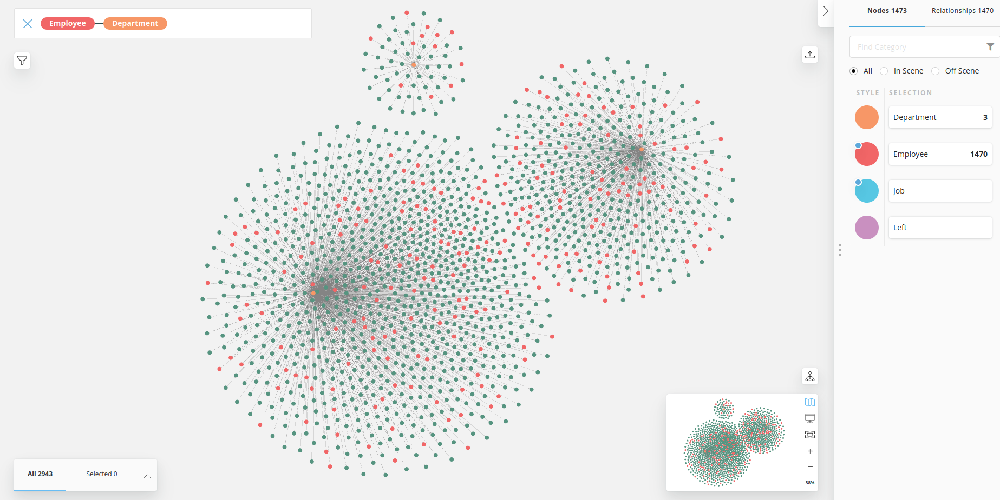
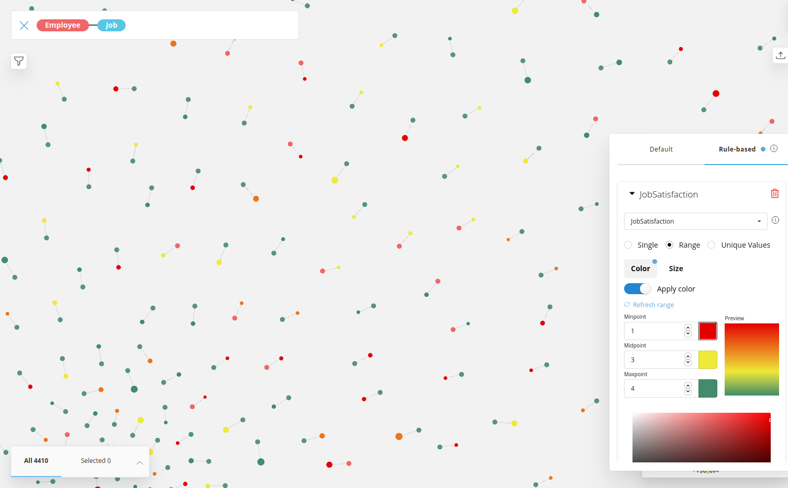
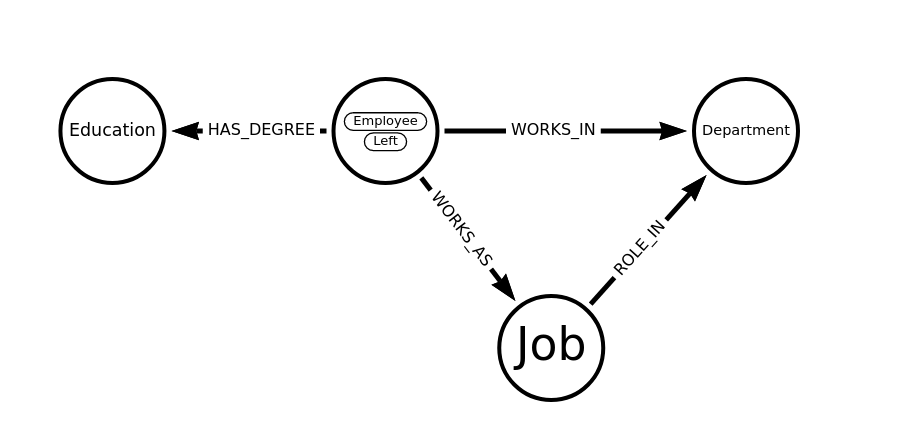

== Week 13 - Exploring a Kaggle HR Attrition Dataset

Neo4j has been used in several HR applications and use-cases.
E.g. for sales hierarchies, skills-management, recruiting applications, learning paths, internal role recommendations and more.

So when I found that https://www.kaggle.com/singhnproud77/hr-attrition-dataset[IBM Attrition Dataset^] as one of the trending datasets on Kaggle, I wanted to give it a try.

The dataset is meant for attrition prediction, but we don't take it that far, we just import and model it into AuraDB free and explore some of the visual aspects of the data.

=== Dataset

The dataset is a CSV with 32 columns with all kinds of employee data

* attrition
* department, role, job level, mode of work
* salary, salary increase percentage, stock options
* overtime, job satisfaction, job involvement
* education degree
* hire date, years at company, years since last promontion, years with mgr, source of recruiting
* leaves, absenteeism, work accidents
* workplace, distance, travel frequency
* gender, maritalstatus
* number of companies worked for, working years

=== Importing Attrition Data

We put that CSV into a https://gist.github.com/jexp/e329b8cb8fdb9176ae67991d3e7d4941[GitHub Gist^] and use a shortlink for accessing the raw file https://git.io/JX0dU.

.First few records
[source,cypher]
----
load csv with headers from "https://git.io/JX0dU" as row 
return row limit 5;
----

----
{
  "null": null,
  "DistanceFromHome": "2",
  "OverTime": "Yes",
  "BusinessTravel": "Travel_Rarely",
  "Date_of_termination": null,
  "Status_of_leaving": "Salary",
  "Absenteeism": "2",
  "Gender": "Male",
  "Attrition": "Yes",
  "Source_of_Hire": "Job Event",
  "YearsAtCompany": "0",
  "Mode_of_work": "OFFICE",
  "Leaves": "4",
  "Department": "Research & Development",
  "Job_mode": "Contract",
  "TotalWorkingYears": "7",
  "PercentSalaryHike": "15",
  "MonthlyIncome": "2090",
  "Age": "37",
  "JobInvolvement": "2",
  "JobSatisfaction": "3",
  "JobLevel": "1",
  "Work_accident": "No",
  "Date_of_Hire": "21-01-2021",
  "PerformanceRating": "3",
  "YearsSinceLastPromotion": "0",
  "JobRole": "Laboratory Technician",
  "Higher_Education": "Graduation",
  "TrainingTimesLastYear": "3",
  "MaritalStatus": "Single",
  "YearsWithCurrManager": "0",
  "NumCompaniesWorked": "6",
  "StockOptionLevel": "0"
}
----

Unfortunately there is no id column to identify employees, so we need to use the https://neo4j.com/docs/cypher-manual/current/functions/load-csv/[`linenumber()` function^], and as it starts at 2 (probably 1 is the header row), subtract 1.

To import our data, this time we just import all attributes of a row into a single Employee node and will later extract other nodes as we progress through the data.

As all the CSV values are returned as strings, we'd have to convert them to numbers or booleans as needed, but we can also do that later.

* toFloat("3.14")
* toInteger("42")
* boolean: value = "Yes"
* date('2020-01-01')

This import statement using `MERGE`is idempotent, so we can run it time and again, without new nodes being created if they already exist with that id.

It creates 1470 nodes which is the number of rows in our dataset.

[source,cypher]
----
LOAD CSV WITH HEADERS FROM "https://git.io/JX0dU" AS row 

WITH linenumber()-1 AS id, row
MERGE (e:Employee {id:id}) 
ON CREATE SET e += row, 
   e.DistanceFromHome = toInteger(row.DistanceFromHome);
----

We want to set the Attrition fact as a label on the node, we picked `:Left` because it's harder to misspell :)

[source,cypher]
----
MATCH (e:Employee) 
WHERE e.Attrition = 'Yes' 
SET e:Left;
----

=== Extract Department

The first node we want to extract is the department.
We will merge department on name to prevent duplicates and create the relationship to employee.

[source,cypher]
----
// see some departments
match (e:Employee)
return e.Department limit 5;

// create unique departments and connect them
match (e:Employee)
merge (d:Department {name:e.Department})
merge (e)-[r:WORKS_IN]->(d);

MATCH p=()-[r:WORKS_IN]->() RETURN p LIMIT 25;
----

Now we can inspect the departments and their employees, e.g. by opening Neo4j Bloom on this database and running the `Employee Department` search phrase and styling the employee by Attrition.

We can also look at the percentage leavers and see that R&D despite being the largest, has the lowest percentage of leavers.

[source,cypher]
----
match (d:Department)<-[:WORKS_IN]-(e)
return d.name, count(*) as total, sum(case when e:Left then 1 else 0 end) as left
order by total desc;

// compute leaver percentage
match (d:Department)<-[:WORKS_IN]-(e)
with d.name as dep, count(*) as total, sum(case when e:Left then 1 else 0 end) as left
return dep, total, left, toFloat(left)/total as percent
order by percent desc;
----

----
╒════════════════════════╤═══════╤══════╤═══════════════════╕
│"dep"                   │"total"│"left"│"percent"          │
╞════════════════════════╪═══════╪══════╪═══════════════════╡
│"Sales"                 │446    │92    │0.2062780269058296 │
├────────────────────────┼───────┼──────┼───────────────────┤
│"Human Resources"       │63     │12    │0.19047619047619047│
├────────────────────────┼───────┼──────┼───────────────────┤
│"Research & Development"│961    │133   │0.1383975026014568 │
└────────────────────────┴───────┴──────┴───────────────────┘
----

=== Extracting Role and Job related Data

Next we can extract the role and some of the related job data.

We could just store it on the relationship to the department but wanted to connect other information to the core concept of employment, so we turn it into a node.

This time we use `CREATE` to get one instance of a role per employee.

[source,cypher]
----
MATCH (e:Employee)
CREATE (j:Job {name:e.JobRole})
SET j.JobSatisfaction=toInteger(e.JobSatisfaction), 
    j.JobInvolvement = toInteger(e.JobInvolvement), 
    j.JobLevel = toInteger(e.JobLevel), 
    j.MonthlyIncome = toInteger(e.MonthlyIncome)
MERGE (e)-[r:WORKS_AS]->(j);
----

We can now color the role by job satisfaction (red-yellow-green) in bloom and size it by salary.

This allows us to see pairs of red-red (unsatisified-left), green-green (satisfied-retained) and the critical red-green (unsatisfied-not yet left) nodes between employees and their roles.

We forgot to create the relationship between role and department, but fortunately we can just spell our our graph pattern and close the triangle that you can also see in the data model below.

[source,cypher]
----
MATCH (d:Department)<-[:WORKS_IN]-(e:Employee)-[:WORKS_AS]->(j:Job)
MERGE (j)-[:ROLE_IN]->(d);
----

We could use the Job Level in conjunction with the roles to create an hierarchy of roles, but as we don't know who reported to whom, we can't tell much about the real org-level.

=== Data Model

So far we ended up with this data model, but there are more and different approaches to extract relevant information into separate nodes.

Some of the attributes, like role, salary etc. we could also have modeled as relationship properties the WORKS_IN relationship of Department, but we wanted to show and highlight the roles as first class entities in our model.

=== Extracting Education

Turning Education into a node was straightforward but not as insightful.

[source,cypher]
----
match (e:Employee)
merge (edu:Education {name:e.Higher_Education})
merge (e)-[r:HAS_DEGREE]->(edu);

MATCH (edu:Education)
RETURN edu.name, size( (edu)<--() ) as count
ORDER BY c DESC;
----

We find 4 types of education, pretty evenly distributed.

----
╒═════════════════╤═══╕
│"edu.name"       │"c"│
╞═════════════════╪═══╡
│"Post-Graduation"│387│
├─────────────────┼───┤
│"Graduation"     │367│
├─────────────────┼───┤
│"PHD"            │358│
├─────────────────┼───┤
│"12th"           │358│
└─────────────────┴───┘
----

We now can also start looking for patterns, like people that have similar education like leavers and which ones is most frequent.

[source,cypher]
----
MATCH (e:Left)-[:HAS_DEGREE]->(edu)<-[:HAS_DEGREE]-(e2)
return edu.name, e2:Left as hasLeft, count(distinct e2) as c order by c desc;
----

But again those numbers are pretty close so not that predictive.

----
╒═════════════════╤═════════╤═══╕
│"edu.name"       │"hasLeft"│"c"│
╞═════════════════╪═════════╪═══╡
│"Post-Graduation"│false    │323│
├─────────────────┼─────────┼───┤
│"Graduation"     │false    │309│
├─────────────────┼─────────┼───┤
│"PHD"            │false    │301│
├─────────────────┼─────────┼───┤
│"12th"           │false    │300│
├─────────────────┼─────────┼───┤
│"Post-Graduation"│true     │64 │
├─────────────────┼─────────┼───┤
│"Graduation"     │true     │58 │
├─────────────────┼─────────┼───┤
│"12th"           │true     │58 │
├─────────────────┼─────────┼───┤
│"PHD"            │true     │57 │
└─────────────────┴─────────┴───┘
----

=== Temporal Data

We wanted to see how recent the data is to we returned the min- and max hire date, unfortunately the date strings are not iso formatted, so the results were not useful and we had to convert them into date values.

Because they are not iso formatted dates, we can't use the built in  functions `date("2021-11-08")` but need to make use of the APOC utility library, and its `apoc.temporal.toZonedTemporal` which can use a supplied format.

[source,cypher]
----
call apoc.help("temporal");

match (e:Employee) 
set e.Date_of_Hire = date(apoc.temporal.toZonedTemporal(e.Date_of_Hire,"dd-MM-yyyy"));

match (e:Employee) return min(e.Date_of_Hire), max(e.Date_of_Hire);
----

Now we see that the dataset is current and that the earliest employee is from 1969 :)

----
╒═════════════════════╤═════════════════════╕
│"min(e.Date_of_Hire)"│"max(e.Date_of_Hire)"│
╞═════════════════════╪═════════════════════╡
│"1969-06-19"         │"2021-06-25"         │
└─────────────────────┴─────────────────────┘
----

As the dataset also contains the `YearsAtCompany` information, we can compute the date until which they are employed and set it as a new attribute using the built-in `duration` arithmetics.

[source,cypher]
----
match (e:Employee) 
set e.Employed_Until = e.Date_of_Hire + duration({years:toInteger(e.YearsAtCompany)});

match (e:Employee) return min(e.Employed_Until), max(e.Employed_Until);
----

The first employee left in 1994 and the dataset seems to be from June 2021.

----
╒═══════════════════════╤═══════════════════════╕
│"min(e.Employed_Until)"│"max(e.Employed_Until)"│
╞═══════════════════════╪═══════════════════════╡
│"1994-06-19"           │"2021-06-30"           │
└───────────────────────┴───────────────────────┘
----

=== Similarity Network and Predictions

As you would need the graph data science library for computing similarity networks or node classification based on attributes and then using them to identify similar employees to the leavers that have not left yet and try to help them with their career.

In Neo4j Sandbox, Desktop or soon AuraDS you can project the isolated employee data into a in-memory graph with rescaled, normalized attributes, that form an vector of information about each employee.

Those vectors can then either be used to compute a similarity network with k-nearest-neighbors or node-similarity. 
That network can then be analysed for tightly knit clusters that identify similar people and see the risk of churning per cluster. 
For high risk clusters the people that have not yet left, can be identified and worked with.

Alternatively those vectors, our extracted nodes and the similarity network can be to compute node embeddings that then are utilized in training a node-classification algorithm to predict attrition.

=== Resources

* GitHub Gist: https://gist.github.com/jexp/e329b8cb8fdb9176ae67991d3e7d4941
* ShortLink to Raw CSV: https://git.io/JX0dU
* Datamodel
* https://medium.com/neo4j/cypher-sleuthing-dealing-with-dates-part-1-90eff82b113d[5-part series on temporal data in Neo4j^]
