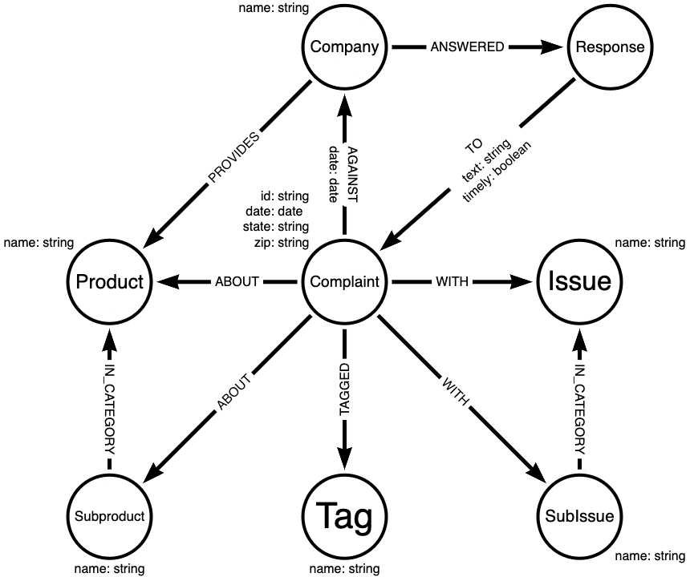
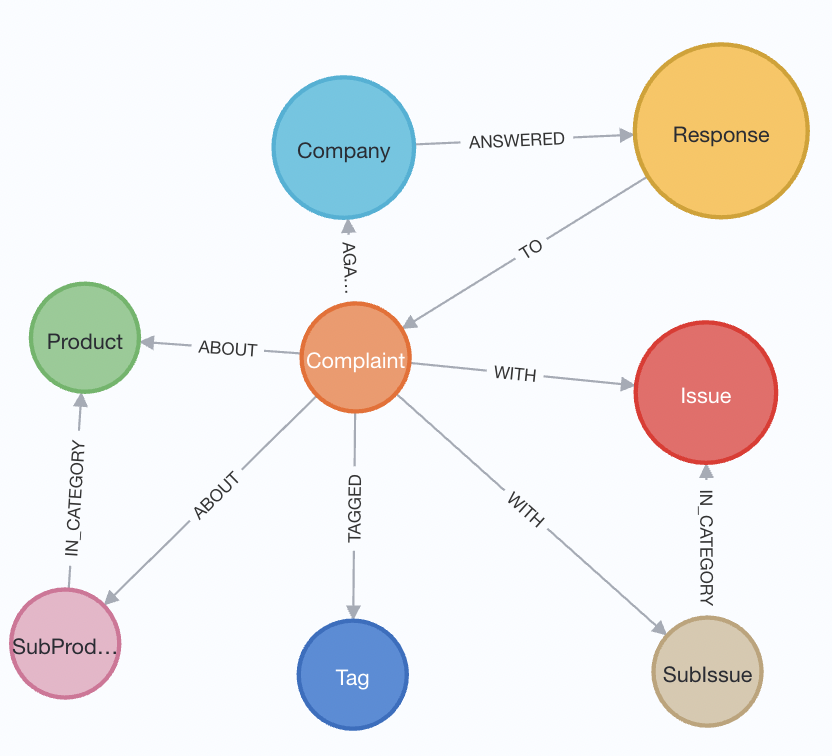

== Week 14 - Consumer Complaints Database

In 2015 our data scientist Nicole White ran a Webinar https://www.youtube.com/watch?v=Eh_79goBRUk["LOAD CSV in the Real World"^], which is really popular.
It has more than 56k views and people are still referring to it frequently because it is so well done.

That's why we decided this time in our live-stream to re-enact Nicole's webinar with Neo4j 4.3 and AuraDB Free to give people todays equivalent of that session.

=== References

* Consumer Complaints Database: https://catalog.data.gov/dataset/consumer-complaint-database
* https://www.youtube.com/watch?v=Eh_79goBRUk[Nicole White's webinar "LOAD CVS in the real World"^]
* https://github.com/nicolewhite/neo4j-complaints[Nicole's GitHub repository^]

=== Dataset

The consumer https://catalog.data.gov/dataset/consumer-complaint-database[complaints database^] is available with data since 2011 from data.gov with more than 2.3 million complaints about products from different companies totalling 1.4GB (380MB compressed).

We're using xsv a really neat and fast CSV processing tool written in Rust for some pre-processing.

.xsv frequency -s 'Company' complaints.csv 
,===
field,value,count
Company,"EQUIFAX, INC.",355140
Company,"TRANSUNION INTERMEDIATE HOLDINGS, INC.",265086
Company,Experian Information Solutions Inc.,250538
Company,"BANK OF AMERICA, NATIONAL ASSOCIATION",106775
Company,WELLS FARGO & COMPANY,90802
Company,JPMORGAN CHASE & CO.,83789
Company,"CITIBANK, N.A.",70313
Company,CAPITAL ONE FINANCIAL CORPORATION,60117
Company,"Navient Solutions, LLC.",35285
Company,SYNCHRONY FINANCIAL,34418
,===

To fit the data into the LIMITs of AuraDB free, we need to subfilter to a certain range, the complaints received in November 2021 are 12295, which is a good number for us.

.xsv search for filtering
----
xsv search -s 'Date received' '2021-11-' complaints.csv | wc -l
   12295

xsv search -s 'Date received' '2021-11-' complaints.csv > complaints-nov-2021.csv
----

The file is also data/complaints-nov-2021.csv[available here^].

,===
Date received,Product,Sub-product,Issue,Sub-issue,Consumer complaint narrative,Company public response,Company,State,ZIP code,Tags,Consumer consent provided?,Submitted via,Date sent to company,Company response to consumer,Timely response?,Consumer disputed?,Complaint ID
2021-11-03,"Credit reporting, credit repair services, or other personal consumer reports",Credit reporting,Incorrect information on your report,Information belongs to someone else,,,"EQUIFAX, INC.",OH,45458,,,Web,2021-11-03,In progress,Yes,N/A,4874335
2021-11-02,Debt collection,Other debt,Attempts to collect debt not owed,Debt was paid,,,FISERV INC.,FL,33156,Older American,Other,Web,2021-11-02,In progress,Yes,N/A,4867119
,===

To load the data into Neo4j, we need it on a publicly accessible URL.

We can put it into a GitHub Gist or a Google Spreadsheet

* https://gist.githubusercontent.com/jexp/50feea0e6f82f7944d11963e0e1edf79/raw/edcb747cd408de0b0f7e9e9e0d79dacb78d7d77d/complaints-nov-2021.csv[GitHub Gist^]
* Short URL: https://git.io/J1m7e
* link:https://docs.google.com/spreadsheets/d/e/2PACX-1vTHPyjiQ1_nZuIkkRQj53RVEsHwWp_AsS8S06s6-qiUoXXfN0mCKXDOeSgt99voH6U8Kerc5vvtFQpm/pub?gid=1179076529&single=true&output=csv[Google Sheet^] (File -> Publish to Web -> Publish Sheet)

.Can we load all rows?
[source,cypher]
----
LOAD CSV WITH HEADERS FROM "https://git.io/J1m7e" AS row
RETURN count(*);
// 12295
----

When loading the data via Cypher we get each row RETURNed as a map/dict/hash object that we then can use to create our graph.

.What does the data look like in Cypher
[source,cypher]
----
LOAD CSV WITH HEADERS FROM "https://git.io/J1m7e" AS row
RETURN row LIMIT 1;
----

[source,json]
----
{
  "Company": "EQUIFAX, INC.",
  "Date received": "2021-11-03",
  "Issue": "Incorrect information on your report",
  "Timely response?": "Yes",
  "Sub-product": "Credit reporting",
  "Consumer complaint narrative": null,
  "ZIP code": "45458",
  "Consumer consent provided?": null,
  "Product": "Credit reporting, credit repair services, or other personal consumer reports",
  "Consumer disputed?": "N/A",
  "Company public response": null,
  "Sub-issue": "Information belongs to someone else",
  "Date sent to company": "2021-11-03",
  "State": "OH",
  "Complaint ID": "4874335",
  "Submitted via": "Web",
  "Tags": null,
  "Company response to consumer": "In progress"
}
----

=== Data Model

We closely follow Nicole's modeling, with the exception of new datatypes for dates.
All names are capitalized to ensure uniqueness.

We have the following Nodes in our models that are connected with appropriate relationships.

* `Complaint` - core entity, also holds user information
* `Company` - the company the complaint is against
* `Product` - the product that is complained about
* `SubProduct` - optional subclassification of product
* `Issue` - the categorized issue with the product
* `SubIssue` - optional subclassification of the issue
* `Response` - Response of the company
* `Tag` - there are a few tagged values

Here is our data model which is very similar to the original.

//image::img/consumer-complaints.svg[]

=== Data Import

First we create constraints for our key-properties, the compliant-id and the names for the other entities.

[source,cypher]
----
CREATE CONSTRAINT ON (c:Complaint) ASSERT c.id IS UNIQUE;

CREATE CONSTRAINT ON (c:Company) ASSERT c.name IS UNIQUE;

CREATE CONSTRAINT ON (c:Response) ASSERT c.name IS UNIQUE;

CREATE CONSTRAINT ON (c:Product) ASSERT c.name IS UNIQUE;
CREATE CONSTRAINT ON (c:SubProduct) ASSERT c.name IS UNIQUE;

CREATE CONSTRAINT ON (c:Issue) ASSERT c.name IS UNIQUE;
CREATE CONSTRAINT ON (c:SubIssue) ASSERT c.name IS UNIQUE;

CREATE CONSTRAINT ON (c:Tag) ASSERT c.name IS UNIQUE;
----

We can run `:schema` to see if our constraints were correctly created.

Then we import the data step by step, starting with the complaints.
And then running additional passes to load and connect the other entities.

We need to deal with a few optional elements, like SubIssue, SubProduct, and Tag.
Tags also form a comma separated list.

For complaints we `MERGE` (get-or-create) them by the key-id and set the date, zip-code and state as properties.
Note the backticked field names if they are not just alphanumeric characters.

.Complaint
[source,cypher]
----
LOAD CSV WITH HEADERS FROM "https://git.io/J1m7e" AS row
MERGE (c:Complaint {id:row.`Complaint ID`})
SET c.dateReceived = date(row.`Date received`) 
SET c.zip = row.`ZIP code`
SET c.state = row.State;
----

For companies we do our second pass over the data.
We find the Complaint by ID and `MERGE` the Company and then MERGE the relationship (so only one relationship can exist betwen a complaint and company)
Then we set the date properties for when the complaint was sent to this company.

.Company
[source,cypher]
----
LOAD CSV WITH HEADERS FROM "https://git.io/J1m7e" AS row

MATCH (c:Complaint {id:row.`Complaint ID`})

MERGE (co:Company {name:toUpper(row.Company)})

MERGE (c)-[rel:AGAINST]->(co) 
SET rel.date = date(row.`Date sent to company`);
----

.Most frequently companies complained against
[source,cypher]
----
MATCH (n:Company)<-[:AGAINST]-()
RETURN n.name, count(*) AS c 
ORDER BY c DESC LIMIT 10;
----

----
╒════════════════════════════════════════╤════╕
│"n.name"                                │"c" │
╞════════════════════════════════════════╪════╡
│"EQUIFAX, INC."                         │5858│
├────────────────────────────────────────┼────┤
│"TRANSUNION INTERMEDIATE HOLDINGS, INC."│3583│
├────────────────────────────────────────┼────┤
│"EXPERIAN INFORMATION SOLUTIONS INC."   │707 │
├────────────────────────────────────────┼────┤
│"NAVY FEDERAL CREDIT UNION"             │114 │
├────────────────────────────────────────┼────┤
│"ALLY FINANCIAL INC."                   │96  │
└────────────────────────────────────────┴────┘
----

For adding Products we need to first connect the complaint to the product as before, but then filter out rows where the `Sub-product` cell contains an empty string.
For all others we merge and connect the SubProduct both to the product and the complaint.

.Product and SubProduct
[source,cypher]
----
LOAD CSV WITH HEADERS FROM "https://git.io/J1m7e" as row

MATCH (c:Complaint {id:row.`Complaint ID`})

MERGE (p:Product {name:toUpper(row.Product)})
MERGE (c)-[:ABOUT]->(p) 

WITH * WHERE trim(row.`Sub-product`) <> ""

MERGE (sp:SubProduct {name:toUpper(row.`Sub-product`)})
MERGE (c)-[:ABOUT]->(sp) 
MERGE (sp)-[:IN_CATEGORY]->(p);
----

The same way we add issues and subissues.

.Issue and SubIssue
[source,cypher]
----
LOAD CSV WITH HEADERS FROM "https://git.io/J1m7e" as row

MATCH (c:Complaint {id:row.`Complaint ID`})

MERGE (iss:Issue {name:toUpper(row.Issue)})
MERGE (c)-[:WITH]->(iss) 

WITH * WHERE trim(row.`Sub-issue`) <> ""

MERGE (si:SubIssue {name:toUpper(row.`Sub-issue`)})
MERGE (c)-[:WITH]->(si) 
MERGE (si)-[:IN_CATEGORY]->(iss);
----

Now we can have a bit of fun with the data.

.Complaint counts by state and issue
[source,cypher]
----
MATCH (n:Complaint)-[:WITH]->(iss:Issue) 
RETURN n.state, iss.name, count(*) as c
ORDER BY c DESC LIMIT 5;
----

----
╒═════════╤═══════════════════════════════════════════╤═══╕
│"n.state"│"iss.name"                                 │"c"│
╞═════════╪═══════════════════════════════════════════╪═══╡
│"TX"     │"PROBLEM WITH A CREDIT REPORTING COMPANY'S │847│
│         │INVESTIGATION INTO AN EXISTING PROBLEM"    │   │
├─────────┼───────────────────────────────────────────┼───┤
│"PA"     │"INCORRECT INFORMATION ON YOUR REPORT"     │596│
├─────────┼───────────────────────────────────────────┼───┤
│"FL"     │"INCORRECT INFORMATION ON YOUR REPORT"     │542│
├─────────┼───────────────────────────────────────────┼───┤
│"CA"     │"PROBLEM WITH A CREDIT REPORTING COMPANY'S │455│
│         │INVESTIGATION INTO AN EXISTING PROBLEM"    │   │
├─────────┼───────────────────────────────────────────┼───┤
│"TX"     │"INCORRECT INFORMATION ON YOUR REPORT"     │425│
└─────────┴───────────────────────────────────────────┴───┘
----

If there is a response, it is coming from the company pointing to the complaint.
So we need to match both in our pass and then connect the response to the complaint and to the company.
Additionally we store some properties on the relationship.
Yes/No/Blank values are converted to boolean just with an expression.
For other conditional expressions we can use `CASE`.

.Response
[source,cypher]
----
LOAD CSV WITH HEADERS FROM "https://git.io/J1m7e" as row

MATCH (c:Complaint {id:row.`Complaint ID`})
MATCH (co:Company {name:toUpper(row.Company)})
WITH * WHERE trim(row.`Company response to consumer`) <> ""

MERGE (res:Response {name:toUpper(row.`Company response to consumer`)})

MERGE (c)<-[rel:TO]-(res)
SET rel.disputed = (row.`Consumer disputed?` = "Yes")
SET rel.timely = (row.`Timely response?` = "Yes")
SET rel.text = CASE row.`Company public response` 
                WHEN "" THEN null 
                ELSE row.`Company public response` END

MERGE (co)-[:ANSWERED]->(res);
----

For tags we need to do two things.
First to split the comma seprated name into its constituent parts.
Then taking that list, turning it into rows with UNWIND and connect the newly merged Tag nodes to the previously found Complaint.

The `WITH * WHERE ...` is there to filter arbirary data with a `WHERE` clause.

.Tag
[source,cypher]
----
LOAD CSV WITH HEADERS FROM "https://git.io/J1m7e" as row

MATCH (c:Complaint {id:row.`Complaint ID`})

WITH * WHERE trim(row.`Tags`) <> ""
WITH distinct row.Tags as tagsName,c
UNWIND split(tagsName,", ") as tagName

MERGE (t:Tag {name:toUpper(tagName)})
MERGE (c)-[:TAGGED]->(t);
----

Now we can look at our imported graph model with `call db.schema.visualization();` or better `call apoc.meta.graph` to see the schema of the data we have imported.
It's great to see how well it fits our model.

=== Exploration

The queries here were taken and adjusted from https://github.com/nicolewhite/neo4j-complaints/blob/master/query.cql[Nicole's GitHub repository^].

.Subissues with communication tactics
[source,cypher]
----
MATCH (i:Issue {name:'COMMUNICATION TACTICS'})
MATCH (sub:SubIssue)-[:IN_CATEGORY]->(i)
RETURN sub.name AS subissue
ORDER BY subissue;
----

----
╒════════════════════════════════════════════════════════════╕
│"subissue"                                                  │
╞════════════════════════════════════════════════════════════╡
│"CALLED BEFORE 8AM OR AFTER 9PM"                            │
├────────────────────────────────────────────────────────────┤
│"FREQUENT OR REPEATED CALLS"                                │
├────────────────────────────────────────────────────────────┤
│"USED OBSCENE, PROFANE, OR OTHER ABUSIVE LANGUAGE"          │
├────────────────────────────────────────────────────────────┤
│"YOU TOLD THEM TO STOP CONTACTING YOU, BUT THEY KEEP TRYING"│
└────────────────────────────────────────────────────────────┘
----

.Common Responses
[source,cypher]
----
MATCH (r:Response)-[:TO]->(:Complaint)
RETURN r.name AS response, COUNT(*) AS count
ORDER BY count DESC;
----

----
╒═════════════════════════════════╤═══════╕
│"response"                       │"count"│
╞═════════════════════════════════╪═══════╡
│"IN PROGRESS"                    │6097   │
├─────────────────────────────────┼───────┤
│"CLOSED WITH EXPLANATION"        │5970   │
├─────────────────────────────────┼───────┤
│"CLOSED WITH NON-MONETARY RELIEF"│192    │
├─────────────────────────────────┼───────┤
│"CLOSED WITH MONETARY RELIEF"    │35     │
└─────────────────────────────────┴───────┘
----

.Sub-Issues in multiple different Issues
[source,cypher]
----
MATCH (sub:SubIssue)-[:IN_CATEGORY]->(i:Issue)
WITH sub, COLLECT(i.name) AS issues
WHERE size(issues) > 1
RETURN sub.name, issues;
----

----

╒══════════════════════════════════════════════════╤══════════════════════════════════════════════════╕
│"sub.name"                                        │"issues"                                          │
╞══════════════════════════════════════════════════╪══════════════════════════════════════════════════╡
│"DIFFICULTY SUBMITTING A DISPUTE OR GETTING INFORM│["PROBLEM WITH A CREDIT REPORTING COMPANY'S INVEST│
│ATION ABOUT A DISPUTE OVER THE PHONE"             │IGATION INTO AN EXISTING PROBLEM","PROBLEM WITH A │
│                                                  │COMPANY'S INVESTIGATION INTO AN EXISTING ISSUE"]  │
├──────────────────────────────────────────────────┼──────────────────────────────────────────────────┤
│"THEIR INVESTIGATION DID NOT FIX AN ERROR ON YOUR │["PROBLEM WITH A CREDIT REPORTING COMPANY'S INVEST│
│REPORT"                                           │IGATION INTO AN EXISTING PROBLEM","PROBLEM WITH A │
│                                                  │COMPANY'S INVESTIGATION INTO AN EXISTING ISSUE"]  │
├──────────────────────────────────────────────────┼──────────────────────────────────────────────────┤
│"INVESTIGATION TOOK MORE THAN 30 DAYS"            │["PROBLEM WITH A CREDIT REPORTING COMPANY'S INVEST│
│                                                  │IGATION INTO AN EXISTING PROBLEM","PROBLEM WITH A │
│                                                  │COMPANY'S INVESTIGATION INTO AN EXISTING ISSUE"]  │
├──────────────────────────────────────────────────┼──────────────────────────────────────────────────┤
│"WAS NOT NOTIFIED OF INVESTIGATION STATUS OR RESUL│["PROBLEM WITH A CREDIT REPORTING COMPANY'S INVEST│
│TS"                                               │IGATION INTO AN EXISTING PROBLEM","PROBLEM WITH A │
│                                                  │COMPANY'S INVESTIGATION INTO AN EXISTING ISSUE"]  │
├──────────────────────────────────────────────────┼──────────────────────────────────────────────────┤
│"CAN'T CLOSE YOUR ACCOUNT"                        │["CLOSING AN ACCOUNT","CLOSING YOUR ACCOUNT"]     │
├──────────────────────────────────────────────────┼──────────────────────────────────────────────────┤
│"COMPANY CLOSED YOUR ACCOUNT"                     │["CLOSING AN ACCOUNT","CLOSING YOUR ACCOUNT"]     │
└──────────────────────────────────────────────────┴──────────────────────────────────────────────────┘
----

.Product and issues with 'EQUIFAX, INC.'
[source,cypher]
----
MATCH (ef:Company {name:'EQUIFAX, INC.'})
MATCH (complaint:Complaint)-[:AGAINST]->(ef)
MATCH (:Response)-[:TO]->(complaint)
MATCH (complaint)-[:ABOUT]->(p:Product)
MATCH (complaint)-[:WITH]->(i:Issue)
RETURN p.name AS product, i.name AS issue, COUNT(*) AS count
ORDER BY count DESC LIMIT 2;
----

----
╒══════════════════════════════════════════════╤══════════════════════════════════════════════╤═══════╕
│"product"                                     │"issue"                                       │"count"│
╞══════════════════════════════════════════════╪══════════════════════════════════════════════╪═══════╡
│"CREDIT REPORTING, CREDIT REPAIR SERVICES, OR │"PROBLEM WITH A CREDIT REPORTING COMPANY'S INV│2394   │
│OTHER PERSONAL CONSUMER REPORTS"              │ESTIGATION INTO AN EXISTING PROBLEM"          │       │
├──────────────────────────────────────────────┼──────────────────────────────────────────────┼───────┤
│"CREDIT REPORTING, CREDIT REPAIR SERVICES, OR │"INCORRECT INFORMATION ON YOUR REPORT"        │2262   │
│OTHER PERSONAL CONSUMER REPORTS"              │                                              │       │
└──────────────────────────────────────────────┴──────────────────────────────────────────────┴───────┘
----

.Which (sub-)products have sub-issues about obscene language
[source,cypher]
----
MATCH (subIssue:SubIssue)
WHERE subIssue.name contains 'OBSCENE'
MATCH (complaint:Complaint)-[:WITH]->(subIssue)
MATCH (complaint)-[:ABOUT]->(p:Product)
OPTIONAL MATCH (complaint)-[:ABOUT]->(sub:SubProduct)
RETURN p.name AS product, sub.name AS subproduct, COUNT(*) AS count
ORDER BY count DESC;
----

----
╒═════════════════╤══════════════════╤═══════╕
│"product"        │"subproduct"      │"count"│
╞═════════════════╪══════════════════╪═══════╡
│"DEBT COLLECTION"│"OTHER DEBT"      │3      │
├─────────────────┼──────────────────┼───────┤
│"DEBT COLLECTION"│"CREDIT CARD DEBT"│2      │
├─────────────────┼──────────────────┼───────┤
│"DEBT COLLECTION"│"PAYDAY LOAN DEBT"│2      │
├─────────────────┼──────────────────┼───────┤
│"DEBT COLLECTION"│"MEDICAL DEBT"    │1      │
└─────────────────┴──────────────────┴───────┘
----

.Typical Response percentages per product
[source,cypher]
----
MATCH ()<--(r:Response) with r, count(*) as rCount
MATCH (p:Product)<--(:Complaint)<--(r)
RETURN p.name, r.name, count(*) as c, (count(*)*100)/rCount as percent ORDER BY percent DESC LIMIT 10;
----

----
╒═══════════════════════════════════════╤═════════════════════════════════╤════╤═════════╕
│"p.name"                               │"r.name"                         │"c" │"percent"│
╞═══════════════════════════════════════╪═════════════════════════════════╪════╪═════════╡
│"CREDIT REPORTING, CREDIT REPAIR SERVIC│"IN PROGRESS"                    │5672│93       │
│ES, OR OTHER PERSONAL CONSUMER REPORTS"│                                 │    │         │
├───────────────────────────────────────┼─────────────────────────────────┼────┼─────────┤
│"CREDIT REPORTING, CREDIT REPAIR SERVIC│"CLOSED WITH EXPLANATION"        │4752│79       │
│ES, OR OTHER PERSONAL CONSUMER REPORTS"│                                 │    │         │
├───────────────────────────────────────┼─────────────────────────────────┼────┼─────────┤
│"CREDIT REPORTING, CREDIT REPAIR SERVIC│"CLOSED WITH NON-MONETARY RELIEF"│135 │70       │
│ES, OR OTHER PERSONAL CONSUMER REPORTS"│                                 │    │         │
├───────────────────────────────────────┼─────────────────────────────────┼────┼─────────┤
│"CREDIT CARD OR PREPAID CARD"          │"CLOSED WITH MONETARY RELIEF"    │16  │45       │
----
