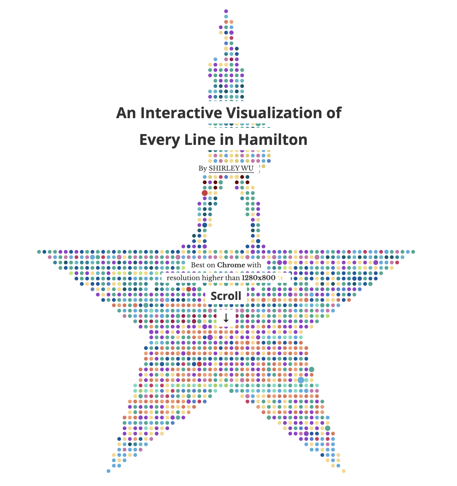
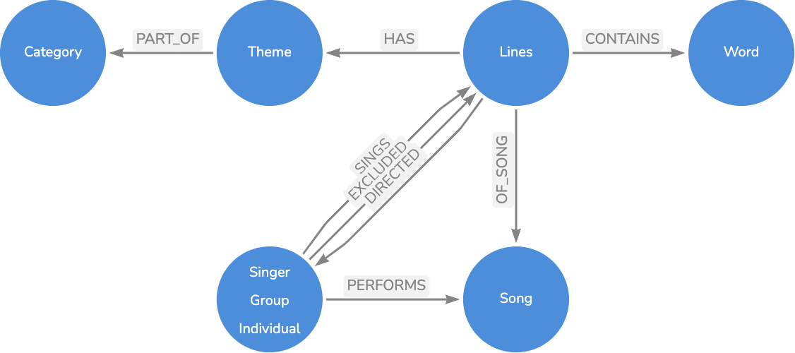
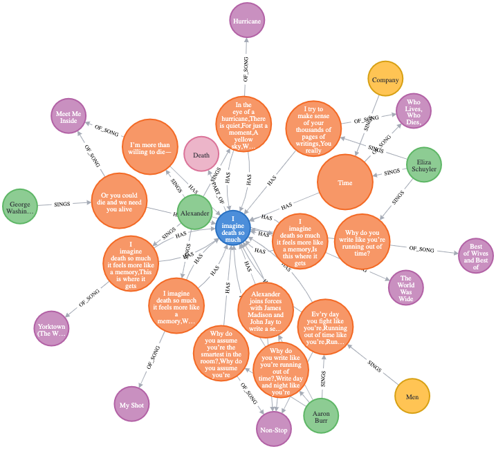
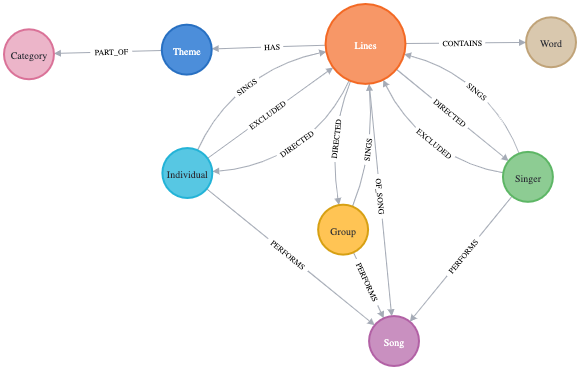
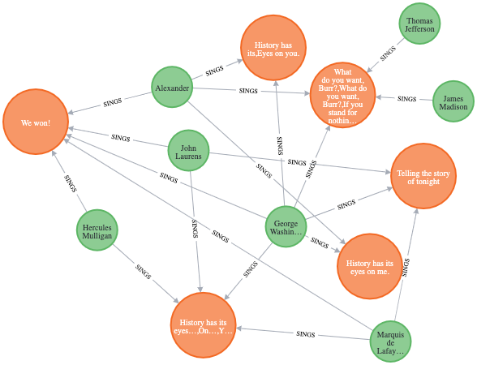

== Week 15 - The Graph of Hamilton

I love https://en.wikipedia.org/wiki/Hamilton_(musical)[Hamilton the Musical by Lin-Manuel Miranda^], an semi-accurate retelling of the story of the founding Alexander Hamilton with powerful lyrics and songs.

If you haven't seen it, here is a sneak in the Disney+ Trailer (but there are also other uploads on youtube).

https://www.youtube.com/watch?v=DSCKfXpAGHc

I was lucky and able to see it from the last free seat at the SFO performance in 2019.

Like https://twitter.com/sxywu[Shirley Wu^] I've been listening to the soundtrack on repeat since forever, it's just a joy.

For a long time I've been wanting to turn Shirley Wu's amazing https://pudding.cool/2017/03/hamilton/["An Interactive Visualization of Every Line in Hamilton"^] into a Neo4j graph for myself and others to play around with.

Please check out her work and play with it, it's really inspiring.

=== Live Stream

If you missed our live-stream, and rather watch than read the article, enjoy us having fun with this data.

https://www.youtube.com/watch?v=rPlYduWayMo

=== Data Source

Thankfully she made the data available as part of her https://github.com/sxywu/hamilton/[GitHub Repository^] for the visualization.

The JSON files can be found here, together with some explanations.

https://github.com/sxywu/hamilton/tree/master/src/data

Each JSON file has keys which are usually id's for the entities pointing to a list of values, some of which can also be nested.

Here is the final data model I ended up with for the data:

We have

* `Singer` that can be `Individual` or `Group`
* `Song`, with
* `Lines`, that a Singer `SINGS`, are `DIRECTED` at a Singer or `EXCLUDE` a Singer
* `CONTAINS` Word
* `HAS` a `Theme`, which
* is `PART_OF` a `Category`

=== Indexes and Constraints

For faster lookups to connect our data, let's create some constraints and indexes first.

[source,cypher]
----
create constraint on (s:Singer) assert s.id is unique;
create constraint on (l:Lines) assert l.id is unique;
create constraint on (s:Song) assert s.id is unique;
create constraint on (t:Theme) assert t.id is unique;
create constraint on (c:Category) assert c.name is unique;
create constraint on (w:Word) assert w.word is unique;

create index on :Singer(name);
create index on :Song(title);
----

=== Singers

Let's load the data one by one, starting with the Singers.

.char_list.json
[source,javascript]
----
{"1": ["Aaron Burr", "M", "individual", true, "rgb(149,65,200)"]}
----

We load the data, and process each key and it's value as a row to create a Singer with an additinal label.

[source,cypher]
----
call apoc.load.json('https://raw.githubusercontent.com/sxywu/hamilton/master/src/data/char_list.json') YIELD value
UNWIND keys(value) AS key
WITH key, value[key] AS data

call apoc.create.node(["Singer",apoc.text.capitalize(data[2])], {id:key, name:data[0], gender:data[1],xx:data[3],color:data[4]}) yield node 
return node;
----

=== Songs

Songs are straightforward with just an id and title.

.song_list.json
[source,javascript]
----
{"1": ["Alexander Hamilton", "#9541c8"]}
----

We load the data again and turn them into nodes.

[source,cypher]
----
call apoc.load.json('https://raw.githubusercontent.com/sxywu/hamilton/master/src/data/song_list.json') YIELD value
UNWIND keys(value) AS key
WITH key, value[key] AS data

MERGE (s:Song {id:key}) 
ON CREATE SET s.title = data[0], s.color = data[1]
RETURN s;
----

=== Lines

Lines is a bit more complicated, here is the https://github.com/sxywu/hamilton/tree/master/src/data#linesjson[description^] from Shirley's repository

====
----
key: line key
(example) 1:31 would be song 1, line 31
(example) 1:1-5 would be song 1, lines 1 through 5
value: array of 4 values
0: line key
1: array
0: character(s) singing
1: character(s) excluded from singing
2: character(s) the lines were directed to
2: array of the actual lyrics in those lines
3: number of lines
----
====

.lines.json
[source,javascript]
----
{"1:1-5":["1:1-5",[["1"],[""],[""]],["How does a bastard, orphan, son of a whore and a","Scotsman, dropped in the middle of a","Forgotten spot in the Caribbean by providence","Impoverished, in squalor","Grow up to be a hero and a scholar?"],5]}
----

Here after loading the data, we 

. split the id into song-id and lines
. find the song
. create an `Lines` node for each key
. connect sines to the song
. then for each type of relationship to a singer (SING, EXCLUDED, DIRECTED)
. we loop over the id-array and connect the lines to that singer appropriately
. for the SING relationship we also connect the singer to the actual song

[source,cypher]
----
call apoc.load.json('https://raw.githubusercontent.com/sxywu/hamilton/master/src/data/lines.json') YIELD value
UNWIND keys(value) AS key
WITH key, value[key] AS data

WITH key, split(key,':')[0] as song, split(key,':')[1] as lines, data[1][0] as singers, data[1][1] as excluded, data[1][2] as directed, data[2] as text, data[3] as count

MATCH (s:Song {id:song})
MERGE (l:Lines {id:key}) 
ON CREATE SET l.text = text, l.count = count, l.lines = lines
MERGE (l)-[:OF_SONG]->(s)

FOREACH (id IN [id IN singers WHERE id <> ""] |
    MERGE (p:Singer {id:id})
    MERGE (p)-[:SINGS]->(l)
    MERGE (p)-[:PERFORMS]->(s)
)
FOREACH (id IN [id IN excluded WHERE id <> ""] |
    MERGE (p:Singer {id:id})
    MERGE (p)-[:EXCLUDED]->(l)
)
FOREACH (id IN [id IN directed WHERE id <> ""] |
    MERGE (p:Singer {id:id})
    MERGE (l)-[:DIRECTED]->(p)
)
RETURN count(*);
----

In a memory restricted environment like AuraDB Free, we need to process the data in chunks:

All the JSON and String data takes too much of the available, transactional memory.

Just increase the `SKIP` value from 0 all the way to 1400 in steps of 200.

[source,cypher]
----
:auto call apoc.load.json('https://raw.githubusercontent.com/sxywu/hamilton/master/src/data/lines.json') YIELD value
UNWIND keys(value) AS key
WITH key, value[key] AS data
SKIP 0 LIMIT 200

call {
with key, data
WITH key, split(key,':')[0] as song, split(key,':')[1] as lines, data[1][0] as singers, data[1][1] as excluded, data[1][2] as directed, data[2] as text, data[3] as count

MATCH (s:Song {id:song})
MERGE (l:Lines {id:key})
ON CREATE SET l.text = text, l.count = count, l.lines = lines
MERGE (l)-[:OF_SONG]->(s)

FOREACH (id IN [id IN singers WHERE id <> ""] |
    MERGE (p:Singer {id:id})
    MERGE (p)-[:SINGS]->(l)
    MERGE (p)-[:PERFORMS]->(s)
)
FOREACH (id IN [id IN excluded WHERE id <> ""] |
    MERGE (p:Singer {id:id})
    MERGE (p)-[:EXCLUDED]->(l)
)
FOREACH (id IN [id IN directed WHERE id <> ""] |
    MERGE (p:Singer {id:id})
    MERGE (l)-[:DIRECTED]->(p)
)
} in transactions of 100 rows
RETURN count(*);
----

Now we can have our first graph query, that shows us who sings which songs.

[source,cypher]
----
MATCH (p:Singer)-[r:SINGS]->()-[:OF_SONG]->(s:Song) 
RETURN s.id, s.title, collect(distinct p.name) 
ORDER by toInteger(s.id) asc
LIMIT 25;
----

There is also a file `character.json` which contains the same singing information as the lines, so we don't need to process it.

////
// test "character.json" if it adds anything (nope)
// ["characters", "conversing", "excluding"]

call apoc.load.json('https://raw.githubusercontent.com/sxywu/hamilton/master/src/data/characters.json') yield value
with value.characters as value
unwind keys(value) as key
with key, value[key] as data
MATCH (p:Singer {id:key})
UNWIND data as id
WITH * where id <> ""
MATCH (l:Lines {id:id})
MERGE (p)-[:SINGS]->(l);
////

=== Words

Something that's not used in the visualization but I wanted to include in the graph are the words of the text.

We could have extracted them ourselves but stemming etc. was already taken care of in `words.json`.

Here we have the word as key and the line within the lines as array of values.

.words.json
[source,javascript]
----
{"how":["1:1/1:1-5","3:49/3:47-51"]}
----

When loading the file, the most annoying part is splitting the string to find the lines-key and the data to compute the offset in the text-array.

[source,cypher]
----
:auto call apoc.load.json('https://raw.githubusercontent.com/sxywu/hamilton/master/src/data/words.json') YIELD value
UNWIND keys(value) AS key
WITH key, value[key] AS data
CALL { WITH key, data
    MERGE (w:Word {word:key})
    WITH *
    UNWIND data as entries
    WITH w, split(entries, "/") as parts
    WITH w, parts[1] as lines, parts[0] as line
    WITH *, toInteger(split(line,':')[1])-toInteger(split(split(lines,':')[1],'-')[0]) as idx
    MATCH (l:Lines {id:lines})
    MERGE (w)<-[:CONTAINS {pos:line, idx:idx}]-(l)
} IN TRANSACTIONS OF 500 ROWS
RETURN count(*);
----

Now we can query for Words within lines of songs

[source,cypher]
----
MATCH (s:Song)<-[:OF_SONG]-(l:Lines)-[c:CONTAINS]->(n:Word) where n.word = 'satisfied' 
RETURN s.title, l.text[c.idx],n.word LIMIT 25
----

=== Themes

The theme list has the theme id as key and some text examples and the category name as values
Not sure what the "true" value means, it's true in all entiries.

.theme_list.json
[source,javascript]
----
{"1": [["Just you wait", "wait for it"], "Ambition", true]}
----

We create the theme by id and set the text and category, but then also create a category node that we want to connect to.

[source,cypher]
----
call apoc.load.json('https://raw.githubusercontent.com/sxywu/hamilton/master/src/data/theme_list.json') YIELD value
UNWIND keys(value) AS key
WITH key, value[key] AS data

MERGE (t:Theme {id:key})
ON CREATE SET t.category=data[1], t.text=data[0]

MERGE (c:Category {name:data[1]})
MERGE (t)-[:PART_OF]->(c)

RETURN *;
----

The actual themes are more complicated.
With the theme id as key, we have a triple nested list of lines and lines-ids and the text lines.

.themes.json
[source,javascript]
----
{"1":[ [["1:27/24-27"],["But just you wait, just you wait..."]],[["1:54/54"],["Just you wait!"]]]}
----

But we're only interested in the lines keys and the offset, so we do our usual spiel of splitting hairs to compute the index.
This time they lines-key is not directly there so we need to construct it from song and lines-range.

[source,cypher]
----
call apoc.load.json('https://raw.githubusercontent.com/sxywu/hamilton/master/src/data/themes.json') YIELD value
UNWIND keys(value) AS key
WITH key, value[key] AS data

MATCH (t:Theme {id:key})

UNWIND data as phrases
UNWIND phrases[0] as entries
WITH t, split(entries, ":") as parts
WITH t, parts[0] as song, split(parts[1],"/") as lines

MATCH (l:Lines {id:song + ":" + lines[1]})

WITH l, t, toInteger(lines[0]) - toInteger(split(lines[1],"-")[0]) as idx

MERGE (l)-[:HAS {idx:idx}]->(t)
RETURN *;
----

Now we can see who sings about "Death" in Hamilton.

[source,cypher]
----
MATCH p1=(c:Category {name:"Death"})<-[:PART_OF]-(t:Theme)<-[h:HAS]-(l:Lines)-[:OF_SONG]->(s:Song), p2=(l)<-[:SINGS]-(p:Singer)
RETURN p1,p2
----

=== Resulting Data Model

After importing all the data, we can see that the resulting graph data in the database resembles our original planned model.

You can see it by calling `call db.schema.visualization()`.

=== Exploration - Themes directed at Hamilton

Now we can start exploring this wonderful dataset.

E.g. to see who's most often directing lines at Hamilton, unsurprisingly it's Eliza followed by Burr.

[source,cypher]
----
MATCH (p:Singer)-[:SINGS]->(l:Lines)-[:DIRECTED]->(:Singer {name:"Alexander Hamilton"}),(l)-[:HAS]->(t)-[:PART_OF]->(c)
RETURN p.name, count(*) as freq, collect(distinct c.name) as categories
ORDER BY freq DESC
----

----
╒═══════════════════╤══════╤════════════════════════════════╕
│"p.name"           │"freq"│"categories"                    │
╞═══════════════════╪══════╪════════════════════════════════╡
│"Eliza Schuyler"   │20    │["Contentment","Legacy",        │
│                   │      │ "Ambition", "Death"]           │
├───────────────────┼──────┼────────────────────────────────┤
│"Aaron Burr"       │11    │["Personality","Relationship",  │
│                   │      │ "Ambition","Legacy"]           │
├───────────────────┼──────┼────────────────────────────────┤
│"George Washington"│8     │["Personality","Miscellaneous", │
│                   │      │ "Contentment","Legacy","Death"]│
├───────────────────┼──────┼────────────────────────────────┤
│"Maria Reynolds"   │6     │["Relationship","Personality"]  │
├───────────────────┼──────┼────────────────────────────────┤
│"James Reynolds"   │1     │["Relationship"]                │
├───────────────────┼──────┼────────────────────────────────┤
│"Phillip Hamilton" │1     │["Miscellaneous"]               │
└───────────────────┴──────┴────────────────────────────────┘
----

=== Co-Singing

Who does Thomas Jefferson most frequently sing with.

[source,cypher]
----
MATCH (p:Singer)-[:SINGS]->(l:Lines)<-[:SINGS]-(:Singer {name:"Thomas Jefferson"})
RETURN p.name, count(*) as freq
ORDER BY freq DESC
----

----
╒════════════════════╤══════╕
│"p.name"            │"freq"│
╞════════════════════╪══════╡
│"James Madison"     │35    │
├────────────────────┼──────┤
│"Aaron Burr"        │18    │
├────────────────────┼──────┤
│"Alexander Hamilton"│4     │
├────────────────────┼──────┤
│"Company"           │3     │
├────────────────────┼──────┤
│"George Washington" │1     │
├────────────────────┼──────┤
│"Angelica Schuyler" │1     │
└────────────────────┴──────┘
----

=== Visuals - who surrounding Washington

[source,cypher]
----
MATCH path=(p:Individual)-[:SINGS]->(l:Lines)<-[:SINGS]-(:Singer {name:"George Washington"})
RETURN path
----

=== Timeline

What timeframe is a character active in the story

[source,cypher]
----
MATCH (p:Singer)-[r:SINGS]->()-[:OF_SONG]->(s:Song)
// exlude the first and last song where everyone sings
WHERE NOT s.id IN ["1","46"]
// order numerically
WITH DISTINCT p.name as name, s.id as song ORDER BY toInteger(song) ASC
// collect all songs of a character into a list
WITH name, collect(song) as songs
// first and last entry of the list
RETURN name, songs[0]+"-"+songs[-1] as time
// sorted by frequency and first appearance
ORDER BY size(songs) DESC, toInteger(songs[0]) asc
----

----
╒══════════════════════╤═══════╕
│"name"                │"time" │
╞══════════════════════╪═══════╡
│"Alexander Hamilton"  │"2-45" │
├──────────────────────┼───────┤
│"Company"             │"2-45" │
├──────────────────────┼───────┤
│"Aaron Burr"          │"2-45" │
├──────────────────────┼───────┤
│"George Washington"   │"4-32" │
├──────────────────────┼───────┤
│"John Laurens"        │"2-23" │
├──────────────────────┼───────┤
│"Eliza Schuyler"      │"5-44" │
├──────────────────────┼───────┤
│"Men"                 │"5-45" │
├──────────────────────┼───────┤
│"Hercules Mulligan"   │"2-23" │
├──────────────────────┼───────┤
│"Marquis de Lafayette"│"2-23" │
├──────────────────────┼───────┤
│"Angelica Schuyler"   │"5-45" │
├──────────────────────┼───────┤
│"Thomas Jefferson"    │"24-42"│
├──────────────────────┼───────┤
│"James Madison"       │"24-42"│
├──────────────────────┼───────┤
│"Women"               │"5-42" │
├──────────────────────┼───────┤
│"Phillip Hamilton"    │"26-45"│
├──────────────────────┼───────┤
│"King George III"     │"7-33" │
├──────────────────────┼───────┤
│"Charles Lee"         │"14-15"│
├──────────────────────┼───────┤
│"Peggy Schuyler"      │"5-5"  │
├──────────────────────┼───────┤
│"Samuel Seabury"      │"6-6"  │
├──────────────────────┼───────┤
│"Maria Reynolds"      │"27-27"│
├──────────────────────┼───────┤
│"James Reynolds"      │"27-27"│
├──────────────────────┼───────┤
│"George Eacker"       │"39-39"│
└──────────────────────┴───────┘
----

=== Words

Frequency of words used

[source,cypher]
----
MATCH (w:Word)
WHERE size(w.word) > 4
RETURN w.word, size((w)<-[:CONTAINS]-()) as freq
order by freq desc LIMIT 20
----

----
╒═══════════╤══════╕
│"w.word"   │"freq"│
╞═══════════╪══════╡
│"where"    │82    │
├───────────┼──────┤
│"don’t"    │76    │
├───────────┼──────┤
│"hamilton" │68    │
├───────────┼──────┤
│"you’re"   │68    │
├───────────┼──────┤
│"never"    │56    │
├───────────┼──────┤
│"alexander"│49    │
├───────────┼──────┤
│"right"    │40    │
├───────────┼──────┤
│"gonna"    │37    │
├───────────┼──────┤
│"would"    │36    │
├───────────┼──────┤
│"world"    │35    │
----

Which words are related to which themes.

[source,cypher]
----
MATCH (w:Word)<-[:CONTAINS]-(l)-[:HAS]->(t)-[:PART_OF]->(c)
WHERE size(w.word) > 4
RETURN w.word, c.name, count(*) AS freq
ORDER BY freq DESC LIMIT 50;
----

----
╒════════════╤═══════════════╤══════╕
│"w.word"    │"c.name"       │"freq"│
╞════════════╪═══════════════╪══════╡
│"enough"    │"Contentment"  │104   │
├────────────┼───────────────┼──────┤
│"where"     │"Ambition"     │102   │
├────────────┼───────────────┼──────┤
│"would"     │"Contentment"  │74    │
├────────────┼───────────────┼──────┤
│"could"     │"Contentment"  │57    │
├────────────┼───────────────┼──────┤
│"satisfied" │"Contentment"  │54    │
├────────────┼───────────────┼──────┤
│"happens"   │"Ambition"     │50    │
├────────────┼───────────────┼──────┤
│"where"     │"Contentment"  │47    │
├────────────┼───────────────┼──────┤
│"alive"     │"Contentment"  │47    │
├────────────┼───────────────┼──────┤
│"happened"  │"Ambition"     │46    │
├────────────┼───────────────┼──────┤
│"don’t"     │"Contentment"  │37    │
├────────────┼───────────────┼──────┤
│"throwing"  │"Ambition"     │34    │
├────────────┼───────────────┼──────┤
│"enough"    │"Legacy"       │28    │
├────────────┼───────────────┼──────┤
│"story"     │"Legacy"       │27    │
├────────────┼───────────────┼──────┤
│"helpless"  │"Personality"  │26    │
├────────────┼───────────────┼──────┤
│"world"     │"Legacy"       │25    │
├────────────┼───────────────┼──────┤
│"you’re"    │"Contentment"  │25    │
├────────────┼───────────────┼──────┤
│"other"     │"Ambition"     │25    │
├────────────┼───────────────┼──────┤
│"never"     │"Contentment"  │23    │
├────────────┼───────────────┼──────┤
│"wrote"     │"Death"        │22    │
├────────────┼───────────────┼──────┤
│"wanna"     │"Ambition"     │21    │
├────────────┼───────────────┼──────┤
│"running"   │"Death"        │20    │
----