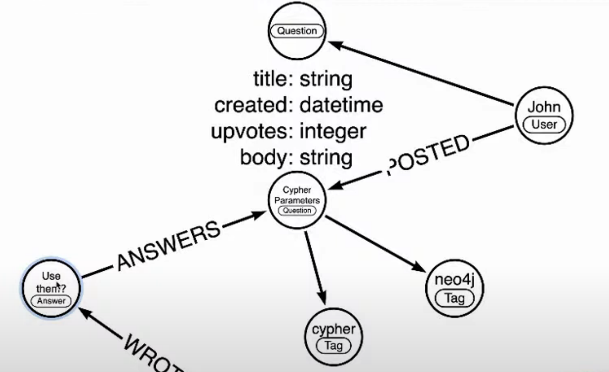

== Week 8 - StackOverflow

The Stackoverflow data is a really fun dataset. 
Every developer who ever asked or answered questions there or just copied code can relate to it.

We wanted to answer two questions:

* What other tags are related to this tag?
* Which users could answer this unanswered question best.

Our model in Arrows had users asking questions, that are tagged and other users answering these questions.

Then we looked at the data returned from the StackOverflow REST API which gives us the opportunity to find pages of questions with certain tags.

E.g. this https://api.stackexchange.com/2.2/questions?pagesize=100&order=desc&sort=creation&tagged=neo4j&site=stackoverflow&filter=!5-i6Zw8Y)4W7vpy91PMYsKM-k9yzEsSC1_Uxlf[link returns the last 100 questions for neo4j^].

We're using `apoc.load.json` procedure to load the data from the REST API and then regular Cypher to create the graph data from the response.

Then we incrementally looked at the data and imported, questions, users and tags, we used the starting statement from the https://neo4j.com/labs/apoc/4.1/import/load-json/#load-json-examples-stackoverflow[APOC docs page for load json^].

It takes the data from the REST API call, turns the "items" aka questiosn from a list into rows and then returns for each question the title, owner (map), creation date, and the other top-level keys of the question.

[source,cypher]
----
WITH "https://api.stackexchange.com/2.2/questions?pagesize=100&order=desc&sort=creation&tagged=neo4j&site=stackoverflow&filter=!5-i6Zw8Y)4W7vpy91PMYsKM-k9yzEsSC1_Uxlf" AS url
CALL apoc.load.json(url) YIELD value
UNWIND value.items AS item
RETURN item.title, item.owner, item.creation_date, keys(item)
LIMIT 5;
----

After importing the minimal data we could answer our first question - which tags are related to each other.

The query was, e.g. for the "cypher" tag.

[source,cypher]
----
match (t:Tag {name:"cypher"})<-[:TAGGED]-(q:Question)-[:TAGGED]->(t2:Tag)
return t2.name,count(*) as c
order by c desc limit 10 
----

Our second question - Who can answer this question best? - required us to import also the answers and people answering into the graph.

For that we just took the example statement from the [APOC docs^] but reduced the page-size to 50 to deal with an Aura Free memory limit.

[source,cypher]
----
WITH "https://api.stackexchange.com/2.2/questions?pagesize=50&order=desc&sort=creation&tagged=neo4j&site=stackoverflow&filter=!5-i6Zw8Y)4W7vpy91PMYsKM-k9yzEsSC1_Uxlf" AS url
CALL apoc.load.json(url) YIELD value
UNWIND value.items AS q
MERGE (question:Question {id:q.question_id})
ON CREATE SET question.title = q.title,
              question.share_link = q.share_link,
              question.favorite_count = q.favorite_count

FOREACH (tagName IN q.tags | MERGE (tag:Tag {name:tagName}) MERGE (question)-[:TAGGED]->(tag))
FOREACH (a IN q.answers |
   MERGE (question)<-[:ANSWERS]-(answer:Answer {id:a.answer_id})
   MERGE (answerer:User {id:a.owner.user_id}) ON CREATE SET answerer.display_name = a.owner.display_name
   MERGE (answer)<-[:PROVIDED]-(answerer)
)

WITH * WHERE NOT q.owner.user_id IS NULL
MERGE (owner:User {id:q.owner.user_id}) ON CREATE SET owner.display_name = q.owner.display_name
MERGE (owner)-[:ASKED]->(question)
----

Then we could build up our query step by step to find best folks to answer unanswered questions.

[source,cypher]
----
match (q0:Question)-[:TAGGED]->(tag) where not exists { (q0)<-[:ANSWERS]-() }
with q0, tag limit 5
match (q)-[:TAGGED]->(tag:Tag)
match (q:Question)<-[:ANSWERS]-(a)<-[:PROVIDED]-(u:User)

return q0.title, collect(distinct tag.name) as tags, u.display_name, count(*) as c

order by c desc limit 10
----

For our second question we also had to import answers and the people posting them, so that we could 

The recording https://youtu.be/arjywFPvf80?t=722[is here^]
