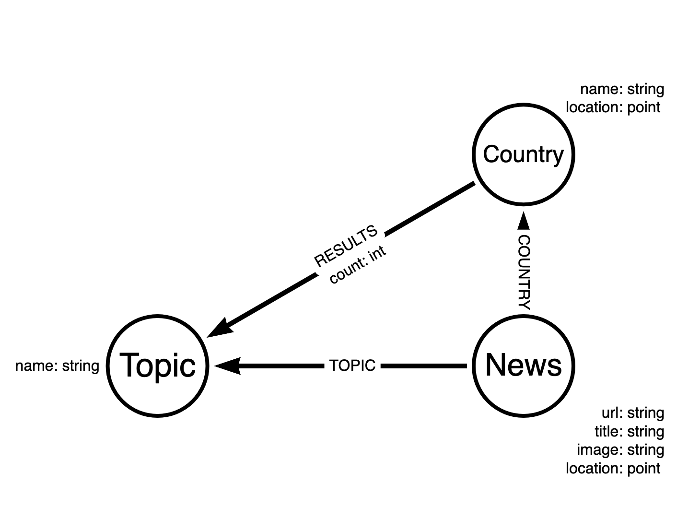
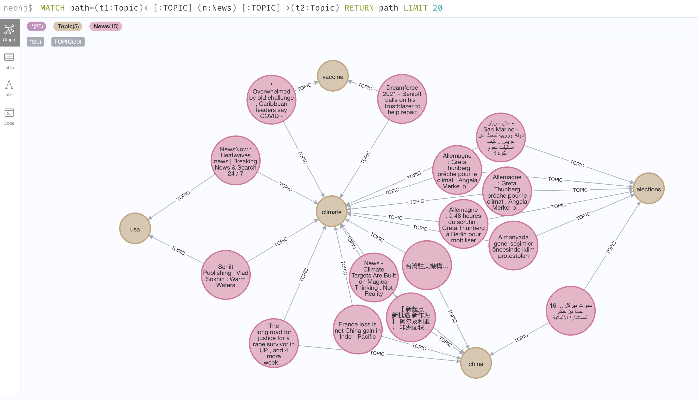

== Week 9 - GDelt Project

This week we want to explore the https://www.gdeltproject.org/[GDelt project^], which collects and analyses global news from hundreds of sources and makes them available in many formats.

You can https://www.youtube.com/watch?v=7iONKK8gleM&list=PL9Hl4pk2FsvVZaoIpfsfpdzEXxyUJlAYw&index=8[watch the recording of the GDelt Exploration here^].

For our needs their API is good enough but if you want to go deeper there is much more to be found.

* API page: https://blog.gdeltproject.org/gdelt-geo-2-0-api-debuts/
* JSON API: https://api.gdeltproject.org/api/v2/geo/geo?query=elections&MODE=country&format=geojson&TIMESPAN=1d&GEORES=0 
* CSV API: https://api.gdeltproject.org/api/v2/geo/geo?query=elections&MODE=country&format=csv&TIMESPAN=7d&GEORES=0

We'll be using the CSV endpoint to get news for a certain topic with geolocation and country.

We could also use the JSON result but it misses the geo-information.

Unfortunately the REST API is a bit too limited for real use, as it does not return

* language
* timestamp
* entities (people, locations, organizations)

So for properly using GDelt you have to query the bigquery tables to extract all that detail.

David Allen has explored that in this repository: https://github.com/moxious/gdelt

=== Data Model

The data model is pretty straightforward, we have

* News
* Country
* Topic

=== Data Import

.Exploring the data
[source,cypher]
----
WITH "elections" AS topic
LOAD CSV WITH HEADERS FROM "https://api.gdeltproject.org/api/v2/geo/geo?query="+topic+"&MODE=country&format=csv&TIMESPAN=7d&GEORES=0" AS row 
RETURN row LIMIT 5
----

.Loading the data
[source,cypher]
----
WITH "elections" AS topic
LOAD CSV WITH HEADERS FROM "https://api.gdeltproject.org/api/v2/geo/geo?query="+topic+"&MODE=country&format=csv&TIMESPAN=7d&GEORES=0" AS row 

MERGE (t:Topic {name:topic})

MERGE (n:News {url:row.URL})
ON CREATE SET n.title=row.Title, n.location=point({latitude:toFloat(row.Latitude), longitude:toFloat(row.Longitude)}), n.image=row.ImageURL

MERGE (n))-[:TOPIC]->(t)

MERGE (c:Country {name:row.Location}) ON CREATE SET c.location = n.location
MERGE (n)-[:COUNTRY]->(c)
MERGE (t)-[r:RESULTS]->(c) SET r.count=toInteger(row.LocationResultCount)
----

Feel free to use other topics to query, we used these additional ones in the session:

* climate
* china
* usa
* taiwan
* corona
* vaccines

=== Data Exploration 

.Some News with Topic and Country
[source,cypher]
----
MATCH (c:Country)<-[:COUNTRY]-(n:News)-[:TOPIC]->(t:Topic)
RETURN * LIMIT 20
----

.News per Country
[source,cypher]
----
match (c:Country) 
return c, size( (c)<-[:COUNTRY]-()) as newsCount 
order by newsCount desc LIMIT 5
----

.Topic Overlap between News
[source,cypher]
----
MATCH path=(t1:Topic)<-[:TOPIC]-(n:News)-[:TOPIC]->(t2:Topic) 
RETURN path LIMIT 20
----

We also looked at how to expand our news graph by extracting new topics from titles.

.Extract Top Words from Titles
[source,cypher]
----
match (n:News) 
unwind apoc.text.split(toLower(n.title), "\W+") as word
with word where size(word) > 3
return word, count(*) order by count(*) desc limit 100
----
